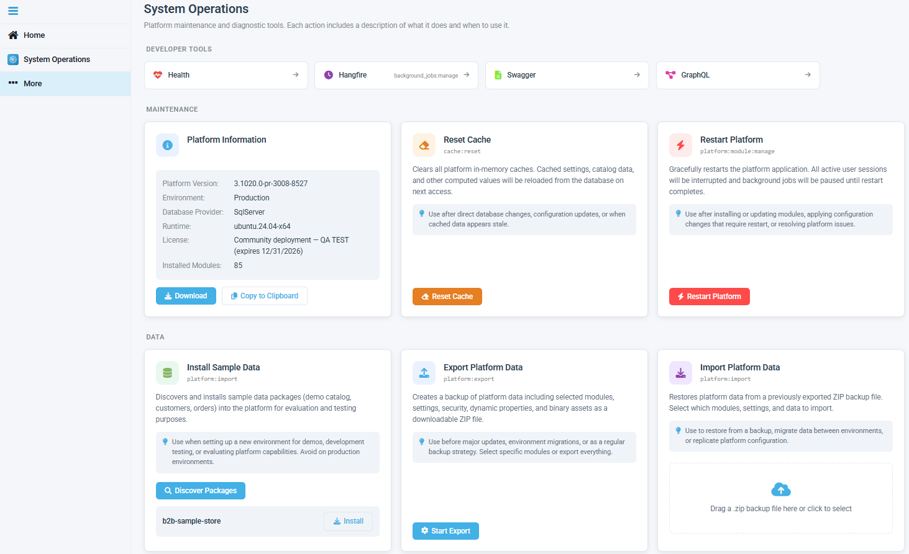

# Overview

The **System Operations** module provides a centralized developer tools page for platform maintenance and diagnostic actions in the Virto Commerce Platform. It consolidates commonly used operations into a single, well-documented interface within the Developer Tools section. These operations were previously scattered across Settings, Platform Info, and widgets.

The module opens as a standalone page. Every operation includes a short description of what it does and when to use it. Destructive actions ask for confirmation before running:

## Key features

The System Operations page groups actions into three categories: 

* Developer Tools navigation.
* Maintenance.
* Diagnostics and export. 

The table below lists every available action:

<table border="1">
    <tr>
        <th>Category</th>
        <th>Action</th>
        <th>Description</th>
    </tr>
    <tr>
        <td rowspan="4">Developer Tools</td>
        <td>Health</td>
        <td>Opens the platform health check page.</td>
    </tr>
    <tr>
        <td>Hangfire</td>
        <td>Opens the Hangfire background jobs dashboard.</td>
    </tr>
    <tr>
        <td>Swagger</td>
        <td>Opens the Swagger API reference.</td>
    </tr>
    <tr>
        <td>GraphQL</td>
        <td>Opens the GraphQL playground.</td>
    </tr>
    <tr>
        <td rowspan="6">Maintenance</td>
        <td>Platform information</td>
        <td>Displays platform version, environment, database, runtime, and license details.</td>
    </tr>
    <tr>
        <td>Reset cache</td>
        <td>Clears all platform in-memory caches. Use when cached data appears stale.</td>
    </tr>
    <tr>
        <td>Restart Platform</td>
        <td>Gracefully restarts the platform. Use after installing or updating modules.</td>
    </tr>
    <tr>
        <td>Install Sample Data</td>
        <td>Installs sample data packages into the platform. Avoid on production environments.</td>
    </tr>
    <tr>
        <td>Export Platform Data</td>
        <td>Creates a ZIP backup of selected modules, settings, and assets.</td>
    </tr>
    <tr>
        <td>Import Platform Data</td>
        <td>Restores platform data from a previously exported ZIP backup.</td>
    </tr>
    <tr>
        <td rowspan="2">Diagnostics and export</td>
        <td>Download Package JSON</td>
        <td>Downloads a <b>vc-package.json</b> file listing all installed modules. Use to replicate the module set on another environment.</td>
    </tr>
    <tr>
        <td>Module Load Sequence</td>
        <td>Displays the loading order of all installed modules during startup.</td>
    </tr>
</table>

 
 
********

    <a href="../../subscription/overview">← Subscription module overview</a>
    <a href="../../tasks/overview">Tasks module overview →</a>

