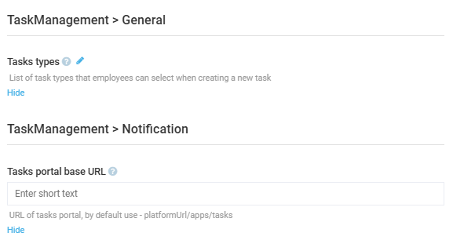

# Settings

To configure the Task module global settings:

1. Open the Platform and go to **Settings**.
1. In the new blade, type **Task management** to find the settings related to the module.
1. In the next blade, configure the following:

    

1. Click **Save** in the toolbar to save the changes.

Your modifications have been applied.

 
 
********

    <a href="../using-application">← Using Tasks application</a>
    <a href="../roles-permissions">Roles and permissions →</a>

