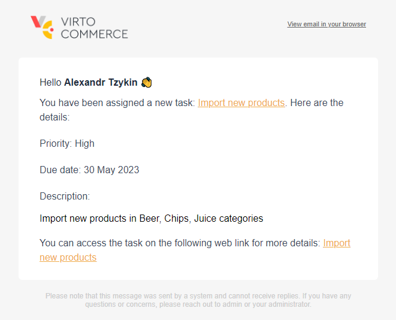

# Use Tasks Application

To start using the Tasks application, click  {: width="25" height="25"}  to open the applications menu.

* **My tasks** opens the user's active and completed tasks.
* **All tasks** opens all currently active tasks.
* **Archive** opens all completed tasks.

All tasks can be filtered by:
    
* Type.
* Priority.
* Due date.

## Create tasks

To create a new task:

1. Select **All tasks** and click {: width="25" height="25"}.

1. Fill in the fields:

    | Field	        | Description                                                                                                                             	|
    |-----------	|-----------------------------------------------------------------------------------------------------------------------------------------	|
    | Type          | Select a task type from a dropdown list. Read more about creating and configuring task types in the [Settings](settings.md) section.  	|
    | Summary    	| Descriptive title.                                                                                                                      	|
    | Description 	| Task detailed description (optional).                                                                                                   	|
    | Priority    	| Task priority. Select from a dropdown list:  <ul> <li>Lowest.</li> <li>Low.</li> <li>Normal.</li><li>High.</li> <li>Highest.</li></ul> |
    | Due    	    | Task deadline.                                                                                                                            |
    | Assignee    	| From a dropdown list, select the employee the task is assigned to. Read more about [Roles and permissions](roles-permissions.md).      |
    | Status	    | Current task status. Assigned automatically.                                                                                              |
    | Attachments	| Attachments to the task.                                                                                                                	|

1. Click {: width="30" height="30"} to save changes.

The assignee receives an email notification of the assigned task.

## Process tasks

To process the assigned task:

1. Open the assigned task using either way:

    1. Click a link in a notification email.
    1. Open the **Tasks** application and go to **My tasks** -> **Active**.

1. Process the task:

    * Click {: width="25" height="25"} to complete the task. The task wil be archived with the **Done** status. 
    * Click {: width="25" height="25"} to reject the task. The task wil be archived with the **Canceled** status.
    * Click {: width="25" height="25"} to restore the original version of the task.
    * Click {: width="30" height="30"} to save changes.
    * Click {: width="25" height="25"} to delete the task.
