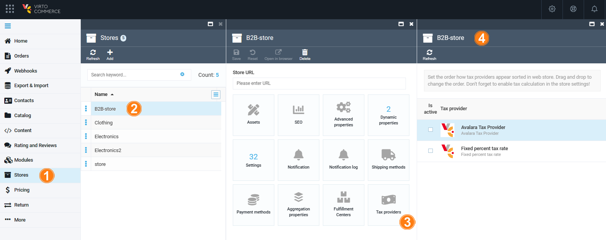
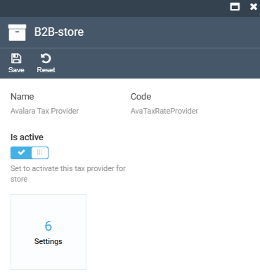

# Manage Tax Providers

Managing tax providers includes:

* [Viewing the list of available tax providers.](managing-taxes.md#view-tax-providers)
* [Enabling/disabling tax providers.](managing-taxes.md#enabledisable-tax-provider)
* [Configuring tax provider settings.](settings.md)

## View tax providers

To view the available tax providers:

1. Click **Stores** in the main menu.
1. In the next blade, select the required **Store**.
1. In the next **Store details** blade, click on the **Tax providers** widget.
1. The next blade displays the available tax providers:

{: style="display: block; margin: 0 auto;" }

## Enable/ disable tax provider

1. Complete steps 1-4 from the instruction above.
1. In the next blade, click on the required tax provider.
1. In the next blade, turn the switch to on/ off.
1. Click **Save** in the toolbar to save the changes.

{: style="display: block; margin: 0 auto;" }

 
 
********

    <a href="../overview">← Tax module overview</a>
    <a href="../settings">Settings →</a>

