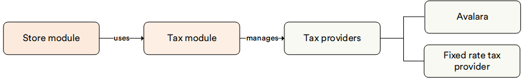

# Overview

The Tax module provides a flexible way to evaluate taxes by using different tax providers and core abstractions for custom tax providers. It allows easy addition of custom tax calculation rules.

The module includes a **FixedRateTaxProvider** as a built-in tax provider.

The module provides an API to work with the tax provider list and allows you to connect the tax providers to a selected store. The list of available tax providers can be viewed and edited in the UI.

!!! note
    The Tax module required preinstalled Store module.

## Default providers

* FixedRateTaxProvider is a built-in tax provider included into the Virto Commerce Tax module. It calculates taxes based on fixed rates.
* [Avalara.Tax](../integrations/avalara/overview.md) is a real time integration with Avalara Tax automation. This module is officially certified by Avalara to be compatible with Avalara API.

## Key features

With the Tax module, you can:

* Evaluate tax using different tax providers, including the built-in FixedRateTaxProvider, and easily add custom tax calculation rules.
* View the list of available tax providers on the user interface and edit their settings directly from the platform.
* Connect tax providers to specific stores and configure different tax rates based on location, product type, or other parameters.
* Implement custom tax providers by creating new modules that inherit from the abstract TaxProviderBase class.
* Register new tax providers programmatically by implementing the ITaxProvider interface.
* Access the list of available tax providers and their settings via the public API.

The diagram below illustrates the functionality of the Tax module:

