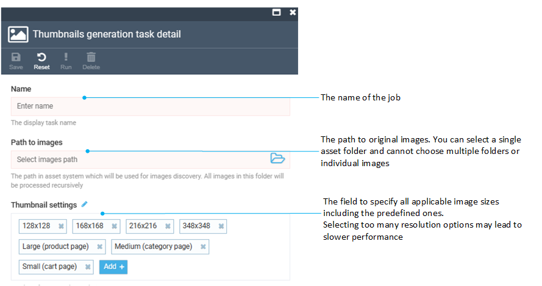
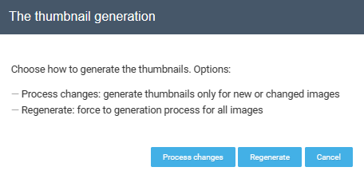
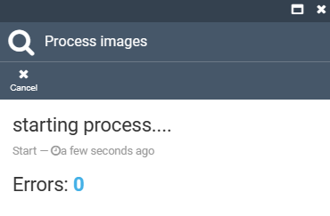

# Generate thumbnails

If your asset folders contain any images, you have the option to create a new thumbnail generation job. You can then choose to execute it manually or schedule it to run at specific intervals, such as every X hours, days, and so on.

## Create new job

To create a new thumbnail generation job:

1. Click **Thumbnails** in the main menu.
1. In the next **Thumbnail generation tasks list** blade, click **Add** in the toolbar.
1. Fill in the following fields:

	

1. Click **Save** in the toolbar to save the changes.

Your job has been added to the list.

## Run thumbnail generation job

The created job can be run:

* [Manually](generating-thumbnails.md#manual-run).
* Automatically via the [Scheduled run](settings.md) feature.

### Manual run

To run the job manually:

1. Check the required job.
1. Click **Run** in the toolbar.
1. Select the required action in the notification window:
	* **Process changes** to generate thumbnails only for new or changed images.
	* **Regenerate** to force generation process for all images.

		

	!!! note
		If you are running this job for the first time, the **Process Changes** option will be grayed out.

1. The result is displayed in the next **Process images** blade:

	

### Scheduled run

You can schedule thumbnail generation to run in the background once in a certain period of time. Read more about it in the [Settings](settings.md) section. 
