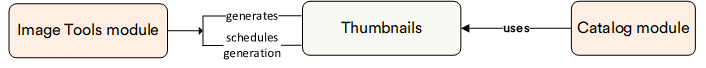

# Thumbnails

Online stores are likely to need images, not only full-size product images (which are stored in the [Assets module](../assets/overview.md)), but also smaller images, or thumbnails, to fit product lists, search results, previews, catalog grid view, etc.

With the **Image Tools (or Thumbnails)** module you do not need to generate thumbnails manually, which is challenging, especially when you have hundreds or thousands of various products. You can generate any reasonable number of small images with predefined sizes quickly and efficiently. Additionally, this generation runs as a job, which means you can schedule it to run every specific period of time to cover the recently added images as well.

## Key features

The diagram below illustrates the interconnections among various key entities within the Thumbnails module:

{: style="display: block; margin: 0 auto;" }

With the Thumbnails module, you can:

* [Generate image thumbnails](generating-thumbnails.md)
* [Schedule thumbnail generation](generating-thumbnails.md#scheduled-run)
* [Select resize options](thumbnail-options.md)
* [Access the resulting thumbnails](using-thumbnails.md)

 
 
********

    <a href="../../tax/overview">← Tax module overview</a>
    <a href="../generating-thumbnails">Generating thumbnails →</a>

