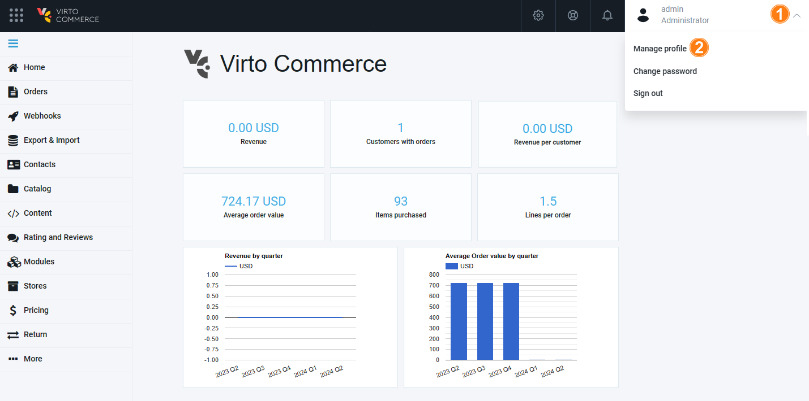
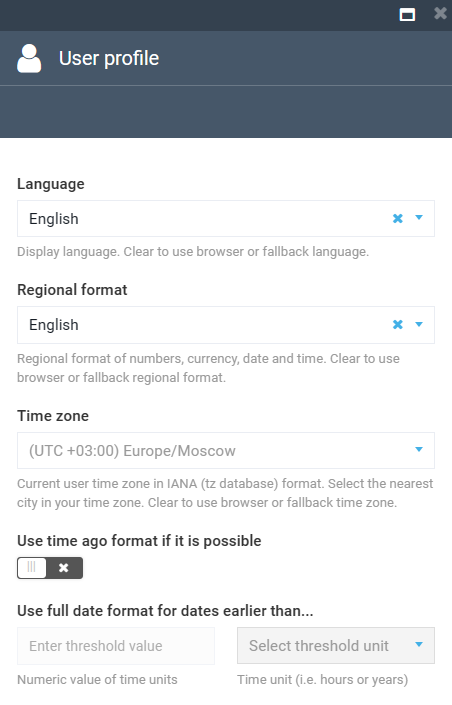

# User Profile

To configure the admin profile:

1. Open Platform and expand the profile settings in the top right corner.
1. In the dropdown menu, select **Manage profile**:

    

1. In the **User profile** blade, set up the following parameters:

    {: style="display: block; margin: 0 auto;" }

	!!! note
		If a user is listed in the Contacts, they can now upload their personal photos to customize and brand their workspace:

		{: style="display: block; margin: 0 auto;" }

Your settings are saved automatically.

 
 
********

    <a href="../general-guidelines">← General guidelines </a>
    <a href="../modules-installation">Modules installation →</a>

