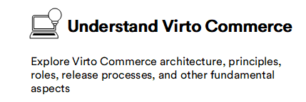
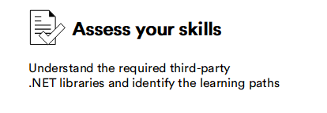
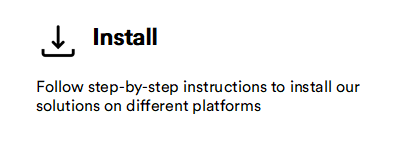
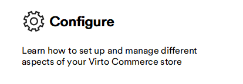
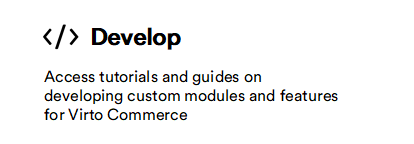
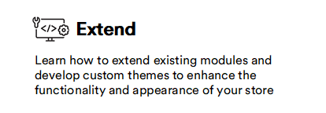

# Virto Commerce Documentation

Learn how to use Virto Commerce solutions with our installation, configuration, and development guides.

|Step|Description|
|---|---|
|  | <ul><li> [Atomic architecture](https://virtocommerce.com/atomic-architecture)</li><li> [Headless solution](https://virtocommerce.com/b2b-headless-ecommerce-solution) </li> <li>[Scalability](../../developer-guide/Fundamentals/Scalability/scalability-options)</li> <li>[Modularity](../../developer-guide/Fundamentals/Modularity/01-overview)</li><li> [Security](../../developer-guide/Fundamentals/Security/overview)</li><li> [Release strategy](../../developer-guide/Updating-Virto-Commerce-Based-Project/release-strategy-overview)</li></ul>|
|  | <ul><li> [Common skills](../../developer-guide/skills-required-for-VC-developers/#common-skills)</li><li> [Ecommerce common skills](../../developer-guide/skills-required-for-VC-developers/#e-commerce-common-skills)</li><li> [Backend developer skills](../../developer-guide/skills-required-for-VC-developers/#backend-developer-skills)</li><li> [Frontend developer skills](../../developer-guide/skills-required-for-VC-developers/#frontend-developer-skills)</li></ul>|
|  | Platform: <ul><li> [On Virto cloud](../../developer-guide/Getting-Started/Installation-Guide/windows/#use-virto-commerce-cli)</li><li> [On Azure cloud](../../developer-guide/Tutorials-and-How-tos/How-tos/deploy-platform-on-azure)</li> <li>[On Premises](../../developer-guide/Getting-Started/Installation-Guide/windows/#download-precomplied-binaries)</li></ul> Frontend Application:   <ul><li>[On Virto cloud](../../../storefront/developer-guide/deployment/#deployment-on-virto-cloud)</li> <li>[On Azure cloud](../../../storefront/developer-guide/deployment/#deployment-in-azure)</li> <li>[On Local Machine](../../../storefront/developer-guide/deployment/#deployment-on-local-machine)</li></ul>|
|  | <ul><li> [Create, export, import catalogs](catalog/add-new-catalog.md)</li><li> [Create and configure new store](store/adding-new-store.md)</li><li> [Add products](catalog/managing-products.md)</li><li> [Create price-lists and add products to them](pricing/creating-new-price-list.md)</li><li>[Manage inventory](inventory/managing-inventory.md)</li><li>[Manage promotions](marketing/managing-promotions.md)</li><li>[Manage permissions](security/roles-and-permissions.md)</li><li>[Settings](general-guidelines.md/#settings)</li><li>[View results on frontend environment](view-results-on-frontend.md)</li></ul>|
|  | Create module:   <ul><li> [From template:](../../developer-guide/Tutorials-and-How-tos/Tutorials/creating-custom-module)</li> <ul><li> [Build and run](../../developer-guide/Tutorials-and-How-tos/Tutorials/creating-custom-module/#create-solution-from-template)</li><li> [Work with database](../../developer-guide/Tutorials-and-How-tos/Tutorials/creating-custom-module/#work-with-database) </li><li> [Add new API endpoints](../../developer-guide/Tutorials-and-How-tos/Tutorials/creating-custom-module/#adding-new-api) </li> <li> [Extend UI](../../developer-guide/Tutorials-and-How-tos/Tutorials/creating-custom-module/#extend-vc-manager-with-new-ui)</li> <li> [Debug](../../developer-guide/Tutorials-and-How-tos/Tutorials/creating-custom-module/#test-and-debug-api)</li><li> [Pack and deploy](../../developer-guide/Tutorials-and-How-tos/Tutorials/creating-custom-module/#pack-your-module)</li></ul></li> <li> [From scratch](../../developer-guide/Tutorials-and-How-tos/Tutorials/create-new-module-from-scratch)</li></ul>|
|  | Extend existing modules: <ul><li>Add dependencies:</li> <ul><li>[Extend domain types](../../developer-guide/Tutorials-and-How-tos/Tutorials/extending-domain-models) </li><li>[Extend database](../../developer-guide/Tutorials-and-How-tos/Tutorials/extending-database-model)</li></ul></li><li>Extend UI:<ul><li>[Main menu](../../developer-guide/Platform-Manager/Extensibility-Points/extending-main-menu)</li><li>[Widgets](../../developer-guide/Platform-Manager/Extensibility-Points/widgets)</li><li>[Blades](../../developer-guide/Platform-Manager/Extensibility-Points/blades-and-navigation)</li></ul>|
