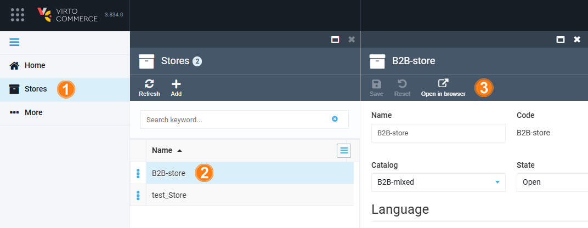

# View Results on Frontend

To view the results of Platform modifications in the Frontend Application:

1. Click **Stores** in the main menu.
1. In the next blade, select the desired store.
1. In the next blade, click **Open in browser** in the toolbar.

The Frontend Application opens in a new blade.

!!! tip
    You can simply refresh your Frontend Application site to view the modifications made.

 
 
********

    <a href="../multiregional-ecommerce">← B2B multi-regional ecommerce architecture </a>
    <a href="../backup-and-restore">Backup and restore →</a>

