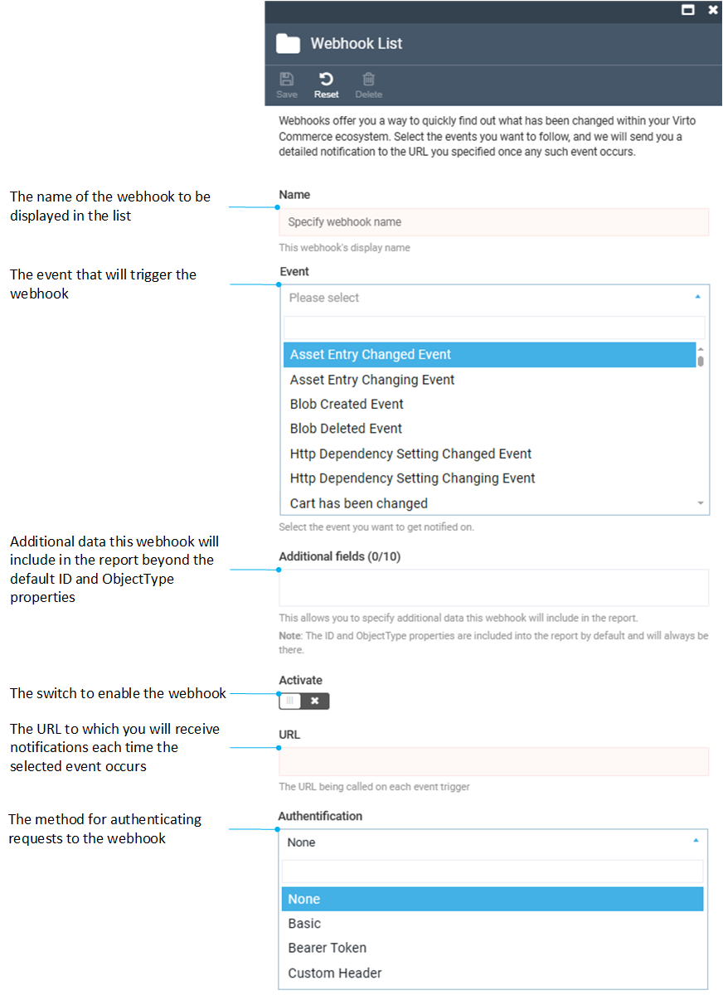

# Manage Webhooks

Managing Webhooks includes:

* [Creating new webhooks.](managing-webhooks.md#create-webhook)
* [Editing webhooks.](managing-webhooks.md#edit-webhook)
* [Deleting webhooks from the list.](managing-webhooks.md#delete-webhook)

## Create webhook

To create a new webhook:

1. Click **Webhooks** in the main menu.
1. The next blade displays the list of existing webhooks. Click **Add** in the toolbar.
1. In the next blade, fill in the following fields:

    {: style="display: block; margin: 0 auto;" width="700"}

1. Click **Save** in the toolbar to save the changes.

Your new webhook appears in the webhook list.

!!! note
    You can create any reasonable number of webhooks you need to track all kinds of events.

## Edit webhook

To edit a webhook:

1. Click **Webhooks** in the main menu.
1. In the next blade, click on the required webhook.
1. Edit it in the next blade.
1. Click **Save** in the toolbar to save the changes.

The modifications have been applied.

## Delete webhook

To delete a webhook:

1. Click **Webhooks** in the main menu.
1. In the next blade, check the required webhook.
1. Click **Delete** in the toolbar.
1. Confirm your action.

The webhook has been deleted.

## Warning Message

Upon updating the Virto Commerce Platform, users employing webhooks with multiple event subscriptions in previous versions may encounter the following warning message:

{: style="display: block; margin: 0 auto;" }

You can continue using such a webhook as before, although **you will not be able to edit it**. However, we recommend that you remove such webhooks and replace them with new ones. 

 
 
********

    <a href="../overview">← Webhooks module overview</a>
    <a href="../settings">Settings →</a>

