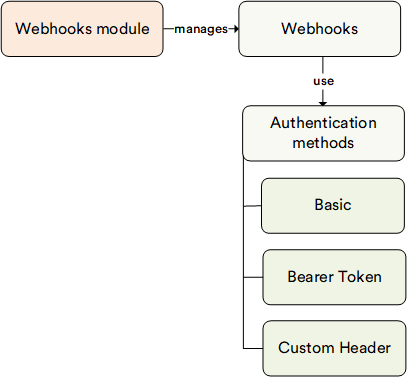

# Webhooks

The **Webhooks** module allows you to monitor important changes within your Virto Commerce ecosystem, such as order changes, catalog and product updates, and more.
When a change you're subscribed to is triggered, you receive a notification at the URL you specified.
You can also configure which fields or parameters to include in the report you receive.

## Key Features

With the Webhooks module:

* Employees can manage webhooks within their permission level.
* Admin users have full control over webhook management.
* It resolves domain events for installed Virto Commerce modules.
* It quietly sends webhook notifications in the background via a POST request, with event data serialized in JSON, to the specified URL.
* It supports Basic, Bearer Token, and Custom Header authentication methods.
* You can access previous values of selected fields.
* The retry policy is configurable, with intervals that increase exponentially.
* Error messages are available for viewing in case a webhook notification fails.

The diagram below illustrates the functionality of the Return module:

