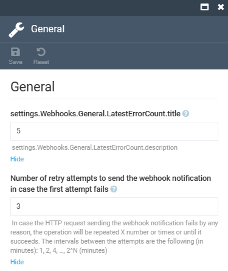

# Settings

To configure the **Webhooks** module settings:

1. Click **Settings** in the main menu.
1. In the search field of the next blade, type **Webhooks** to find the settings related to the module.
1. Click **General** to configure the following settings:

    

1. Click **Save** in the toolbar to save the changes.

The settings have been saved.
