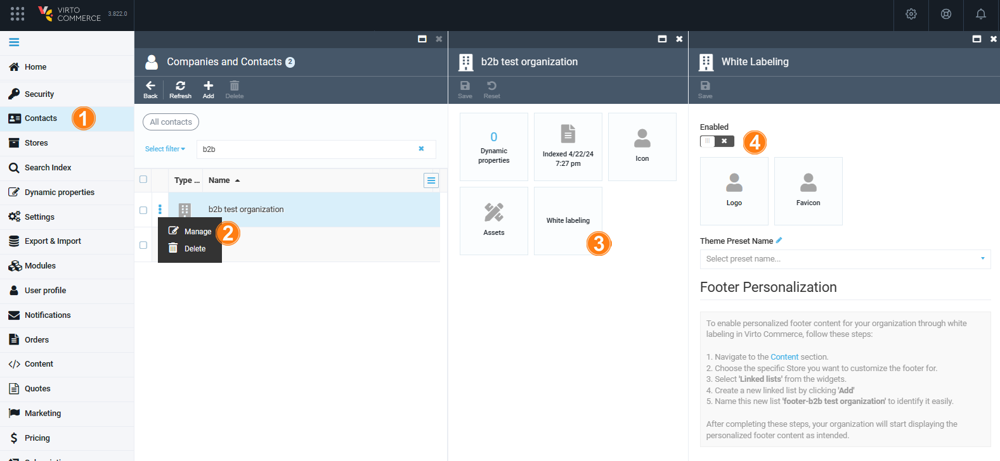

To start customizing brand elements:

1. [Enable white labeling feature via the Stores](customizing-brand-elements.md#enable-white-labeling-via-stores) or [the Contacts module.](customizing-brand-elements.md#enable-white-labeling-via-contacts)
1. [Customize logo and favicon.](customizing-brand-elements.md#customize-logo-and-favicon)
1. [Customize footer.](customizing-brand-elements.md#customize-footer)

## Enable White Labeling via Stores

To enable white labeling via the **Stores** module:

1. Click **Stores** in the main menu.
1. In the next blade, select the desired store.
1. In the next blade, click on the **Settings** widget.
1. In the **Settings** blade, enable white labeling.

You can start using white labeling.

## Enable White Labeling via Contacts

To enable white labeling via the **Contacts** module:

1. Click **Contacts** in the main menu.
1. In the next blade, click on the three dots to the left of the desired company.
1. In the next blade, click on the **White labeling** widget.
1. In the **White Labeling** blade, enable white labeling.

White labeling has been enabled.

## Customize Logo and Favicon

To start using white labeling:

1. Complete steps 1-4 from the instruction above.
1. In the **White Labeling** blade, click on the **Logo** widget to upload your company's logo.
1. Click on the favicon logo to upload favicon.
1. Click **Save** in the toolbar to save the changes.

Your changes have been applied.

## Customize Footer

To enable personalized footer content for your organization by white labeling, follow these steps:

1. Click **Content** in the main menu.
1. Select a store for which you would like to customize the footer and click on the **Link Lists** widget.
1. [Create new link list](../content/managing-linklists.md).
1. Give your new list a descriptive name.

Your organization page starts displaying personalized footer content as intended.