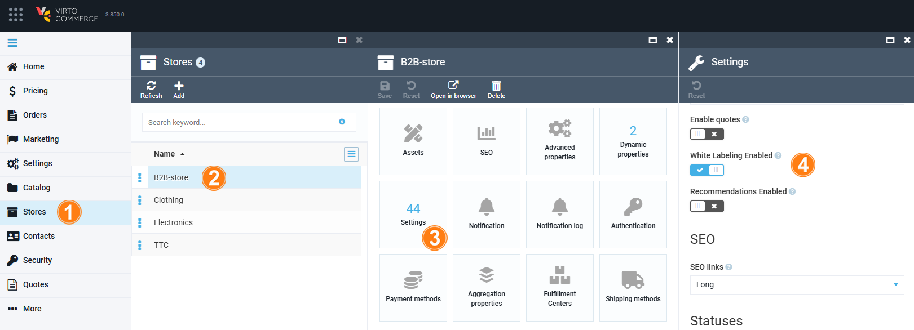

# Customize Brand Elements

To start customizing brand elements:

1. [Enable white labeling feature via the Stores](customizing-brand-elements.md#enable-white-labeling-via-stores) or [the Contacts module.](customizing-brand-elements.md#enable-white-labeling-via-contacts)
1. [Customize logo and favicon.](customizing-brand-elements.md#customize-logo-and-favicon)
1. [Customize footer.](customizing-brand-elements.md#customize-footer)

## Enable white labeling via Stores

To enable white labeling via the **Stores** module:

1. Click **Stores** in the main menu.
1. In the next blade, select the desired store.
1. In the next blade, click on the **White labeling** widget.
1. In the next blade, turn the white labeling option to on.

White labeling has been enabled.

## Enable white labeling via Contacts

To enable white labeling via the **Contacts** module:

1. Click **Contacts** in the main menu.
1. In the next blade, click on the three dots to the left of the desired company.
1. In the next blade, click on the **White labeling** widget.
1. In the **White Labeling** blade, turn the white labeling option to on.

White labeling has been enabled.

## Customize logo and favicon

To add own logos and favicon:

1. In the **White Labeling** blade, click on the **Logo** widget to upload your company's logo.
1. Click on the **Favicon** widget to upload your favicon.
1. Click **Save** in the toolbar, then click **Save** in the previous blade.

Your changes have been applied.

## Customize footer

Let's create the following footer:

1. Go to **Content** --> Your store --> **Link lists**.
1. In the **Link lists** blade, click **Add** in the toolbar.
1. To create root categories, fill in the fields as follows:

    

    !!! note
        Name your footer link list **footer-links** so that the Platform recognizes it as a part of the footer structure.

1. Click **Create**. The current result in the Frontend Application is as follows:

    

1. Now let's add subcategories to the footer root categories. In the **Link lists** blade, click **Add** in the toolbar.
1. For the **My account** category, fill in the fields as follows:

    

1. Click **Create**.

Continue adding subcategories to the root categories according to the example above.

The footer appears in the Frontend Application.

 
 
********

    <a href="../overview">← White Labeling module overview</a>
    <a href="../../integrations/overview">Integrations →</a>

