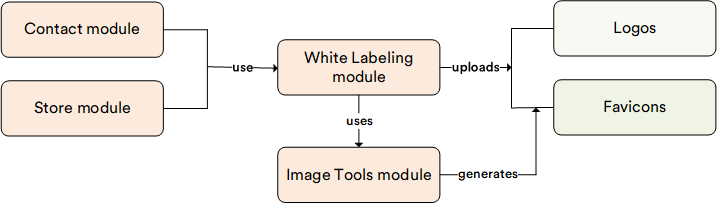

# Overview

The White Labeling module enables organizations to enhance the enterprise user experience by customizing branding elements such as logos, favicons, colors, and footer links based on the logged-in organization context. This module ensures that users from different organizations see personalized branding elements after signing in, improving overall UX and brand consistency.

## Key features

* **Branding Configuration**: Display organization-specific logos, favicons, colors, and footer links post-login.
* **White labeling**: Resolve branding based on the organization context after user authentication.
* **Integration with Virto Frontend**: Seamlessly integrate customized branding elements into Virto Commerce Frontend Application.
* **Custom Domain**: Assign a custom domain with the organization to allow branding activation on the first visit.
* **Automated Favicon Generation**: The module uses Virto Commerce Image Tools module for favicon generation.

The diagram below illustrates the functionality of the White Labeling module:

