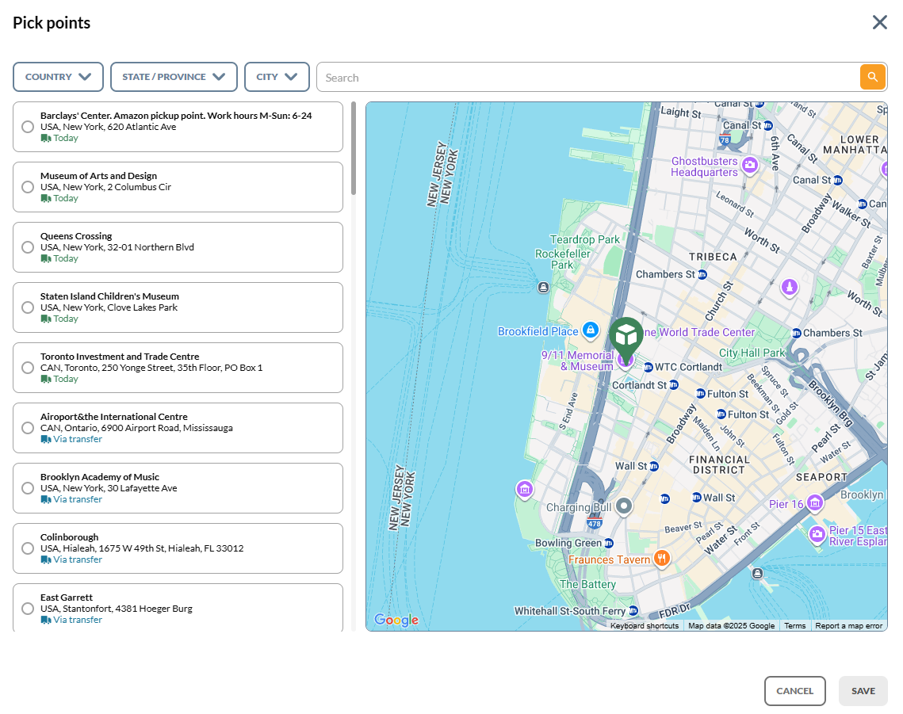

# Overview

The **xPickup** module allows customers to select pickup points for their orders on the Virto Commerce Platform. It integrates pickup options into the checkout process, allowing customers to select from a list of available pickup locations.

{: style="display: block; margin: 0 auto;" width="900"}

## Key features

* Configurable product pickup location details (fulfillment centers, address, geolocation).
* Integration with inventory data (inventory tracking, available in stock quantity).
* Available pickup points in product details page.
* Pickup point selection and confirmation in customer cart.

The diagram below illustrates the functionality of the xPickup module:

{: style="display: block; margin: 0 auto;" }

 
 
********

    <a href="../../skyflow/overview">← Skyflow module overview</a>
    <a href="../managing-pickup-locations">Managing pickup locations →</a>

