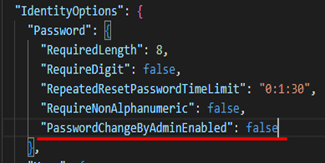
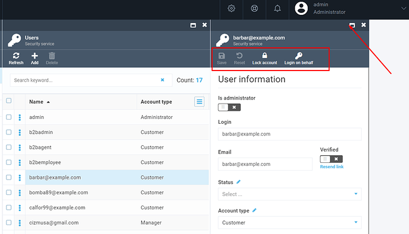
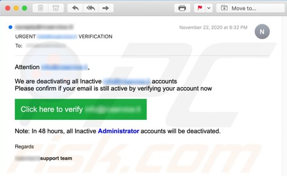
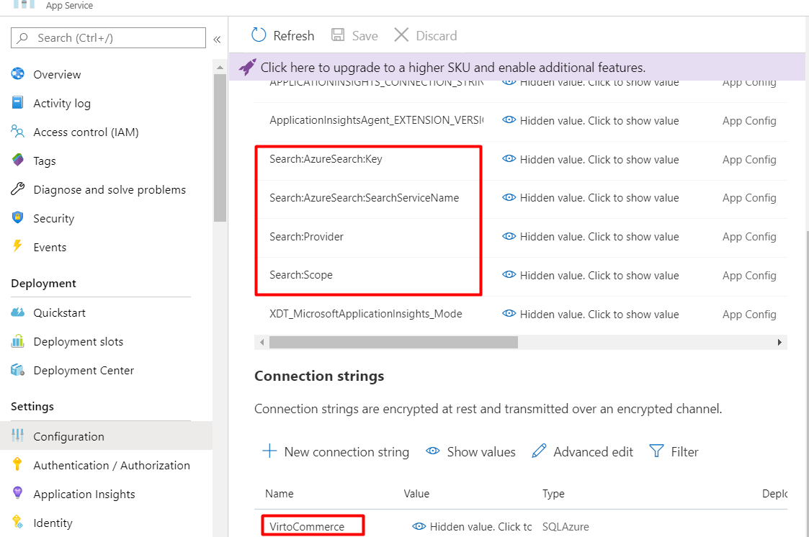

# Appsettings.json
As Virto Commerce Platform is an ASP.NET Core based application, it can be configured as described in [this Microsoft article](https://docs.microsoft.com/en-us/aspnet/core/fundamentals/configuration/?view=aspnetcore-3.1).

## Configuration settings

The configuration keys are hierarchical, and the most convenient way to manage them is to work with the _appsettings.json_ file. The following sections, broken down by configuration node, show the overall structure of the file, provide defaults, and explain what each key is.

!!! note
    All settings listed below are optional unless marked **Required**.

### ConnectionStrings

These **required** settings represent connection strings for VC Platform and modules.

| Node          | Default or sample value           | Description  |
| ------------- | --------------------------------- | ------------ |
| VirtoCommerce | E.g., `Data Source=(local);Initial Catalog=VirtoCommerce3;Persist Security Info=True;User ID=virto;Password=virto; MultipleActiveResultSets=True;Connect Timeout=30` | This required setting is used to provide the VC Platform system connection string to the SQL Server database. VC modules would revert to this connection string if no specific connection string is defined. |
| E.g., VirtoCommerce.Catalog  | E.g., `Data Source=(local);Initial Catalog=VirtoCommerceCatalog;Persist Security Info=True;User ID=virto;Password=virto; MultipleActiveResultSets=True;Connect Timeout=30` | Other module-specific connection string(s). E.g., Virto Commerce Catalog module will use the `VirtoCommerce.Catalog` connection string if it is defined. |                           |
| RedisConnectionString | E.g., `"localhost"` | StackExchange.Redis Configuration string. Read more about [Redis Configuration](https://stackexchange.github.io/StackExchange.Redis/Configuration) for details. |

###  VirtoCommerce

This configuration node defines the system settings of the VC Platform.

| Node                      | Default or sample value                                           | Description                                                                                                   |
| ------------------------- | ----------------------------------------------------------------- | ------------------------------------------------------------------------------------------------------------- |
| CountriesFilePath         |`"localization/common/countries.json"`                             | Local path for the country list, which, by default,<br>includes all countries of the world.                      |
| CountryRegionsFilePath    |`"localization/common/countriesRegions.json"`                      | Local path for state/province list. <br>By default, includes the US states and Canada's provinces.                |
| LicenseActivationUrl      |`"https://virtocommerce.com/admin/api/licenses/activate/"`         | VC Platform license activation service URL.                                                                   |
| LicenseFilePath           |      `"App_Data/VirtoCommerce.lic"`                               | VC Platform license file location.                                                                            |
| LocalUploadFolderPath     | `"App_Data/Uploads"`                                              | The **Uploads** folder location.                                                                                |
| SampleDataUrl             | E.g., `"http://virtocommerce.azureedge.net/sample-data"`          | URL to download sample data upon the initial Platform setup.                                                  |
| AllowInsecureHttp         | `false`                                                           | Manages how the OpenID Connect server (ASOS) handles <br>the incoming requests: whether those arriving to non-HTTPS endpoints<br>should be rejected or not. By default, this property is set to false<br>to help mitigate the man-in-the-middle attacks.                                                                                  |
| Hangfire                  |                                                                   | Background processing library (Hangfire) configuration.<br><br> `JobStorageType`: Current job storage. Supported values: `Memory`, `SqlServer`.<br> `UseHangfireServer`: Enables or disables Hangfire for this app instance.<br> `AutomaticRetryCount`: Maximum number of automatic retry attempts. <br>`SqlServerStorageOptions`: Hangfire.SqlServer.SqlServerStorageOptions.<br>Read more about [Hangfire's SQL Server Configuration](https://docs.hangfire.io/en/latest/configuration/using-sql-server.html#configuration).|
| Swagger                   |                                                                   | Allows you to disable Swagger initialization upon platform<br>startup to prevent access to Swagger UI and documents.
| GraphQL Playground        |                                                                   | Allows you to disable the initialization of the GraphQL Playground<br>at platform startup to prevent access to the GraphQL Playground UI and schemas. By default, the playground is enabled.|
| FileExtensionsBlackList   |                                                                   | This setting is used together with the<br>`VirtoCommerce.Platform.Security.FileExtensionsBlackList` setting (admin UI)<br>to set the extensions of the files the platform does not permit<br>to upload to the server.<br>The `FileExtensionsBlackList` is not accessible from the admin UI.<br>An administrator may provide an additional list of extensions<br>through the UI that may be used with `FileExtensionsBlackList`. |

#### Examples

=== "Hangfire"

    ```json
    "Hangfire": {
    "JobStorageType": "Database",
    "UseHangfireServer": true,
    "AutomaticRetryCount": 1,
    "WorkerCount": 11,
    "Queues": [
    "alpha",
    "default"
    ],
      "SqlServerStorageOptions": {
        "CommandBatchMaxTimeout": "00:05:00",
        "SlidingInvisibilityTimeout": "00:05:00",
        "QueuePollInterval": "00:00:00",
        "UseRecommendedIsolationLevel": true,
        "UsePageLocksOnDequeue": true,
        "DisableGlobalLocks": true,
        "EnableHeavyMigrations": true
      },
      "MySqlStorageOptions": {
        "InvisibilityTimeout": "00:05:00",
        "QueuePollInterval": "00:00:05"
      },
      "PostgreSqlStorageOptions": {
        "InvisibilityTimeout": "00:05:00",
        "QueuePollInterval": "00:00:05",
        "UseRecommendedIsolationLevel": true,
        "UsePageLocksOnDequeue": true,
        "DisableGlobalLocks": true
      }
    }
    ```

=== "Swagger"

    ```json
    "Swagger":
    {
    "Enable": true
    }
    ```

=== "Playground"

    ```json
    "GraphQLPlayground": {
      "Enable": true
    }
    ```

=== "FileExtensionsBlackList"

    ```json
    "FileExtensionsBlackList": [".pdf", ".json"]
    ```

### Serilog

| Node          | Default or sample value                                            | Description                                                                      |
| ------------- | ------------------------------------------------------------------ | -------------------------------------------------------------------------------- |
| Using         | [ `"Serilog.Sinks.Console"`, `"Serilog.Sinks.Debug"` ]             | List of assemblies for logging providers in which<br>configuration methods reside.  |
| MinimumLevel  | `Information`<br> `Warning` <br> `Error` <br> `Debug` <br> `Trace` | Minimum severity level of log message.                                           |

#### Example

```json
"Serilog": {
    "Using": [
      "Serilog.Sinks.Console",
      "Serilog.Sinks.Debug"
    ],
    "MinimumLevel": {
      "Default": "Information"
    },
    "WriteTo": [
      "Console",
      "Debug"
    ],
    "Enrich": [
      "FromLogContext"
    ]
}
```

### FrontendSecurity

|Node                       | Default or sample value  | Description                                                     |
|---------------------------|--------------------------|-----------------------------------------------------------------|
|OrganizationMaintainerRole | Organization maintainer  | The role that defines permissions for organization maintainers. |

#### Example

```json
"FrontendSecurity": {
    "OrganizationMaintainerRole": "Organization maintainer"
}
```

### Auth

This setting determines platfom authencification parameters.

| Node          | Default or sample value   | Description                                                                                                                  |
| ------------- | ------------------------- | ---------------------------------------------------------------------------------------------------------------------------- |
|ConnectionString|                          |This is an optional connection string to the authentification database.<br>If it is not provided, the security tables is placed into the main VirtoCommerce database.|

#### Example

```json
"Auth": {
    //auth server's url, e.g. https://localhost:5051/ or https://auth.example.com/ or leave empty for mode when authorization
    // and resource server is the same application
    "Authority": "",
    "Audience": "resource_server",
    "PublicCertPath": "./certificates/virtocommerce.crt",
    "PrivateKeyPath": "./certificates/virtocommerce.pfx",
    "PrivateKeyPassword": "virto"
}
```

### Assets

This **required** setting determines how VC Platform will be working with assets, i.e. files.

| Node          | Default or sample value   | Description                                                                                                                  |
| ------------- | ------------------------- | ---------------------------------------------------------------------------------------------------------------------------- |
| Provider      | `"FileSystem"`            | Current asset provider. Supported values: FileSystem, AzureBlobStorage.                                                      |
| FileSystem    |                           | File system based asset provider configuration. Used when the `Provider` setting has the `FileSystem` value.                 | 
| AzureBlobStorage |                        | Azure Blob Storage based asset provider configuration. Used when the `Provider` setting has the `AzureBlobStorage` value.    |

#### Examples

=== "FileSystem"

    ```json
    "FileSystem": {
    "RootPath": "~/assets",
    "PublicUrl": "http://localhost:5001/assets/"
    }
    ```

=== "AzureBlobStorage"

    ```json
    "AzureBlobStorage": {
    "ConnectionString": "",
    "CdnUrl": ""
    }  
    ```

### Authorization

This configuration node defines authorization settings for the system.

| Node                      | Default or sample value   | Description                                                                                               |
| ------------------------- | ------------------------- | --------------------------------------------------------------------------------------------------------- |
| ReturnPasswordHash        | `true`                    | A boolean setting that determines whether to return the password hash during user authentication.<br>If set to `true`, the password hash is returned; if set to `false`, it's not returned. |
| RefreshTokenLifeTime     | `"30.00:00:00"`           | The time span specifying the lifetime of a refresh token.<br>A refresh token is used to obtain a new access token without re-entering<br>the user's credentials. The default is 30 days. |
| AccessTokenLifeTime      | `"00:30:00"`              | The time span specifying the lifetime of an access token.<br>An access token is used to access protected resources.<br>The default is 30 minutes. |
| LimitedCookiePermissions | `"platform:asset:read;platform:export;content:read;platform:asset:create;licensing:issue;export:download"` | A semicolon-separated list of permissions that define the limited cookie permissions for the user. These permissions determine what actions the user can perform when using cookies for authentication. |
| AllowApiAccessForCustomers| `false`                   | A boolean setting that controls whether API access is allowed for customers.<br>If set to `false`, customers are not allowed to access the API; if set to `true`, they are granted API access. |

#### Example

```json
"Authorization": {
  "ReturnPasswordHash": true,
  "RefreshTokenLifeTime": "30.00:00:00",
  "AccessTokenLifeTime": "00:30:00",
  "LimitedCookiePermissions": "platform:asset:read;platform:export;content:read;platform:asset:create;licensing:issue;export:download",
  "AllowApiAccessForCustomers": false
}
```

<!--modularity-start-->
### Modularity

This node configures external sources, from which modules are being installed and discovered.

| Node                      | Default or sample value                         | Description                                                                                                   |
| ------------------------- | ----------------------------------------------  | ------------------------------------------------------------------------------------------------------------- |
| IncludePrerelease         | `false`                                         | Shows module versions marked<br>as **Prerelease** if value is `true`.                                         |
| DiscoveryPath             | `"./Modules"`                                   | Relative or absolute folder location where the platform will discover the installed modules from.             |
| ModulesManifestUrl        | E.g., `"https://raw.githubusercontent.com/VirtoCommerce/vc-modules/master/modules_v3.json"` | URL to the *.json* file that contains module manifests.           |
| AuthorizationToken        |                                                 | The authorization token to access `ModulesManifestUrl`, added to the `Authorization` header, if specified.    |
| AutoInstallModuleBundles  | `["commerce"]`                                  | Group(s) of modules to install automatically during the initial Platform setup.<br>If you do not need to install anything here, provide an empty array. |

#### Example

```json
  "ExternalModules": {
    "IncludePrerelease": false,
    "ModulesManifestUrl": "https://raw.githubusercontent.com/VirtoCommerce/vc-modules/master/modules_v3.json",
    "AuthorizationToken": "",
    "AutoInstallModuleBundles": [
      "commerce"
    ]
  }
```
<!--modularity-end-->


### Caching
This node manages caching configuration.
<!--caching-start-->
| Node                      | Default or sample value                   | Description  |
| ------------------------- | ----------------------------------------- | ------------ |
| Redis                     |                                           | Redis configuration. Includes the message channel to use and the number of retries.
| CacheEnabled              | <ul><li>`true`</li><li>`false`</li></ul>  | <ul><li>Cache entries are retained based on the expiration settings.</li><li>Disables caching of application data for the entire application.</li></ul> Used when `ConnectionStrings:RedisConnectionString` is not specified.
| CacheSlidingExpiration    | `"0:15:00"`                               | The cache entry will expire if it is not accessed for a specified amount of time.<br>Used when `CacheAbsoluteExpiration` is not defined.
| CacheAbsoluteExpiration   | `"0:5:00"`                                | The Cache entry will expire after a specified amount of time. <br>Used when `RedisConnectionString` is not specified.
<!--caching-end-->

#### Example

Example settings for the `Redis` node:

```json title="appsettings.json"
"Redis": {
"ChannelName": "VirtoCommerceChannel",
"BusRetryCount": 3
} 
```

<!--notifications-start-->

### Notifications

This enables notification configuration for the `VirtoCommerce.Notifications` module.

| Node          | Default or sample value   | Description                                                                                                               |
| ------------- | ------------------------  | ------------------------------------------------------------------------------------------------------------------------- |
| Gateway       | E.g., `"SendGrid"`        | The current notification sending gateway.<br>The out of the box implemented and<br>supported values are `Smtp`, `SendGrid`.  |
| DefaultSender | E.g., `"noreply@gmail.com"` | This **required** setting provides sender<br>identification used by the current notification sending gateway.           |
| Smtp          |                           | SMTP gateway configuration.<br>Used if the `Gateway` setting has the `Smtp` value.                                        |
| SendGrid      |                           | SendGrid gateway configuration.<br>Used when the `Gateway` setting has the `SendGrid` value.                              |
|`Notifications:DiscoveryPath`|`Templates`  |Relative folder path in the local file system<br>that will be used to discover notification template files<br>during notification rendering.
|`Notifications:FallbackDiscoveryPath`|     |Alternative relative folder path in the local file<br>system that will be used to discover alternative template<br>files during notification rendering.<br>Templates found through this path will be used as backup,<br>in case the templates defined in the<br>`Notifications:DiscoveryPath` setting are not found.

#### Examples

=== "Smtp"

    ```json
    "Smtp": {
    "SmtpServer": "http://smtp.gmail.com",
    "Port": 587,
    "Login": "my-login",
    "Password": "my-password"
    }
    ```

=== "SendGrid"

    ```json
    "SendGrid": {
    "ApiKey": "my-SendGrid-Api-Key"
    } 
    ```
<!--notifications-end-->

<!--search-start-->
### Search

This configures full text search for the `VirtoCommerce.Search` module.

| Node                        | Default or sample value   | Description                                                                                                                                   |
| ----------------------------| ------------------------- | --------------------------------------------------------------------------------------------------------------------------------------------- |
| Provider                    | E.g., `"Lucene"`          | This **required** setting specifies the current search provider. The supported values are  `Lucene`, `AzureSearch`, and `ElasticSearch`.      |
| Scope                       | E.g., `"default"`         | This setting determines the scope to use and is **required**.                                                                                 |
| Lucene                      |                           | Lucene provider configuration for the **VirtoCommerce.LuceneSearch** module.<br>Used when the `Provider` setting has the `Lucene` vaue.            |
| AzureSearch                 |                           | AzureSearch provider configuration for the **VirtoCommerce.AzureSearch** module.<br>Used when the `Provider` setting has the `AzureSearch` value.  |
| ElasticSearch               |                           | Elasticsearch  provider configuration for the **VirtoCommerce.ElasticSearch** module.<br>Used when the `Provider` setting has the `ElasticSearch` value.|
|OrderFullTextSearchEnabled   | `true`                    | This boolean setting enables full-text search for orders.<br>If true (by default), full-text search for orders is enabled,<br>and it allows searching for orders based on their content. |
|ContentFullTextSearchEnabled | `true`                    | This boolean setting enables full-text search for content.<br>If true (by default), full-text search for content is enabled,<br>and it allows searching for content items based on their textual content.|

#### Examples

=== "Lucene"

    ```json
    "Lucene": {
    "Path": "App_Data/Lucene"
    } 
    ```

=== "AzureSearch"

    ```json
    "AzureSearch": {
    "SearchServiceName": "my-ServiceName",
    "Key": "my-AccessKey"
    } 
    ```

=== "ElasticSearch"

    ```json
    "ElasticSearch": {
    "Server": "localhost:9200",
    "User": "elastic",
    "Key": "",
    "EnableHttpCompression": ""
    <!-- For ES 8.0 and higher must be set to True -->
    "EnableCompatibilityMode": true 
    } 
    ```
<!--search-end-->

### Content
This **required** setting is used for static content configuration (including themes) for the `VirtoCommerce.Content` module.

| Node              | Default or sample value   | Description  |
| -------------     | ------------------------  | ------------ |
| Provider          | `"FileSystem"`            | Current content (file) provider. The supported values are `FileSystem` and `AzureBlobStorage`.
| FileSystem        |                           | File system based content provider configuration. This is the default provider used unless `AzureBlobStorage` is set as the current provider.
| AzureBlobStorage  |                           | Azure Blob Storage based content provider configuration. Used when the `Provider` setting has `AzureBlobStorage` as value.

#### Examples

=== "FileSystem"

    ```json
    "FileSystem": {
    "RootPath": "~/cms-content",
    "PublicUrl": "http://localhost:10645/cms-content/"
    }  
    ```

=== "AzureBlobStorage"

    ```json
    "AzureBlobStorage": {
    "ConnectionString": "",
    "CdnUrl": ""
    }
    ```

### Tax

This setting is used to configure tax providers.

| Node                    | Default value | Description                                                                                           |
|-------------------------|---------------|-------------------------------------------------------------------------------------------------------|
| `FixedRateTaxProvider`  | `false`         | Determines whether the `FixedRateTaxProvider` is enabled or disabled. When set to `false`, the `FixedRateTaxProvider` is not active, and tax calculations will not be performed using this provider. When set to `true` the `FixedRateTaxProvider` will be enabled, allowing the platform to use fixed-rate tax calculations. |

#### Example

```json
{
"FixedRateTaxProvider": {"Enabled": false}
}
```

<!--security-start-->
### IdentityOptions

There are options to configure the ASP.NET Core Identity system. For more information, read [this guide](https://github.com/dotnet/AspNetCore.Docs/blob/master/aspnetcore/security/authentication/identity-configuration.md#configure-aspnet-core-identity).

| Node                                  | Default or sample value                      | Description                                                                                                                   |
| ------------------------------------- | ---------------------------------------------|------------------------------------------------------------------------------------------------------------------------------ |
| Password.PasswordHistory              |  E.g., `4`                |The number of recent user passwords to check<br>during password validation. An old password<br>cannot be reused for this number of cycles.<br>If the value is set to `0` or not defined,<br>the password history will be disabled. |
| Password.RepeatedResetPasswordTimeLimit |`0:01:0`| The time limit after which a user can request a password reset.                                                 |
| Password.PasswordChangeByAdminEnabled | `true`                                       |Application setting to disable administrators from setting<br>passwords for users in the system.<br>If you set `PasswordChangeByAdminEnabled` to false,<br>admin UI and API will limit changing the password for administrators. |
| User.MaxPasswordAge                   | `90`                      |The time span defining the maximum user password age<br>until it expires. The user is forced to change<br>the expired password upon login to the Platform Manager UI.<br>If the value is set to `0` or not defined, password expiration will be disabled. |
| User.RequireUniqueEmail                |                                             | A boolean setting that enforces unique email addresses for user accounts, when enabled.<br>When this setting is enabled, users will not be able to register or use an email address<br>that is already associated with another user account.|
| User.RemindPasswordExpiryInDays       | `7`                                          | Number of days to start showing a password<br>expiry warning in the Platform Manager UI.<br>Used only when password expiration is enabled. |
| Lockout.AutoAccountsLockoutJobEnabled |`false`                                       | A boolean value indicating whether<br>the automatic accounts lockout job is enabled.                            |
| Lockout.LockoutMaximumDaysFromLastLogin| `365`                                       | An integer value representing the maximum number of days<br>since the last login before an account is locked out. |
| Lockout.AutoAccountsLockoutJob        | `default: "0 0 * * *"`                       | A string defining the cron expression<br>for the automatic accounts lockout job.                         |
| Lockout.DefaultLockoutTimeSpan        |                                              | The time span for which a user account is locked out when it exceeds the lockout thresholds.<br>This setting defines how long a user's account will be locked after a certain number of failed login attempts.|

#### Examples

=== "Set PasswordChangeByAdminEnabled to false"

    

    The result will be as follows:

    

=== "Set AutoAccountsLockoutJobEnabled to true"

    

### DataProtection
There are options to configure lifetimes for security tokens that are issued by platform like password reset.

| Node                         | Default value                    | Description                                         |
| ---------------------------- | ---------------------------------|---------------------------------------------------- |
| DataProtection.TokenLifespan | "1.00:00:00" - Defaults to 1 day | The amount of time a generated token remains valid. |

#### Example

Example settings for the `DataProtection` section:

```json
"DataProtection": {
		"TokenLifespan": "24:00:00",		
	},
```

### AzureAd
This node is used for authentication with Azure Active Directory. Check [how to enable authentication with Azure Active Directory](../Fundamentals/Security/configuring-and-managing-azure-auth.md) for details.

| Node                  | Default or sample value   | Description  |
| --------------------- | ------------------------- | ------------ |
| Enabled               | `false`                   | Enables authentication with Azure Active Directory. By default, this value is `false`, i.e. the authentication is deisabled.
| UsePreferredUsername  | `false`                   | If set to `true`, the system will check the `preffered_username` in case the `upn` claim returns empty.
| Priority              | 0                         | Configures the priority of the Azure Active Directory login popup on the _Login_ page. The lowest value means the highest priority.
| AuthenticationType    |                           |Provides the authentication scheme. Must always have the `AzureAD` value set.
| AuthenticationCaption |                           | Sets a human-readable caption for the Azure AD authentication provider. Visible on the **Sign In** page.
| ApplicationId         | 01234567-89ab-cdef-0123-456789abcdef | The ID of the Virto Commerce platform application registered in Azure Active Directory. You can find it in the Azure control panel through **Azure Active Directory --> App registrations --> (platform app) --> Application ID**.
| TenantId              | abcdef01-2345-6789-abcd-ef0123456789 | The ID of the Azure AD domain that will be used for authentication. You can find it in the Azure control panel through **Azure Active Directory --> Properties --> Directory ID**.  |
| AzureAdInstance       |https://login.microsoftonline.com  | URL of the Azure AD endpoint used for authentication.
| DefaultUserType       | `Manager`<br>`Customer`           | Default user type for new users created upon first sign in by Azure AD accounts.
| DefaultUserRoles      | `Order manager`<br>`Store manager`| Default user roles assigned to new users created upon first sign-in by Azure AD accounts.
| MetadataAddress       |                           | An optional setting that enables the discovery endpoint for obtaining metadata. Must be set only when your app has custom signing keys.
| UsePreferredUsername  | `false`                   | Indicates whether to use the `preferred_username` claim as a fallback scenario in case the UPN claim is not set for getting user name.

!!! note
	**Note to the `MetadataAddress` node**
	
	If your app has custom signing keys as a result of using the claim mapping feature, you should append the `appid` query parameter containing the app ID in order to get a `jwks_uri` pointing to your app's signing key information.
    For instance, [https://login.microsoftonline.com/{tenant}/v2.0/.well-known/openid-configuration?appid=6731de76-14a6-49ae-97bc-6eba6914391e](https://login.microsoftonline.com/%7Btenant%7D/v2.0/.well-known/openid-configuration?appid=6731de76-14a6-49ae-97bc-6eba6914391e) contains a `jwks_uri` of [https://login.microsoftonline.com/{tenant}/discovery/v2.0/keys?appid=6731de76-14a6-49ae-97bc-6eba6914391e](https://login.microsoftonline.com/%7Btenant%7D/discovery/v2.0/keys?appid=6731de76-14a6-49ae-97bc-6eba6914391e).

#### Example

Example settings for the `AzureAD` section:

```json
"AzureAd": {
		"Enabled": true,
		"AuthenticationType": "AzureAD",
		"AuthenticationCaption": "Azure Active Directory",
		"ApplicationId": "b6d8dc6a-6ddd-4497-ad55-d65f91ca7f50",
		"TenantId": "fe353e8f-5f08-43b4-89d1-f4acec93df33",
		"AzureAdInstance": "https://login.microsoftonline.com/",
		"DefaultUserType": "Manager",
		"UsePreferredUsername": false,
		"Priority": 0
	},
```

### Crud

This configuration node defines settings for the CRUD operations within the system.

| Node            | Default or sample value | Description                                                                                                   |
| --------------- | ----------------------- | ------------------------------------------------------------------------------------------------------------- |
| MaxResultWindow | 2147483647              | The maximum value for the combination of `skip` and `take` parameters in search requests. By setting this value to `2147483647`, there are no specific limits on the number of records that can be retrieved in a single search request. This effectively allows retrieving a large number of records in a single query. |

#### Example

```json
"Crud": {
    "MaxResultWindow": 2147483647
}
```

### Application Insights

<!--AppInsights-start-->
Add and customize the Application Insight section in the `appsettings.json` file.

| Node                              	    | Default or sample value   	| Description                                                                                                	|
|---------------------------------------	|---------------------------	|--------------------------------------------------------------------------------------------------------------	|
| `SamplingOptions.Processor`           	| `Adaptive`<br>`Fixed`      	| Lets you choose between two sampling methods: <ul> <li>**Adaptive sampling**: automatically adjusts the volume of telemetry sent from the SDK in your ASP.NET/ASP.NET Core app, and from Azure Functions.<br>[Read more](https://learn.microsoft.com/en-us/azure/azure-monitor/app/sampling?tabs=net-core-new#configuring-adaptive-sampling-for-aspnet-applications){ .md-button }</li> <li>**Fixed-rate sampling**: reduces the volume of telemetry sent from both applications. Unlike adaptive sampling, it reduces telemetry at a fixed rate controlled by `SamplingPercentage` setting. </li> </ul> 	|
| `IncludedTypes`                       	| `Dependency`<br>`Event`<br>`Exception`<br>`PageView`<br>`Request`<br>`Trace`  	| A semi-colon delimited list of types to be sampled. The specified types will be sampled. All telemetry of other types will always be transmitted. All types are included by default.                                                                                        |
| `ExcludedTypes`                       	| `Dependency`<br>`Event`<br>`Exception`<br>`PageView`<br>`Request`<br>`Trace` | A semi-colon delimited list of types not to be sampled. All telemetry of the specified types is transmitted. The types that aren't specified will be sampled. Empty by default.                                                                                                    |
| `EnableSqlCommandTextInstrumentation` 	| `true`<br>`false`          	| For SQL calls, the name of the server and database is always collected and stored as the name of the collected Dependency Telemetry. Another field, called data, can contain the full SQL query text. To opt in to SQL Text collection, set this setting to `true`.                                                              |
| `IgnoreSqlTelemetryOptions`           	|                            	| Controls the Application Insights telemetry processor that excludes SQL queries related to dependencies. Any SQL command name or statement that contains a string from the `QueryIgnoreSubstrings` options will be ignored.                           	|

#### Example

To configure 'ApplicationInsights': 

1. Use current active telemetry configuration which is already initialized in most application types like ASP.NET Core:
    ```JSON
    {
      "ApplicationInsights": {
        "ConnectionString": "<Copy connection string from Application Insights Resource Overview>"
      }
    }
    ```

1. Configure Platform AP telemetry behavior inside the `VirtoCommerce:ApplicationInsights` section: 
    ```JSON
    {
      "VirtoCommerce": {
        "ApplicationInsights": {
          "SamplingOptions": {
            "Processor": "Adaptive",
            "Adaptive": {
              "MaxTelemetryItemsPerSecond": "5",
              "InitialSamplingPercentage": "100",
              "MinSamplingPercentage": "0.1",
              "MaxSamplingPercentage": "100",
              "EvaluationInterval": "00:00:15",
              "SamplingPercentageDecreaseTimeout": "00:02:00",
              "SamplingPercentageIncreaseTimeout": "00:15:00",
              "MovingAverageRatio": "0.25"
            },
            "Fixed": {
              "SamplingPercentage": 90
            },
            "IncludedTypes": "Dependency;Event;Exception;PageView;Request;Trace",
            "ExcludedTypes": ""
          },
          "EnableSqlCommandTextInstrumentation": true,
          "IgnoreSqlTelemetryOptions": {
            "QueryIgnoreSubstrings": [
              "[HangFire].",
              "sp_getapplock",
              "sp_releaseapplock"
            ]
          }
        }
      }
    }
    ```

<!--AppInsights-end-->

### PasswordLogin
This node enables authentication with username and password.

| Node      | Default or sample value   | Description  |
| ----------| ------------------------  | ------------ |
| Enabled   | `true`                    | Always enabled by default. Setting to `false` will disable logging in with username and password.
| Priority  | 0                         | Configures the priority of the password login popup on the _Login_ page. The lowest value means the highest priority.

### LoginPageUI
This node is used for configuration of the background screen and background pattern of the _Login_ page.

| Node          | Default or sample value   | Description  |
| ------------- | ------------------------  | ------------ |
| BackgroundUrl |                           | Login page background URI. If set, takes priority over the preset.
| PatternUrl    |                           | Login page background pattern URI. If set, takes priority over the preset.
| Preset        | `demo`                    | Login page background preset name. If set, searches the preset from the preset list and applies `BackgroundUrl` and `PatternUrl` from it.
| Presets       |                           | A list of background presets.

#### Example

Example settings for the `Presets` node:

```json
"Presets": [
    {
      "Name": "demo",
      "BackgroundUrl": "",
      "PatternUrl": "/images/pattern-demo.svg"
    },
    {
      "Name": "prod",
      "BackgroundUrl": "",
      "PatternUrl": "/images/pattern-live.svg"
    }
]
```
<!--security-end-->

### PlatformSettings

This node is used for Used for platform settings overriding.

|Node           | Default or sample value   | Description  |
| ------------- | ------------------------  | ------------ |
| Settings      |                           | Array of settings to be overriden. These settings will be read only in the admin panel.|

#### Example

```json
"Settings":{
  "ItHasValues": true,
  "Value": 20000,
  "RestartRequired": false,
  "ModuleId": "VirtoCommerce.Sitemaps",
  "GroupName": "Sitemap|General",
  "Name": "Sitemap.RecordsLimitPerFile",
  "IsRequired": false,
  "IsHidden": false,
  "ValueType": 8,
  "DefaultValue": 10000,
  "IsDictionary": false
}
```

## Hierarchic keys and separators

When working with keys, one should follow these rules:

* Within the Configuration API, a colon separator (`:`) works on all platforms.
* In environment variables, a colon separator may not work on all platforms. A double underscore, `__`, is supported by all platforms and is automatically converted into a colon `:`.
* In Azure Key Vault, hierarchic keys use double hyphen `--` as a separator. The Azure Key Vault configuration provider automatically replaces `--` with a `:` when the secrets are loaded into the app configuration.

??? Example "Configuring ElasticSearch on localhost in the `appsettings.json` file"
    


??? Example "Configuring `VirtoCommerce ConnectionString` and other settings through **environment variables** in the **docker-compose.yml** file"
    

??? Example "Configuring `AzureSearch` and other settings trough the **Application settings** in **Azure**"
    

For more information, refer to [ASP.NET configuration guide](https://docs.microsoft.com/en-us/aspnet/core/fundamentals/configuration/?view=aspnetcore-3.1#configuration-keys-and-values).

