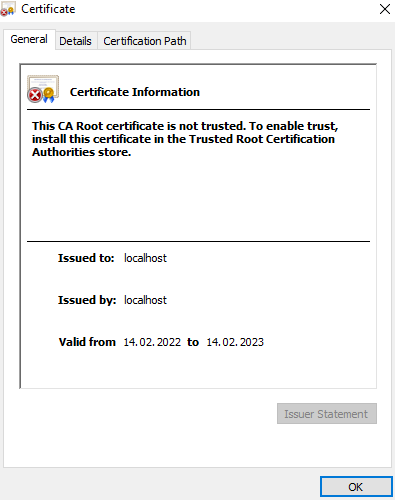
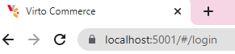

# Setting up Self-signed SSL Certificate
Running Virto Commerce Platform with HTTPS requires using an SSL certificate. When it comes to non-production applications or development and testing scenarios, you can use a self-signed certificate. For more information, see [Installing Self Signed SSL Certificate](https://github.com/VirtoCommerce/vc-platform/blob/new_docs/docs/v2.0/dev_docs/Getting-Started/Installation-Guide/Installing-on-Windows/02-installation-windows-on-premises-precompiled-binaries.md#installing-self-signed-ssl-certificate) and [First Time Launch](https://github.com/VirtoCommerce/vc-platform/blob/new_docs/docs/v2.0/dev_docs/Getting-Started/Installation-Guide/Installing-on-Windows/02-installation-windows-on-premises-precompiled-binaries.md#first-time-launch). 

Although such a certificate implements full encryption, the visitors of your website will see a browser warning saying the certificate should not be trusted.

When you first launch the platform with HTTPS enabled at [https://localhost:5001](https://localhost:5001/), you may also get this warning:

This is because it is a locally generated, untrusted SSL certificate.

If this warning appears:

1. Run `dotnet dev-certs https --trust`

1. Click **Yes** in a popup dialog asking to install this localhost certificate:

    

1. Close your browser and open it again at [https://localhost:5001](https://localhost:5001/). The trusted **Secure** badge appears in your browser (a lock icon):

    

For more information about self-signed certificates, read [Microsoft .NET guide](https://docs.microsoft.com/en-us/dotnet/core/additional-tools/self-signed-certificates-guide).

