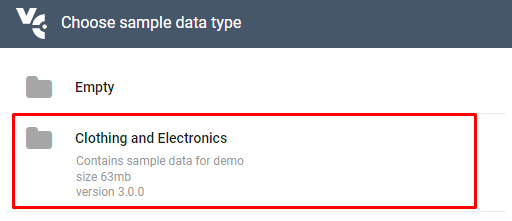
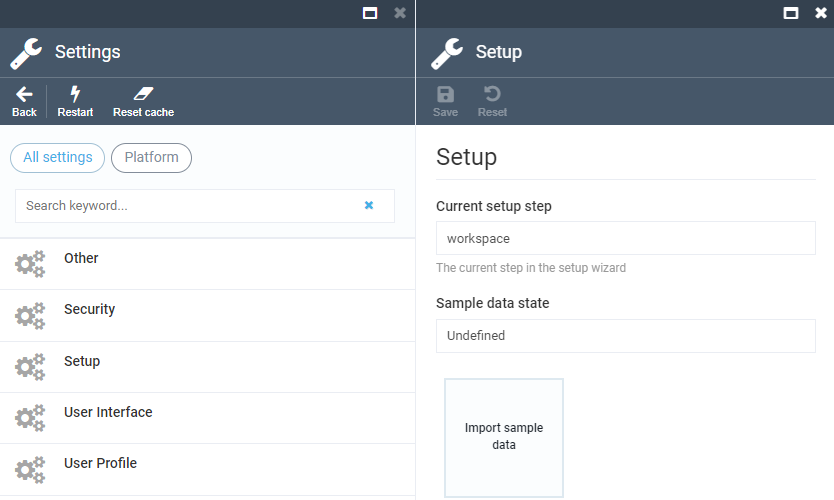

# Importing Sample Data

To help you explore Virto Commerce's capabilities, we provide a sample dataset that you can import to automatically populate various entities. On the first launch, the platform displays a wizard that will prompt you to choose and import sample data. Currently, we offer the **Clothing and Electronics** sample dataset, which includes products, categories, customers, and other demo data that help developers and platform managers learn how Virto Commerce works.

Sometimes you might not want to import sample data right away and can skip this step. If so, you will have to manually import it later.

## Importing Sample Data Manually

To import sample data manually:

1. Open **More** → **Settings** → **Platform** → **Setup** in the Virto Commerce platform.
1. Click the **Import Sample Data** widget:

    

1. Select **Clothing and Electronics** in the popup window. 
1. Wait for the sample data to be downloaded and imported into your system. 

Now you have a complete sample dataset that is ready to use.
