# GraphQL API call from Postman
Many developers use both Postman and Playground to work with GraphQL based on the specific tasks they need to accomplish. Postman provides a wide range of tools for creating, sending, and tracking requests to APIs. Postman allows you to create collections of requests, automate API testing, set up environments, work with variables, create scripts for more complex tests. This guide explains how to make GraphQL API calls using Postman. 

Our instruction contains fundamental guidelines. For more information, refer to the extensive [Postman guide](https://learning.postman.com/docs/introduction/overview/). 

To explore GraphQL via Postman:

1. [Import GraphQL schemas from Playground.](#import-graphql-schemas-from-playground)
1. [Generate collections.](#generate-collection)
1. [Create environments.](#create-environment)
1. [Use tokens.](#authorization-and-token-usage)
1. [Build queries and mutations.](#build-queries-and-mutations)
1. [Use variables.](#use-variables)

## Import GraphQL schemas from Playground

Importing schemas is the crucial initial step to begin working with Postman for GraphQL. To import schemas:

1. Open [Playground](https://virtostart-demo-admin.govirto.com/ui/playground). Inside Playground, locate and click the **Schema** tab.
1. Copy all the content within the **Schema** tab to your clipboard.
1. Open Postman, either using the desktop application or the web version. 
1. In Postman, go to the **APIs** tab in the sidebar. Click **Create an API** or {: width="20"} to add a new API. If necessary, rename your API.
1. In the API setup, look for the **Definition** segment and click {: width="20"}.
1. From the dropdown list that appears, select **Author from scratch**.
1. In the subsequent dropdown lists, set **GraphQL** as the **Definition type** and **GraphQL SDL** as the **Definition format**.
1. Click **Create definition**.
1. Paste the content you copied from Playground into the main field and click **Save**.

    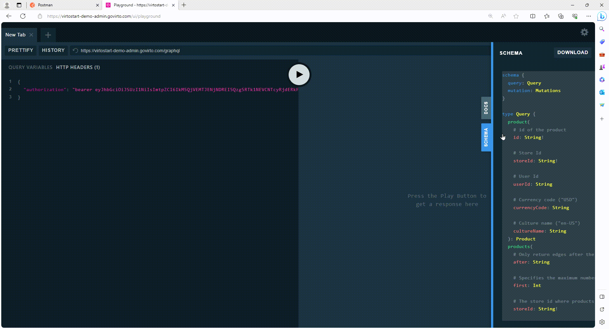

!!! note
    Postman cannot update your schema automatically. You have to update it manually on a regular basis.

## Generate collection

Collections are sets of requests grouped together for organized and streamlined testing and documentation. To generate a collection:

1. Open Postman and navigate to your newly created API.
1. Look for the **Collections** segment and click {: width="20"}. This will open a dropdown list.
1. From the dropdown list, select **Add new collection**.
1. Name your collection in the provided field.
1. Click **Generate Collection**.

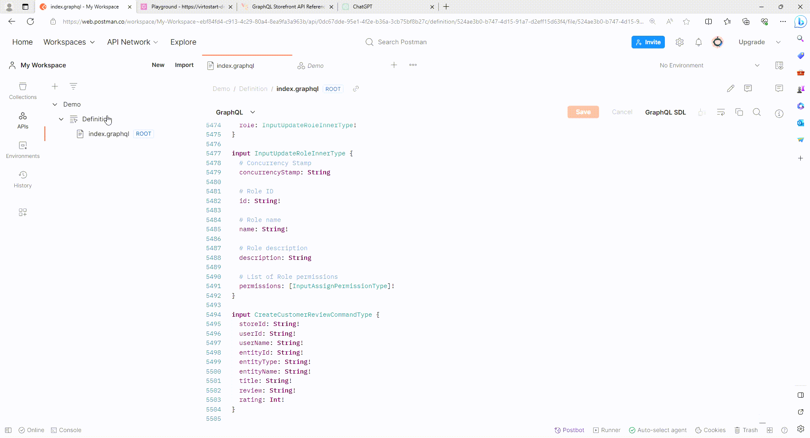    

The list of available queries and mutations appeares in the menu.

## Create environment

Environments are predefined sets of variables that allow you to configure and switch between different testing and development environments easily. To create an environment:

1. Click on the **Environments** tab in the sidebar. 
1. Click {: width="20"} to create a new environment. 
1. Enter its name. 
1. Copy address from Playground and paste it as initial value.
1. In the APIs tab, select your newly created environment from the dropdown list.

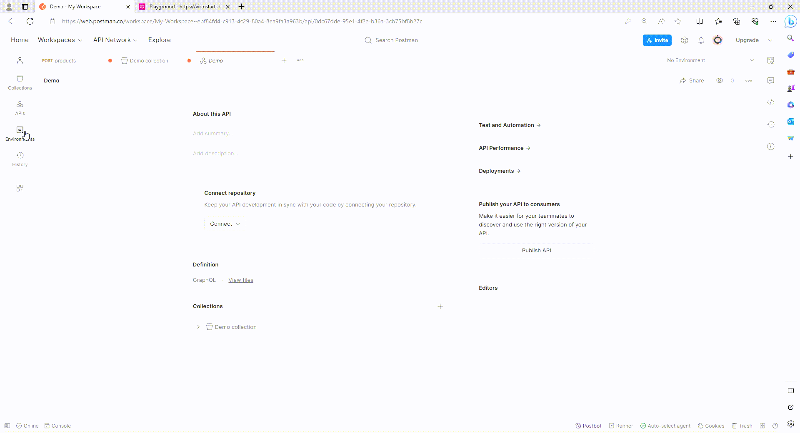

**Example**

This example illustrates how query responses can be adapted to meet specific requirements using variables.

=== "Query" 

    Show total products amount in B2B-store with their:

    * Ids.
    * Names.
    * Images urls.
    * Images ids.
    * Descriptions.

    ```json
    query products ($after: String, $first: Int, $storeId: String!, $userId: String, $currencyCode: String, $cultureName: String, $query: String, $filter: String, $fuzzy: Boolean, $fuzzyLevel: Int, $facet: String,   
        $sort: String, $productIds: [String]) {
        products (after: $after, first: $first, storeId: $storeId, userId: $userId, currencyCode: $currencyCode, cultureName: $cultureName, query: $query, filter: $filter, fuzzy: $fuzzy, fuzzyLevel: $fuzzyLevel, 
            facet: $facet, sort: $sort, productIds: $productIds) {
            totalCount
            items
            {
                id
                name
                images
                {
                    url
                    id
                }
                descriptions
                {
                    languageCode
                    content
                }
            }
        }
    }
    ```

=== "Variables. Sample 1"

    Show first 10 required products in B2B-store.

    ```json
    {
    "after": "0",
    "first": 10,
    "storeId": "B2B-store",
    "query": "",
    "filter": ""
    }
    ```

=== "Variables. Sample 2"

    Show first two Epson products in B2B-Store.

    ```json
    {
    "after": "0",
    "first": 2,
    "storeId": "B2B-store",
    "query": "epson",
    "filter": ""
    }
    ```

=== "Variables. Sample 3"
    
    Filter products by Epson brand. 

    ```json
    {
    "after": "0",
    "first": 2,
    "storeId": "B2B-store",
    "query": "",
    "filter": "brand:epson"
    }
    ```

## Authorization and token usage

In Postman, there are generally two common ways to use tokens, which can be used for authentication in API requests:

* [Generate token via OAuth 2.0 Postman functionality.](#generate-token)
* [Use token as a variable.](#preset-token-as-variable)

### Generate token

To generate token via OAuth 2.0 Postman functionality:

1. Open the **Authorization** tab.
1. From a dropdown list, select **OAuth 2.0** type.
1. Set **Password Credentials** as **Grant Type** to allow exchanging username and password for an access token directly.
1. Enter **Access token URL**. It can be taken:

    * From Swagger.
    * From Platform backend.

1. Enter username and password.
1. Click **Get new access token**.

    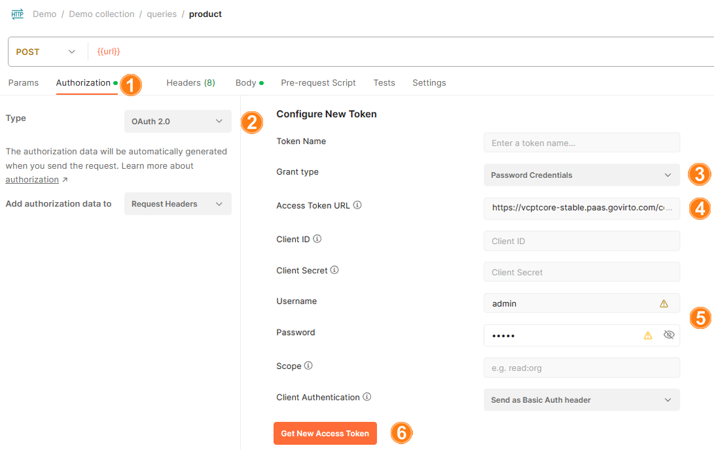

1. The token appears in the new window. Click **Use token** to start using it.

Now all the queries and mutations can use this token.

!!! note
    In the **Authorization** tab, check that the variables are inherited from parent.


## Build queries and mutations

You can use Postman to build queries and mutations:

1. In the top toolbar, click **New** to create a new request.
1. Select **GraphQL** in the next window.
1. Click **Use a GraphQL API** in the query tab. Then select your API from the dropdown list.
1. Enter **{{url}}** in the URL bar.
1. Now you can build queries and mutations in the **Query** tab.

    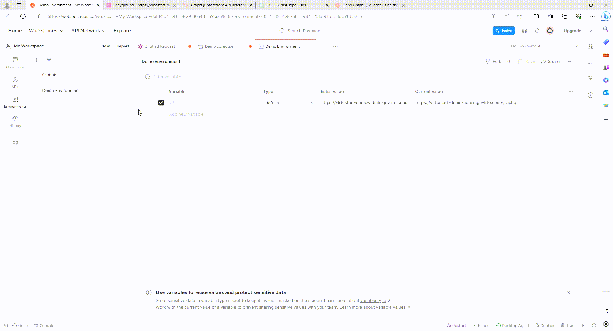


??? Example "Example query"
    Let's build a query asking for the total number of products and categories from the "B2B-store" that contain the word "bolt" in their names or descriptions.

    1. Check **Products** and **Categories** queries in the list of queries and mutations. 
    1. Fill in the required fields that are checked automatically (i.e. **B2B-Store**).
    1. Add **query** field to narrow the results. Fill it in with **bolt**.
    1. Click **Query**.

    There are 93 products and 32 categories in B2B-store that contain the term "bolt" in their names or descriptions.

    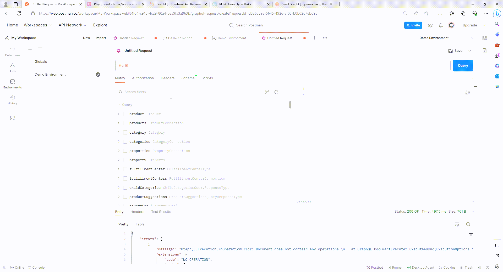


??? Example "Example mutation"
    Let's build a [requestRegistration](/Profile/Mutations/requestRegistration.md) mutation to register **test_organization_name** company and its user named **Test First Name Test Last Name**. 

    1. Click **requestRegistration** and fill in the following fields:

        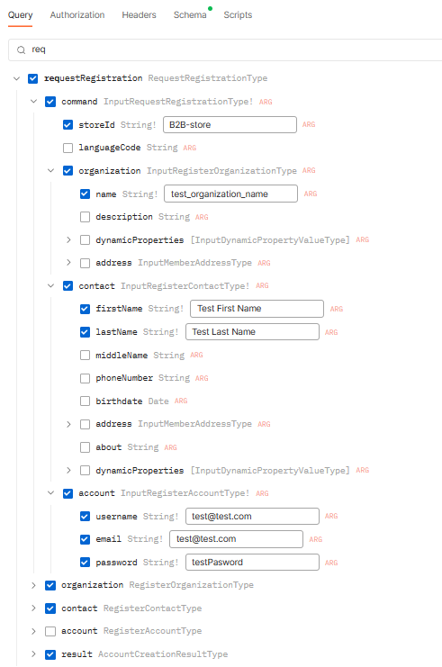

    1. The resulting query looks as follows:

        ```json
        mutation RequestRegistration {
            requestRegistration(
                command: {
                    organization: { name: "test_organization_name" }
                    contact: { firstName: "Test First Name", lastName: "Test Last Name" }
                    account: {
                        username: "test@test.com"
                        email: "test@test.com"
                        password: "testPasword"
                    }
                    storeId: "B2B-store"
                }
            ) {
                organization {
                    id
                    name
                    description
                    status
                    createdBy
                    ownerId
                }
                contact {
                    id
                    firstName
                    lastName
                    middleName
                    phoneNumber
                    birthdate
                    status
                    createdBy
                    about
                    address {
                        id
                        key
                        isDefault
                        city
                        countryCode
                        countryName
                        email
                        firstName
                        middleName
                        lastName
                        line1
                        line2
                        name
                        organization
                        phone
                        postalCode
                        regionId
                        regionName
                        zip
                        outerId
                        description
                        addressType
                    }
                }
                result {
                    succeeded
                    requireEmailVerification
                    errors {
                        code
                        description
                        parameter
                    }
                }
            }
        }
        ```
    1. Click **Query** to execute the mutation.
    1. To check the result, open Platform and click **Contacts** in the main menu.
    1. The **Test organization name** company has been succesfully created with the user **Test first name Test last name**.

    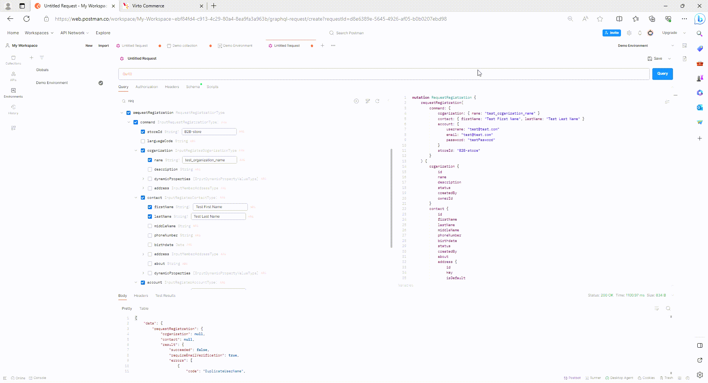

## Preset variables

In Postman, you can preset frequently used variables to streamline the process of sending requests and testing APIs:

1. Click **Environments** in the sidebar to select the required environment.
1. Add frequently used variables and their values.

    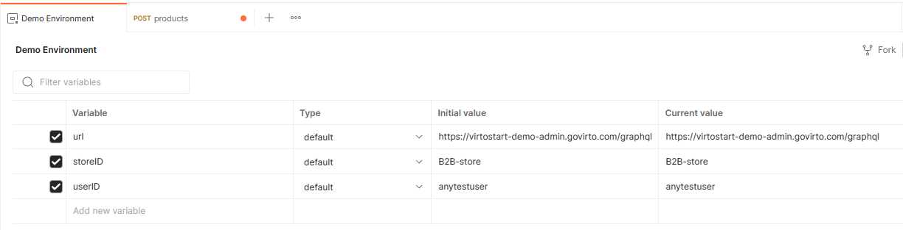

1. Click **Save** to save the changes.

Now you do not need to enter the values for each query and mutation. Enter preset variables in double curly brackets, e.g. **{{StoreID}}**.

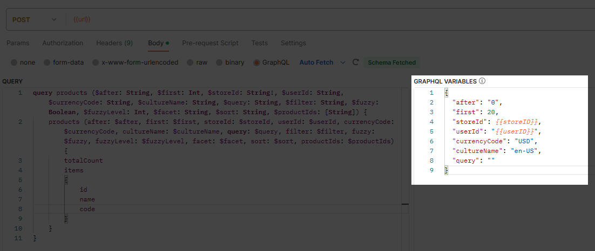

!!! info
    Some variables can be obtained from other queries. For example, you can retrieve the user ID by executing the `createUser` mutation, and to obtain the cart ID, you can use the `cart` query.

### Preset token as variable 

You can set variables programmatically in your request scripts. For more information, refer to the extensive [Postman guide](https://learning.postman.com/docs/sending-requests/variables/#defining-variables-in-scripts). To set your access token as a variable:

1. Execute the following query and provide a variable (e.g., `AdminToken`) to save the response value to in the **Tests** tab. 

    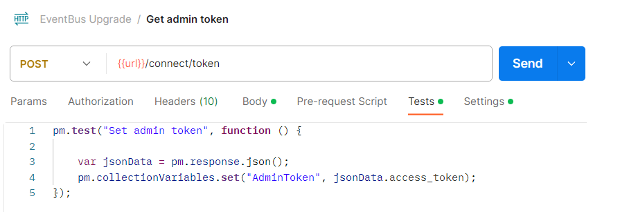

1. In the **Authorization** tab, set the **Token** field as **{{AdminToken}}**.

    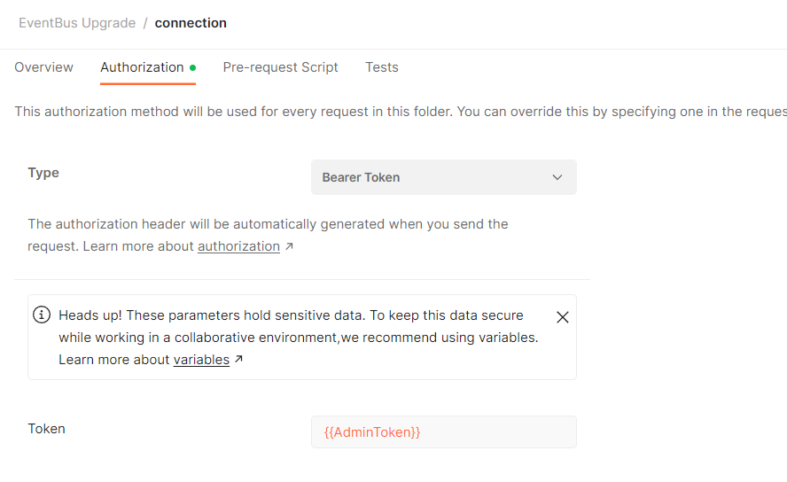

Now you can use your token as a variable.
