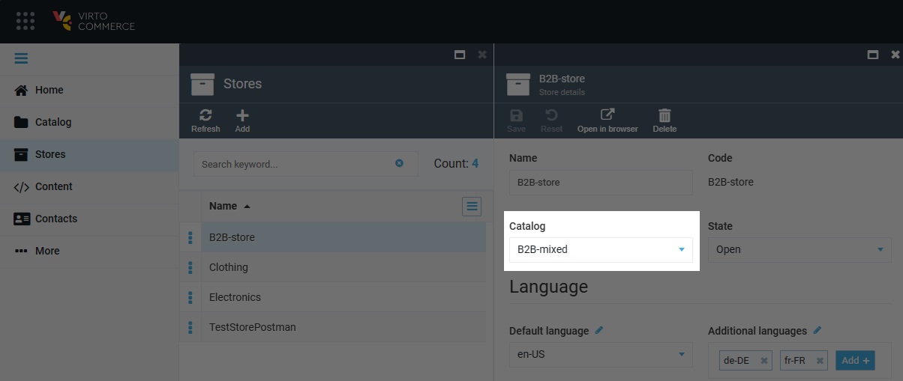
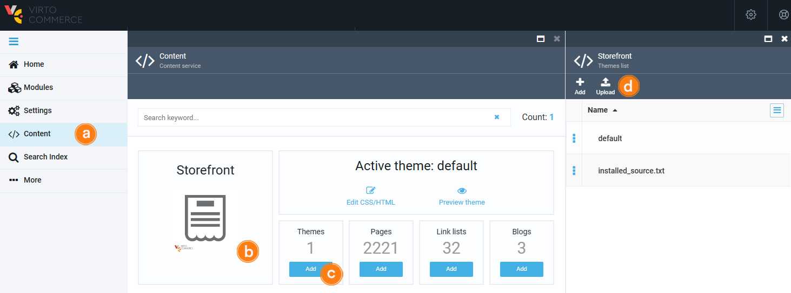
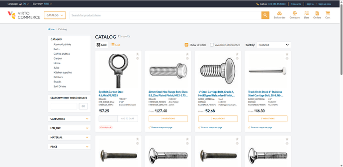
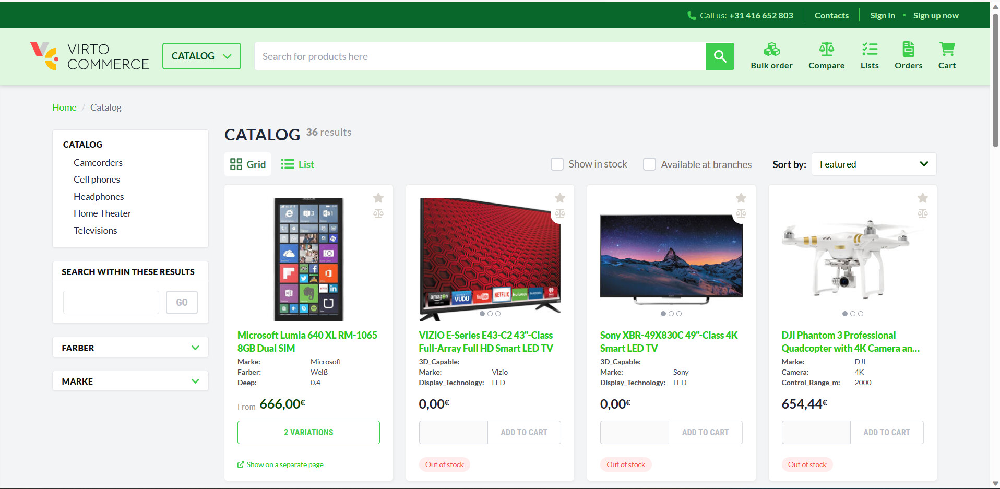

# Configuring Multiple Stores with Multiple Domains

With Virto Commerce, you can configure multiple stores with multiple domains in the same environment. This means you can build and manage different websites for various brands or business entities using a single platform and codebase. 
Configuring multiple stores with multiple domains provides great flexibility and convenience for managing distinct web experiences on the same platform. You can easily set up and configure multiple stores with their own domain names, assign catalogs and price lists, and upload custom themes. 

Additionally, you have the option to share themes between stores to streamline development efforts. With Virto Commerce, you can create a cohesive and efficient multi-store environment to meet the unique needs of your business.

In this guide, we will learn how to set up and configure multiple stores with their own domain names, enabling you to efficiently manage content, marketing activities, and orders for each store.

For demo purposes, we will use [B2B Theme](https://github.com/VirtoCommerce/vc-theme-b2b-vue/) with various presets in the **default\config\settings_data.json** file.

## Prerequisites 

1. Deploy the Virto Commerce Platform and Storefront using the [Virto Commerce documentation](https://docs.virtocommerce.org/new/dev_docs/Getting-Started/Installation-Guide/windows/). 
1. Configure the shared **cms-content** folder between the Storefront and Platform components.
1. [Set up and configure](https://docs.virtocommerce.org/new/user_docs/platform-overview/) languages, currencies, and other relevant settings.
1. Configure or import the necessary catalog(s) for your stores.
1. Configure [price lists](https://docs.virtocommerce.org/new/user_docs/pricing/creating-new-price-list/) and [price list assignments](https://docs.virtocommerce.org/new/user_docs/pricing/adding-new-assignment/) based on your pricing strategy.
1. [Configure inventory](https://docs.virtocommerce.org/new/user_docs/inventory/managing-inventory/) according to your business requirements.
1. Download [Default B2B Theme](https://github.com/VirtoCommerce/vc-theme-b2b-vue/) or Build a custom one.
1. Configure the DNS settings for each domain associated with the stores. Make sure to update the DNS records to point the domain names (e.g., store1-domain.com, store2-domain.com) to the appropriate IP address or hostname where your Virto Commerce instance is hosted. 

## Configure Multiple Stores
To configure multiple stores with their own domains in Virto Commerce:

1. Create and configure **Store1**:
    1. Assign the appropriate catalog to **Store1**.

        

    1. Configure price list assignments for **Store1**, if required.

    !!! note
        Ensure that **Store1** has unique domain name, such as https://store1-domain.com.

1. Deploy the Theme:
    1. Click **Content**.
    1. Select the required store from the list. 
    1. Click on the **Themes** widget.
    1. In the **Themes list** blade, click **Upload** to upload new theme.  
    
    

    The new theme has been uploaded. Go to your store to see it.

    

    !!! note
        The default path for the **CMS-CONTENT** folder is **wwwroot\cms-content\Themes{StoreId}**.

    !!! note
        You can automate theme deployment to the shared **CMS-CONTENT** folder to streamline the process.

1. To create and configure your next store, repeat steps 1 and 2.

    

    !!! note
        Each store should have its own domain name, such as https://store2-domain.com.

## Share Theme Across Multiple Stores

It is possible to share the same theme across multiple stores by using the `LiquidThemeEngine:BaseThemePath` setting in the storefront's **appsettings.json** file.

This approach allows each store's specific **CMS-CONTENT** folder to contain unique store customizations.
