# Setting Up Prerender.io with Azure Application Gateway

[Prerender.io](http://Prerender.io)  is a valuable tool for optimizing your website's SEO performance by rendering JavaScript content for search engine crawlers.

{: width="25"} [Enhancing SEO with Prerender.io](../../storefront-development/integrations/prerender_io.md)

In this guide, we will walk you through the process of setting up **Prerender.io** with **Azure Application Gateway** for our https://virtostart-demo-store.govirto.com single page application using the **Azure Portal**.

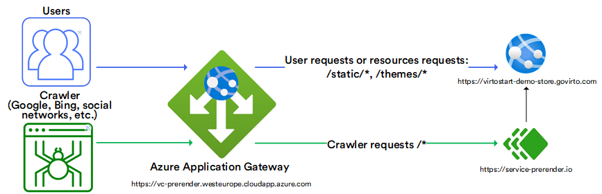

## Prerequisites

* Azure account with an active subscription.
* **Prerender.io** token. [Sign up](http://Prerender.io) to get your token.

    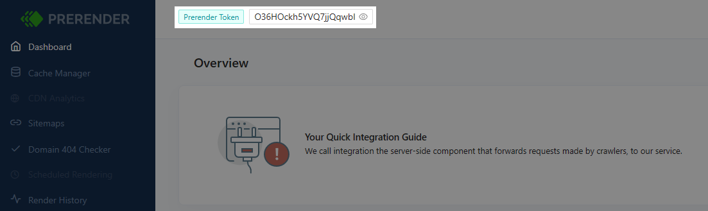

## Create Application Gateway

Create the application gateway using the tabs on the **Create application gateway** page:

1. Click **Create a resource** from the Azure portal menu or from the Home page.
1. Under **Categories**, select **Networking**, and then select **Application Gateway** from the **Popular Azure services** list.

### Basics tab

In the **Basics** tab:

1. Choose a unique name for the Application Gateway.
1. Select a region.
1. Select an SKU based on your requirements.

    The basic settings of selecting a resource group, naming the application gateway, and selecting a VNET subnet are as follows:

    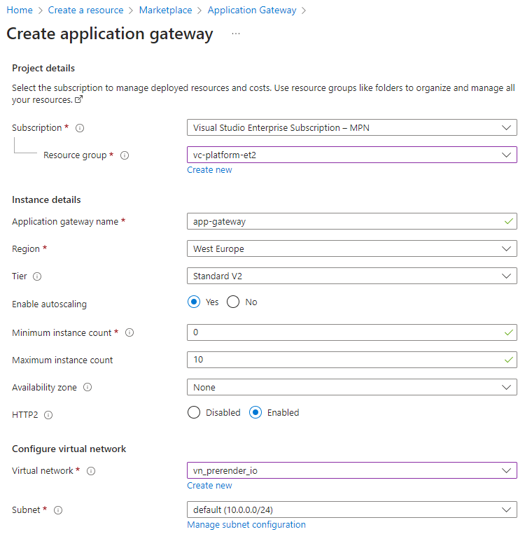

1. Click **Next:Frontends**.

### Frontends tab

In the **Frontends** tab:

1. Select or create the Public IP Address to be assigned to this gateway.
1. Under the **Frontend IP configuration** section, create or select the existing IP configuration.

    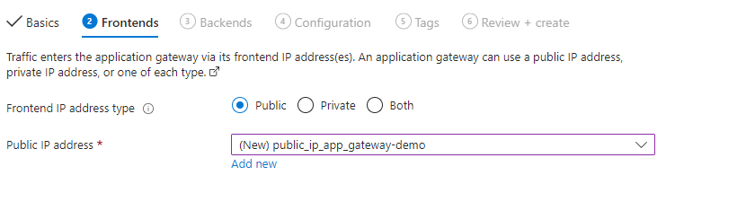

1. Click **Next:Backends**.

### Backends tab

In the **Backends** tab:

1. Click **Add a backend pool**. In this case, we will add two sample backend pools. 
1. Add a pool for the [service.prerender.io](http://service.prerender.io/). Fill in the fields as follows, then click **Add**:
    
    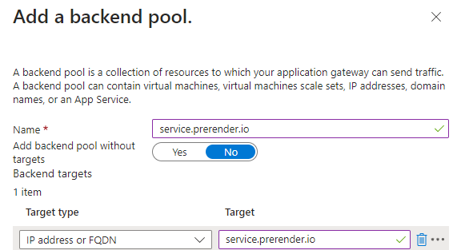
    
1. Add a pool for our downstream frontend https://virtostart-demo-store.govirto.com which runs as a single page application written in Vue.js. This pool will be used to forward all requests for static theme resources directly to the downstream service, bypassing **Prerender.io**. Fill in the fields as follows, then click **Add**:
    
    
    
1. The added pools appear in the list:

    

1. Click **Next:Configuration**.

### Configurations tab

Manage **Configuration** to connect the frontend and backend pool you created using a routing rule:
    
1. Click **Add a routing rule** in the **Routing rules** column. A single routing rule (path-based) that will forward by default all incoming requests to the service.prerender.io by default and all requests to the static resources with the paths matching this pattern `/static/*`,`/themes/*` directly to **virtostart-demo-store.govirto.com**.
1. In the new window, fill in the fields in the **Listener** tab. Fill in the fields as follows and switch to the **Backend targets** tab:

    | Parameter      	| Value                                                              	|
    |----------------	|--------------------------------------------------------------------	|
    | Listener name  	| Enter *https_listener* for the name of the listener                	|
    | Frontend IP    	| Select **Public** to choose the public IP you created for the frontend |
    | Other settings 	| Accept the default values                                          	|

    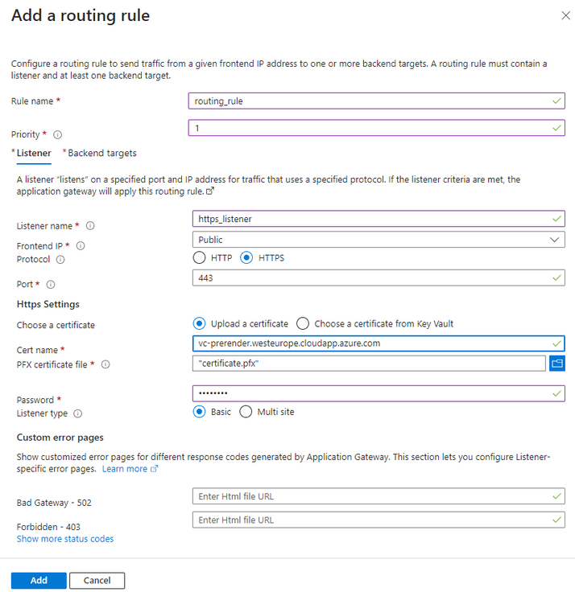
    
    Specify the existing SSL certificate, which was issued for your public domain. In our case, we use an RSA certificate (.pfx) issued by the ZeroSSL service for the domain **vc-prerender.westeurope.cloudapp.azure.com**.

1. In the **Backend targets** tab, fill in the fields as follows:

    | Parameter      	| Value                                                              	|
    |----------------	|--------------------------------------------------------------------	|
    | Rule name  	    | Enter *routing_rule* for the name of the rule                     	|
    | Backend target  	| Select **service.prerender.io**  as default backend pool for rule     |

    
    
1. For the **Backend Settings**, click **Add new**. The **Backend settings** determine the behavior of the routing rule. In the **Add Backend setting** window that opens, enter *https_backend_setting* for the **Backend settings name** and  select **Https** as **backend protocol**. Use **443** for the **Backend port**.  
    Then select **Yes** for the **Override with new host name** option and select **Pick host name from backend target** radio button. Select **No option** for **Create custom probes**:

     

1. Click **Save** to return to the **Add a routing rule** window.

1. In the **Backend targets** tab, click **Add multiple targets to create a path-based rule**. Fill in the fields as follows:

    
    
    The path appears in the paths section, and the rule looks as follows:

    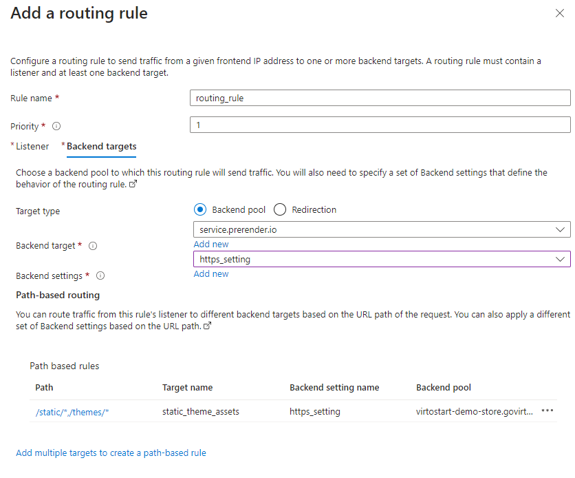

1. In the **Add a routing rule** window, click **Add** to save the routing rule and return to the **Configuration** tab.

1. Click **Next:Tags** to manage tags. Then click **Next: Review + Create**.

1. Review your configurations and click **Create** to deploy the Application Gateway.


## Configure URL rewrite to forward requests to service.prerender.io

Configure the **UrlRewrite** rules to redirect all incoming **GET** requests from a public IP to **service.prerender.io**. 

!!! Example
    When a customer requests https://vc-prerender.westeurope.cloudapp.azure.com/catalog, our rewrite rule redirects and rewrites this request to https://service.prerender.io/https://virtostart-demo-store.govirto.com/catalog and adds an **X-Prerender-Token** header with our auth token value to authorize these requests in the **Prerender.io** service.

1. Select **All resources**, then select your recently created application gateway (**app-gateway**) from the list.
1. Select **Rewrites** in the left panel, then click **+ Rewrite set**:

    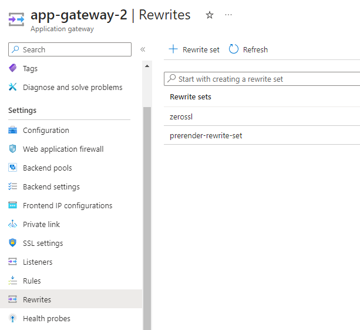

1. Rewrite rule configuration:

    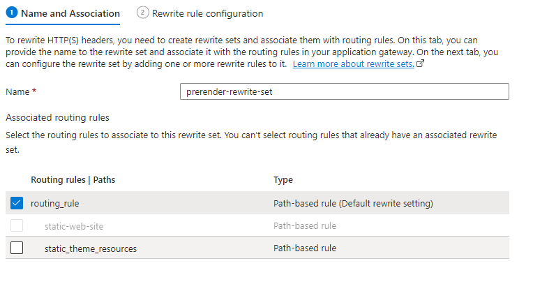

1. Add a rule to add the **X-prerender-token** header to every request:

    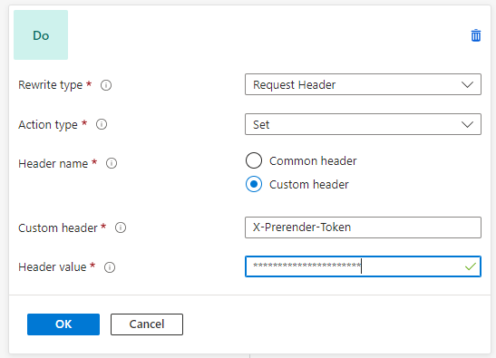

1. Before sending all incoming requests to the backend url **service.prerender.io**, add a rule to rewrite the path for them according to this pattern: `/https://virtostart-demo-store.govirto.com{var_uri_path}`. 

    !!! Example
        The incoming request to the public url https://vc-prerender.westeurope.cloudapp.azure.com/foo will be redirected to https://service.prerender.io/https://virtostart-demo-store.govirto.com/foo after processing this rule.

    


## Verify result

Verify the result by navigating to https://vc-prerender.westeurope.cloudapp.azure.com. The original home page **virtostart-demo-store.govirto.com** should be open:

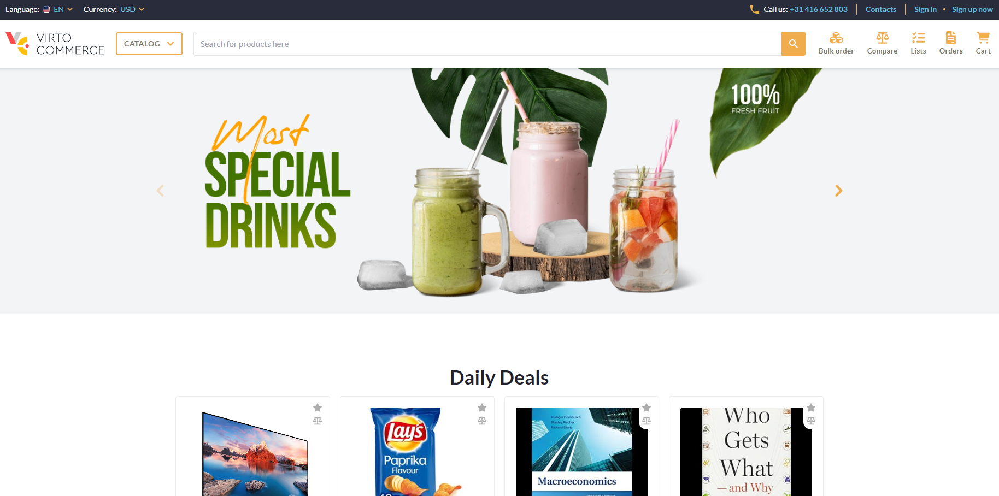

Examine the source code of the page to ensure that it has been pre-rendered by the server, eliminating the render-blocking delays typical of SPA applications. We'll set up a reverse proxy that passes all requests indiscriminately, without distinguishing between real users and web crawlers. However, this approach is not suitable for production scenarios. To refine the configuration and ensure that the pre-rendered version of the site is used exclusively by crawlers, additional URL rewrite rules must be included in the Application Gateway routing. These rules will inspect the user-agent header to see if it matches one of the specified values, such as `googlebot`, `bingbot`, etc. Requests will then be routed to **Prerender.io** only for these identified crawler requests.

## Configure to pre-render site for crawlers only

To pre-render site for crawlers only:

1. Open **routing_rule** for editing:
    1. For **Backend target**, select **virtostart-demo-store.govirto.com**. Now the AGW forwards all requests to the original site by default.
    1. Add new path based rule:

    | Parameter        	| Value                                        	|
    |------------------	|----------------------------------------------	|
    | Path             	| /https://virtostart-demo-store.govirto.com/* 	|
    | Target name      	| service.prerender.io                         	|
    | Backend settings 	| https_listener                               	|
    | Backend target   	| service.prerender.io                         	|

    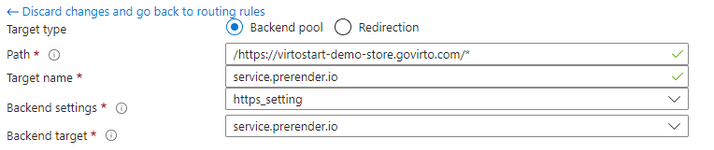

    The resulting routing rule should be as follows:

    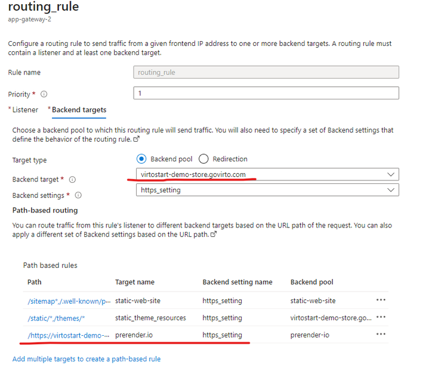

1. Update the rewrite rule to forward requests to the **Prerender.io** service only if the **User-Agent** in the header matches one of the predefined values for crawlers:
    1. Navigate to **Rewrites** and open the **prerender-rewrite-set** rewrite rule for editing.
    1. Add a new condition with the following content. Use the following regular expression as the match pattern for the User-Agent header:

        ```
        (googlebot|bingbot|yandex|baiduspider|facebookexternalhit|twitterbot|rogerbot|linkedinbot|embedly|quora\ link\ preview|showyoubot|outbrain|pinterest\/0\.|pinterestbot|slackbot|vkShare|W3C_Validator|whatsapp|redditbot|applebot|flipboard|tumblr|bitlybot|skypeuripreview|nuzzel|discordbot|google\ page\ speed|qwantify|bitrix\ link\ preview|xing-contenttabreceiver|chrome-lighthouse|telegrambot|google-inspectiontool)
        ```

        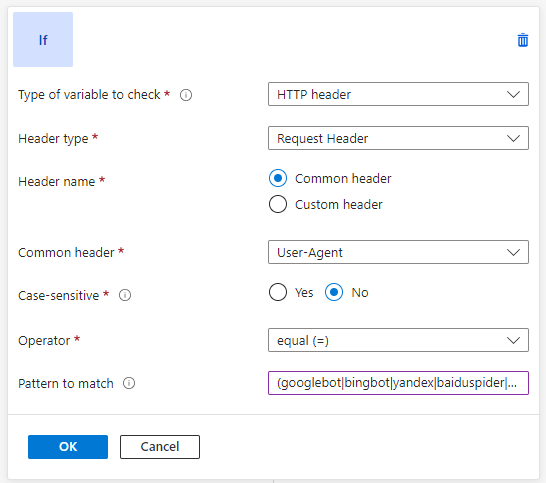

    1. Check the **Re-evaluate path map** for the last action in the rule set:

        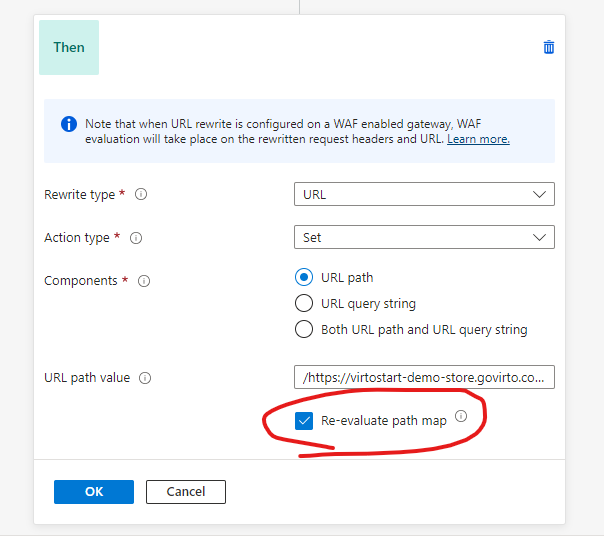
    
        The resulting rewrite rule should be as follows:

        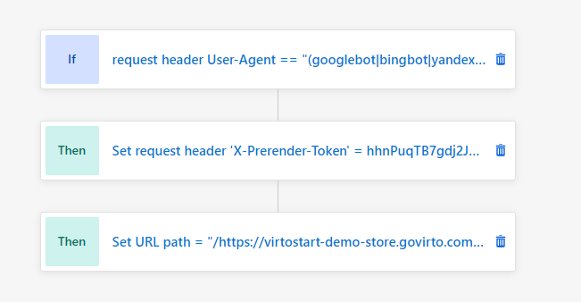
    
1. After applying the changes, check the result. To simulate crawler requests, use Postman, set the User-Agent header to googlebot, and check that the result contains the pre-rendered version of the page.

    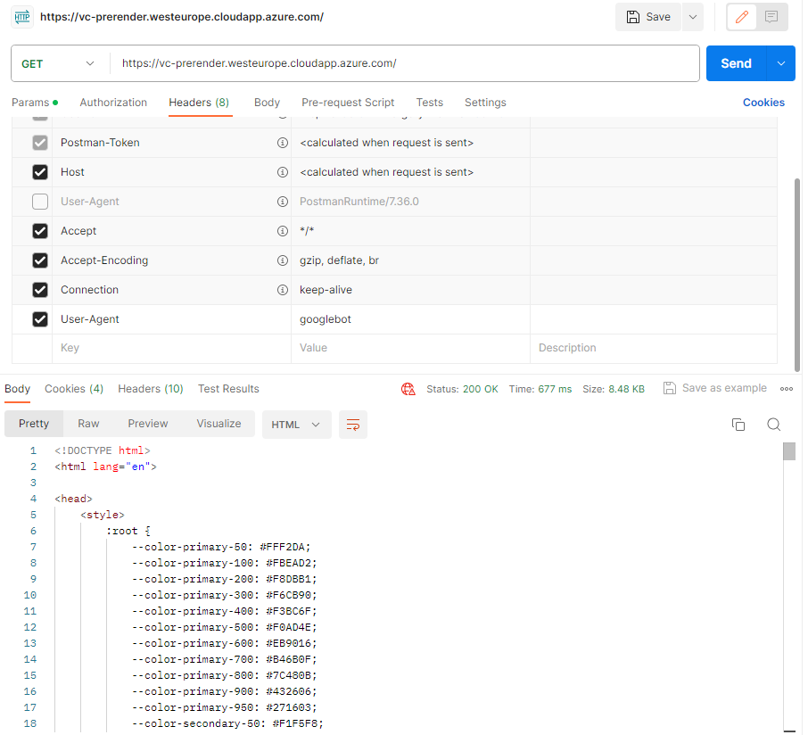

## Wrapping up

This tutorial provides an overview of the steps involved in creating a reverse proxy using Azure Application Gateway to make your single-page application SEO-friendly by using Prerender Seamlessly Renders JavaScript for Faster Indexing for efficient rendering. Following these steps, we will deploy a public proxy, accessible by the URL **https://vc-prerender.westeurope.cloudapp.azure.com**, that will forward requests to virtostart-demo-store.govirto.com using the prerendering capabilities provided by the Prerender.io service.