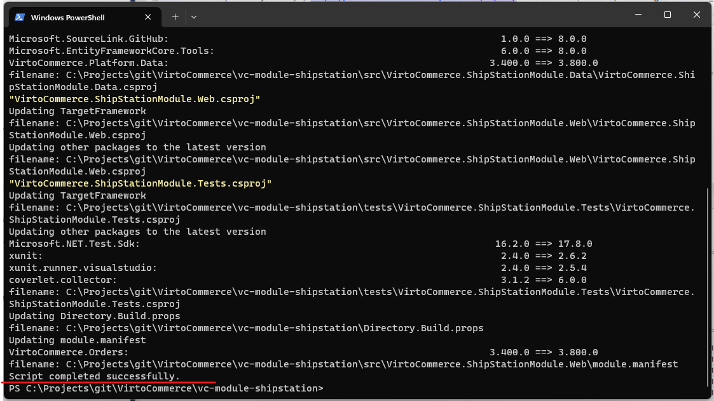

# Upgrading to Virto Commerce on .NET 8

Virto Commerce on NET 8 (3.800+) introduces a significant technical update by transitioning the platform to .NET 8. This update focuses on enhancing performance and stability while maintaining backward compatibility. It involves updating the Target Framework to .NET 8 and integrating the latest LTS releases of third-party libraries. Importantly, no code refactoring or alterations to the API and internal structure have been made.

The release has undergone extensive testing, including unit, end-to-end, regression, and performance tests to ensure a seamless transition as well as for other stable releases.

## .NET 8 Improvements

* **Enhanced performance**: The upgrade to .NET 8 brings substantial improvements in performance, resulting in faster response times and optimized resource utilization. This ensures a smoother and more efficient e-commerce experience for both customers and administrators.

* **Improved stability**: Stability is a cornerstone of this update. By leveraging the advancements in .NET 8, Virto Commerce offers enhanced system reliability and robustness. This translates to fewer disruptions, improved error handling, and increased overall system stability.

* **Optimized bulk operations**: With the transition to .NET 8, bulk operations such as select, update, and delete are optimized for efficiency. This improvement is particularly beneficial for scenarios involving large datasets, providing a noticeable boost in processing speed and resource efficiency.


{: width="25"} [What's new in NET8](https://learn.microsoft.com/en-us/dotnet/core/whats-new/dotnet-8)
{: width="25"} [What's new in EF8 Core](https://learn.microsoft.com/en-us/ef/core/what-is-new/ef-core-8.0/whatsnew)
{: width="25"} [What's new in ASP.NET Core 8](https://learn.microsoft.com/en-us/aspnet/core/release-notes/aspnetcore-8.0?view=aspnetcore-8.0)

## Known Limitations and Breaking Changes

1. **Entity Framework Packages Update:** To prevent "System.MissingMethodException: Method not found errors" when call MigrationBuilder.CreateIndex, it is essential to update Entity Framework packages from version 6 to version 8.
1. **Kestrel HTTPS Binding:** The default HTTPS binding has been removed. Refer to [Microsoft Learn](https://learn.microsoft.com/en-us/dotnet/core/compatibility/aspnet-core/7.0/https-binding-kestrel) for more details.

## Update Process

The process of updating to .NET 8 includes:

1. Installing .NET 8. Follow the [official installation guidelines](https://dotnet.microsoft.com/en-us/download/dotnet/8.0) to set up the environment for the upgrade. 
1. [Updating Virto Commerce Platform and modules](upgrading-to-net8.md#update-virto-commerce-platform-and-modules).
1. [Updating custom modules](upgrading-to-net8.md#update-custom-modules).

### Update Virto Commerce Platform and Modules

=== "Using 'vc-build Update' command"

    Utilize the vc-build Update command for an automated update. This method streamlines the update process, ensuring that all components are seamlessly transitioned to the new version.

    ```cmd
    vc-build Update -Stable -v 8
    ```

=== "Via package.json"

    If you use package.json file for automated deployment, change versions of the platform and Virto Commerce modules to 3.800.0+. Based on latest Stable 8 or Edge release strategy.

=== "Manually" 

Download platform and modules updates to version 3.800+. This method provides more control over the update process, allowing for a step-by-step transition.

### Update Custom Modules

If you develop a custom module, update can be required prior to update .NET dependencies.

### Update Solution to .NET 8

Download and execute the [vc-net8-update.ps1 Power Shell script](https://github.com/VirtoCommerce/vc-platform/blob/dev/docs/release-information/update-to-version-3-800/vc-net8-update.ps1) in your solution folder. To enable execution of PowerShell scripts, set powershell script as trusted if required, by running this power shell command:

```ps1
  Set-ExecutionPolicy -Scope Process -ExecutionPolicy Bypass
```
  

```ps1
./vc-net8-update.ps1
```




This script automates several tasks, including:

1. Updating Target Framework to .NET 8 for every project.
1. Updating project dependencies, including Microsoft NuGet dependencies to version 8.0.0 and VirtoCommerce NuGet dependency to version 3.800.0 and latest.
1. Updating other third-party dependencies to save version that used by Virto Commerce Platform.
1. Updating the **module.manifest** file to align with the changes in .NET 8.


!!! note
    You can perfrom the above updates manually.

### Build Solution

1. Build the solution and meticulously address any compilation errors and warnings if required. This step ensures that the solution is compatible with the updated framework.
1. Verify Tests for Issues Perform a thorough verification of tests to identify and address any issues introduced by the update. This step guarantees that the updated solution maintains the expected functionality and performance.


### Create Module Package

Generate a module package by running `vc-build Compress`. This step finalizes the update process, creating a package that encapsulates the updated modules for deployment.

```cmd
vc-build Compress
```

## Run Virto Commerce on .NET 8

With the update process completed, you can now run and enjoy the enhanced capabilities of Virto Commerce on the .NET 8 platform. Explore the platform new features and optimizations to leverage its full potential for an efficient e-commerce solution.