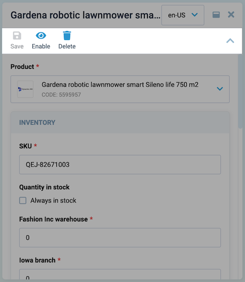

# Toolbar

The toolbar allows you to create buttons with additional actions upon clicking, such as saving or deleting data. Each toolbar button has customizable visibility, disabled status, icon, text, and a customizable method that will be invoked when the button is clicked.

## Usage

Let's explore the two ways of creating a toolbar:

* [Using the `VcBlade` component](Toolbar.md#basic-vue).
* [Employing dynamic views](Toolbar.md#dynamic-views).



### Basic Vue

The `VcBlade` component has a `toolbar-items` prop, that accepts an array of objects with `id`, `title`, `icon`, `clickHandler`, and other properties. For example:

```html
<template>
    <VcBlade
        ...,
        :toolbar-items="bladeToolbar"
        ...,
    >
    </VcBlade>
</template>
```

```typescript
const bladeToolbar = ref<IBladeToolbar[]>([
    {
        id: "refresh",
        title: 'Refresh',
        icon: "fas fa-sync-alt",
        async clickHandler() {
            // your custom refresh logic here
        },
    },
]);
```

### Dynamic Views

To create a toolbar schema, pass a `toolbar` property to the view schema object. The sample schema might look as follows:

```typescript
import { DynamicDetailsSchema } from "@vc-shell/framework";

const schema: DynamicDetailsSchema = {
    settings: {
        // ...
        toolbar: [
            {
                id: "refresh",
                title: 'Refresh',
                icon: "fas fa-sync-alt",
                method: "refresh",
            },
        ],
    },
};
```

This schema creates a toolbar with one button  featuring `refresh` id, `Refresh` title, `fas fa-sync-alt` icon, and `refresh` method. However, the button remains invisible until you add a create method to the `toolbarOverrides` object in the view composable scope. See instruction below to learn how to do this.


#### Binding properties and methods

To add interactivity to your toolbar button, add the `refresh` method to your `toolbarOverrides` object:

```typescript
const useList = (args: // ...): UseList => {
    const scope = ref<ListScope>({
        // ...
        toolbarOverrides: {
            refresh: () => {
                // your custom logic here
            },
        },
    });
}
```

Alternatively, create object with `visible` and `disabled` properties along with the `clickHandler` method:

```typescript
const useList = (args: // ...): UseList => {
    const scope = ref<ListScope>({
        // ...
        toolbarOverrides: {
            refresh: {
                clickHandler(bladeContext) {
                    // your custom logic here
                },
                visible: true,
                disabled: false,
            }
        }
    });
}
```

The `visible` and `disabled` properties can be a boolean, a function, or even a computed property that returns a boolean value.

The`clickHandler` method also has an argument with the provided `bladeContext` object.

{: width="25"} [DynamicBladeList Blade Context](../dynamic-views/Dynamic-Blade-List.md#dynamicbladelist-blade-context) 

{: width="25"} [DynamicBladeForm Blade Context](../dynamic-views/Dynamic-Blade-Form.md#dynamicbladeform-blade-context)

## Toolbar API

The Toolbar API provides a structured set of tools for creating dynamic and customizable toolbars in your application.

### IBladeToolbar interface

The `IBladeToolbar` interface defines the properties available for configuring individual toolbar items. Use this interface to customize the appearance and behavior of each toolbar item within your application.

| Property  | Type                                              | Description                                                                                                           |
|-----------| ----------------------------------------------    |-----------------------------------------------------------------------------------------------------------------------|
| id        | `string`                                            | The Id of the toolbar item.                                                                                           |
| icon      | `string` \| `(() => string)`                          | The icon of the toolbar item. It can be a string or a function that returns a string.                                 |
| disabled    | `boolean` \| `ComputedRef<boolean \| undefined>`    | Whether the toolbar item is disabled.                                                                                 |
| dropdownItems | `IBladeDropdownItem[]`                          | An array of dropdown items for the toolbar item.                                                                      |
| title       | `string` \| `Ref<string>`                           | The title of the toolbar item. It can be a string or a ref to a string.                                               |
| isVisible   | `boolean` \| `Ref<boolean \| undefined>` \| `ComputedRef<boolean \| undefined>`              | Shows if the toolbar item is visible.                                           |
| clickHandler | `((app?: Record<string, any> \| CoreBladeExposed \| null) => void) \| undefined`       | The click handler function for the toolbar item. It takes an optional app object as a parameter.|