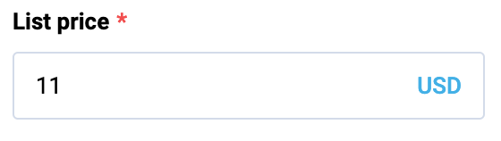

# Input Currency

Input currency is an input component with a currency selector.

## Usage

Include the `vc-input-currency` component in your Vue application, providing theming and enhanced functionality to your currency input.



=== "Basic Vue"

    Create a basic currency input as follows:

    ```html
    <template>
        <vc-input-currency
        :modelValue="inputCurrencyProperty"
        label="Input currency label"></vc-input-currency>
    </template>
    ```

=== "Dynamic Views"

    To start using all the available input currency properties, specify the `vc-input-currency` component when creating the schema. For example:

    ```typescript
    {
        id: "inputCurrencyId",
        component: "vc-input-currency",
        label: "Input currency label",
        property: "inputCurrencyProperty",
        placeholder: "Input currency placeholder",
        optionProperty: "currency",
        optionValue: "value",
        optionLabel: "title",
    }
    ```

    Where `optionProperty` is an object array containing currency data, `optionValue` is the name of the property that contains the value of the currency, `optionLabel` is the name of the property that contains the label of the currency.

    Currency array example:

    ```typescript
    [
        {
            value: "USD",
            title: "US Dollar",
        }
    ]
    ```

## Input Currency API

API empowers you to create dynamic and interactive currency input component to customize its appearance and behavior.

### Basic Vue

You can easily incorporate the `vc-input-currency` component into your Vue applications using simple templates. 

#### Props

To customize the appearance and behavior of your currency input, use the following props:

| Property and Type                                         | Description                                                                                                  |
| --------------------------------------------------------- | ------------------------------------------------------------------------------------------------------------ |
| `modelValue` {==number==}, {==null==}, {==undefined==}    | Model of the currency component. Use with a listener for 'update:price' event OR use v-model:price directive. |
| `label` {==string==}                                      | Input label text. |
| `placeholder` {==string==}                                | Input placeholder text. |
| `hint` {==string==}                                       | Input description (hint) text below input component. |
| `clearable` {==boolean==}                                 | Appends clearable icon when a value is set; When clicked, model becomes null. |
| `prefix` {==string==}                                     | Prefix. |
| `suffix` {==string==}                                     | Suffix. |
| `name` {==string==}                                       | Used to specify the name of the control. If not specified, it takes the value 'Field'. |
| `loading` {==boolean==}                                   | Signals the user a process is in progress by displaying a spinner. |
| `debounce` {==string==}, {==number==}                     | Debounce amount (in milliseconds) for search input. Default: `0` |
| `disabled` {==boolean==}                                  | Put component in disabled mode. |
| `autofocus` {==boolean==}                                 | Focus field on initial component render. |
| `error` {==boolean==}                                     | Does field have validation errors? |
| `errorMessage` {==string==}                               | Validation error message (gets displayed only if 'error' is set to 'true'). |
| `maxlength` {==string==}, {==number==}                    | Specify a max length of model. Default value: `1024`. |
| `tooltip` {==string==}                                    | Input tooltip information. |
| `required` {==boolean==}                                  | Input required state. |
| `option` {==string==}                                     | Option label. |
| `options` {==unknown[]==}                                 | Available options that the user can select from; Default value: `[]`. |
| `optionValue` {==OptionProp<unknown>==}                   | Property of option which holds the 'value'; Default value: `id`. |
| `optionLabel` {==OptionProp<unknown>==}                   | Property of option which holds the 'label'; Default value: `title`. |

#### Slots

To enhance the content of the `vc-input-currency` component, use the slot system:

| Slot      | Description |
| ---       | ----------- |
| `button`  | Slot for custom dropdown open handler. It receives a scope object with a `toggleHandler` function. |

#### Emits

To effectively interact with the component, use the emitted events. The `update:modelValue` is triggered when the component's value undergoes a change. The `update:option` event is emitted when there is a modification in the option.

| Name                  | Parameters                                    | ReturnType    | Description                                           |
| ------------------    | -------------------------------------------   | ----------    | ------------------------------------------------------|
| `update:modelValue`   | value: `string \| number \| null`             | `void`        | Emitted when the value of the component changes.      |
| `update:option`       | value: `unknown`                              | `void`        | Emitted when the option changes.                      |

### Dynamic Views

To dynamically integrate the `vc-input-currency` component into your views, use the schema interface:

```typescript
interface InputCurrencySchema {
    id: string;
    component: "vc-input-currency";
    label?: string;
    property: string;
    rules?: IValidationRules;
    placeholder?: string;
    tooltip?: string;
    optionProperty: string;
    optionValue?: string;
    optionLabel?: string;
    disabled?: {
        method: string;
    };
    visibility?: {
        method: string;
    };
    update?: {
        method: string;
    };
}
```

To incorporate the input into your dynamic applications, define the following properties:

| Property and Type                         | Description                                           |
| ----------------------------------------- | ----------------------------------------------------- |
| `id` {==string==}                         | The unique Id for the `vc-input-currency` component.  |
| `component` {==vc-input-currency==}       | Component used in schema.                             |
| `label` {==string==}                      | Label for the input currency. Also available interpolation `{}` syntax based on current element context. |
| `property` {==string==}                   | Property name that is used for binding input currency value to blade data.  <br> Supports deep nested properties like `property[1].myProperty`. <br> Additionally, you have the flexibility to bind any function or computed property that returns a value and retrieve changed value as an argument for the function.|
| `rules` {==`IValidationRules`==}          | Validation rules for the input currency. Uses [VeeValidate](https://vee-validate.logaretm.com/v4/) validation rules. |
| `placeholder` {==string==}                | Placeholder text for the input currency.  |
| `tooltip` {==string==}                    | Tooltip text for the input currency label. |
| `optionProperty` {==string==}             | Property that holds available currency options. |
| `optionValue` {==string==}                | Property that holds the value of the currency. Default: `id` |
| `optionLabel` {==string==}                | Property that holds the label of the currency. Default: `title` |
| `disabled` {=={method: string}==}         | Disabled state for component, could be used to disable input currency based on some conditions. Method or variable should be defined in the blade `scope` and should return a boolean value. |
| `visibility` {=={method: string}==}       | Visibility state for component, could be used to hide input currency based on some conditions. Method or variable should be defined in the blade `scope` and should return a boolean value. |
| `update` {=={method: string}==}           | Method to call when the input currency value is updated. Method should be defined in the blade `scope`. |
