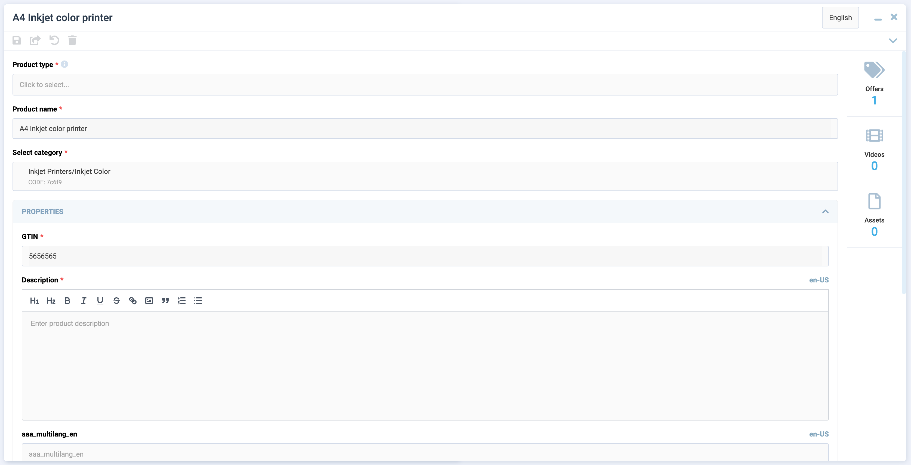

# Overview

This type of view allows you to create blades containing a form. 



The view includes the following features:

* Built-in validation.
* Ability to create complex UI forms.
* Customizable component in the blade header.
* Ability to connect widgets.

## Usage sample

```typescript
import { DynamicDetailsSchema } from "@vc-shell/framework";

export const details: DynamicDetailsSchema = {
    settings: {
        url: "/dynamic-module-details",
        id: "DynamicItem",
        localizationPrefix: "DynamicModule",
        titleTemplate: "Dynamic module details",
        composable: "useDetails",
        component: "DynamicBladeForm",
        toolbar: [
            {
                id: "refresh",
                icon: "fas fa-sync-alt",
                title: "Refresh",
                method: "refresh",
            },
        ],
    },
    content: [
        {
        id: "dynamicItemForm",
        component: "vc-form",
        children: [
            {
                id: "itemName",
                component: "vc-input",
                label: "Name",
                property: "name",
            },
            {
                id: "itemCreatedDate",
                component: "vc-input",
                label: "Created date",
                property: "createdDate",
            },
        ],
        },
    ],
};
```

## View programming structure

The View Programming Structure section provides a comprehensive guide to understanding and utilizing the various components and interfaces involved in creating dynamic views using the `DynamicBladeForm` component. 

### View declaration

To create a view, create a schema and pass it to the dynamic view. The schema must contain the following properties: `settings` and `content`:

```typescript
interface DynamicDetailsSchema {
    settings: SettingsDetails;
    content: [FormContentSchema, WidgetsSchema?];
}
```

| Property and Type                                  | Description               |
| -------------------------------------------------- | ------------------------- |
| `settings` {==SettingsDetails==}                   | The settings of the view. |
| `content` {==[FormContentSchema, WidgetsSchema?]==}| The content of the view.  |

#### Schema Settings API

`SettingsDetails` is an extension of `SettingsBase` with additional settings for `DynamicBladeForm`:

```typescript
interface SettingsDetails extends SettingsBase {
    component: "DynamicBladeForm";
    status?: {
        component: string;
    };
}
```

Every newly created view must have settings that describe its behavior and appearance. Depending on the type of view used, the settings may vary slightly. The settings are represented by an object built using the following `SettingsBase` interface:

```typescript
interface SettingsBase {
    url?: string;
    localizationPrefix: string;
    id: string;
    titleTemplate: string;
    composable: string;
    toolbar: {
        id: string;
        title: string;
        icon: string;
        method: string;
    }[];
    component: "DynamicBladeForm";
    permissions?: string | string[];
    pushNotificationType?: string | string[];
    isWorkspace?: boolean;
}
```

| Property and Type                                                 | Description                                                                                                    |
| ----------------------------------------------------------------- | ------------------- | --------------------------------------------------------------------------------------                         |
| `url` {==string==}                                                | The URL of the view. This option is required if you want to add the view to the navigation menu or want to access it directly by URL. If you do not specify a URL, the view will be available only as a child view of another view. |
| `id` {==string==}                                                 | The unique Id of the view. This option is required. The ID is used to identify the view in the navigation system and provides scheme overriding capabilities.   |
| `localizationPrefix` {==`string==}                                | The prefix used for localization keys. This option is required. The prefix is used to provide localized content for the view. For example, if you specify the prefix `MyList`, the localization key for the title of the view will be `MyList.Title`. Under the hood, [vue-i18n](https://kazupon.github.io/vue-i18n/) is used.       |
| `titleTemplate` {==string==}                                      | The title of the view that is shown in the blade header by default. This option is required.                   |
| `component`  {=="DynamicBladeForm"==}, {=="DynamicBladeList"`==}  | The name of the Vue component used by the view. This option is required. It could be one of the following values: <br> - `DynamicBladeList` <br> - `DynamicBladeForm`|
| `composable` {==string==}                                         | The name of the composable used by the view. This option is required. |
| `isWorkspace` {==boolean==}                                       | Specification whether the view is a workspace. This option is used to determine which view should be the default view. Default: `false`             |
| `toolbar` {==object[]==}                                          | An array of objects representing the toolbar buttons. This option is optional. If you do not specify any buttons, the toolbar will not be displayed. Each object in the array must have the following properties: id, title, icon, and method. More info about toolbar creation can be found in the [Toolbar](./toolbar.md) section. |
| `permissions` {==string==}, {==string[]==}                        | The permissions required to access the view. This option is optional. If you do not specify any permissions, the view will be available to all users. |
| `pushNotificationType` {==string==}, {==string[]==}               | The push notification types associated with the view. This option is optional. If you do not specify any push notification types, the view will not receive any push notifications. |

#### Schema Content API

The Schema Content API provides two key interfaces for defining dynamic views: 

* [FormContentSchema](Dynamic-Blade-Form.md#formcontentschema).
* [WidgetsSchema](Dynamic-Blade-Form.md#widgetsschema).

##### FormContentSchema

`FormContentSchema` is an interface that contains settings for the form:

```typescript
interface FormContentSchema {
    id: string;
    component: "vc-form";
    children: ControlSchema[];
}
```

Where `ControlSchema` is an interface that represents an array of form controls. 

{: width="25"} [Features of Dynamic Views](./../overview.md#features-of-dynamic-views) documentation section.

##### WidgetsSchema

`WidgetsSchema` is an interface that contains settings for widgets:

```typescript
interface WidgetsSchema {
    id: "string";
    component: "vc-widgets";
    children: string[];
}
```

The `children` property is an array of widget component names. Widget components must be registered globally.

{: width="25"} [Creating widgets](../../Controls/widgets.md)

### Create composable for DynamicBladeForm

To create a composable for `DynamicBladeForm`, use the built-in composable factory function named `useDetailsFactory`. This factory returns a composable method that provides you with all the necessary methods and properties to work with the form.

#### useDetailsFactory API

The `useDetailsFactory` function return an object with the following properly typed properties:

| Property          | Type                                  | Description                                                                                                       |
| ----------------- | ------------------------------------- | ----------------------------------------------------------------------------------------------------------------- |
| `item`            | `Ref<Item` `|` `undefined>`           | The current loaded details item.                                                                                  |
| `loading`         | `Ref<boolean>`                        | Indication whether the data is loading.                                                                            |
| `validationState` | `ComputedRef<IValidationState<Item>>` | Validation state and methods of the form. <br> More information about [validationState](#validationState) section |
| `load`            | `AsyncAction<ItemId>`                 | The method used to load the details item.                                                                         |
| `saveChanges`     | `AsyncAction<Item>`                   | The method used to create or save the details item.                                                               |
| `remove`          | `AsyncAction<ItemId>`                 | The method used to remove the details item.                                                                       |

This function accepts an object with callback methods `load`, `saveChanges`, `remove`, which you should implement. The `load` method is used for loading the details item. The `saveChanges` method is used for creating or saving the details item. The `remove` method is used for removing the details item.

!!! note
    The `load`, `saveChanges` and `remove` methods must return a promise.

#### Implement composable from `useDetailsFactory`

Let's create a file named `useDetails.ts` in the `composables` folder of your module and add the following code:

```typescript
import { useDetailsFactory, UseDetails } from "@vc-shell/framework";

const useDetails = (): UseDetails => {
    const factory = useDetailsFactory({
        load: async ([id]) => {
            // return your load method here
        },
        saveChanges: async (details) => {
            // return your saveChanges method here
        },
        remove: async ({ id }) => {
            // return your remove method here
        },
    });

    const { load, saveChanges, remove, loading, item, validationState, query } =
        factory();

    return {
        load,
        saveChanges,
        remove,
        loading,
        item,
        query,
        validationState,
    };
};
```

To implement the `load`, `saveChanges` and `remove` methods, you need to use `useApiClient` composable from `@vc-shell/framework` package. This composable returns a `getApiClient` method, that provides you with an instance of the API client class, which you can use to make requests to your API.

Let's look at the example of using the `useApiClient` method with `useDetailsFactory` in the `useDetails` composable:

```typescript
import { useApiClient } from "@vc-shell/framework";
import { SomeClient } from "@your-api-package";

const { getApiClient } = useApiClient(SomeClient);

const useDetails = (): UseDetails => {
    const factory = useDetailsFactory({
        load: async ({ id }) => {
            return (await getApiClient()).someSearchFn(id);
        },
        saveChanges: async (details) => {
            return details.id
                ? (await getApiClient()).someSaveFn(details)
                : (await getApiClient()).someCreateFn(details);
        },
        remove: async ({ id }) => {
            return (await getApiClient()).someRemoveFn(id);
        },
    });
};
```

!!!note
    As you can see, these callback methods have arguments. 
    
    * The `load` method gets an `id`, that is passed to blade as a `param` prop. 
    * The `saveChanges` method gets a `details` object, that contains the current details item. 
    * The `remove` method gets an `id`, that is passed to blade as a `param` prop.

With the use of `useDetailsFactory`, you get a ready-to-use composable, which already has all the necessary methods and properties to work with the form. All you need to do is just to implement the `load`, `remove` and `saveChanges` methods. Also you can add your own logic, methods and properties to the composable, as in other composable functions.

Since the `useDetailsFactory` method is generic, you can provide your own types for your loaded `item`. Let's look at the example based on Offers module from `vc-app`:

```typescript
useDetailsFactory<IOffer>();
// ...
```

`UseDetails` interface is also a generic type that accepts your `item` and `scope` types:

```typescript
UseDetails<IOffer, OfferDetailsScope>;
```

This allows you to get proper typing of your composable and data.


{: width="25"} [Blade Scope](#blade-scope)


#### Access to Blade Component Props and Events

All composables created for dynamic views have incoming parameters by default, which are passed from the dynamic views component:

| Name       | Description                                                   |
|------------|---------------------------------------------------------------|
| `props`    | Contains all blade parameters.                                |
| `emit`     | Includes all blade events that it can emit.                   |
| `mounted`  | Returns `true` if the dynamic views component has been mounted; otherwise, it returns `false`. |


To obtain types, import `DynamicBladeForm` as follows:

```typescript
import { Ref } from "vue";
import { DynamicBladeForm } from "@vc-shell/framework";

const useDetails = (args: {
    props: InstanceType<typeof DynamicBladeForm>["$props"];
    emit: InstanceType<typeof DynamicBladeForm>["$emit"];
    mounted: Ref<boolean>;
}) => {
    // your composable code here
};
```

Thanks to this, you always have access to all incoming blade parameters and can use `emit` events directly from your composable.

#### Blade Scope

Each composable created for dynamic views can have a `scope`, a special variable which can contain all additional methods, computed values, reactive variables, toolbar overrides that you want to use in your blade.

To use `scope`, return it from your composable:

```typescript
const useDetails = (args: // ...): UseList => {
    const scope = ref<DetailsScope>({
        // your scope here
    });

    return {
        // ...,
        scope: computed(() => scope.value),
    }
}
```

Create an interface, for example, `DetailsScope`, which should extend from the `DetailsBaseBladeScope` interface to provide type-check for the `scope` and should include all additional methods, computed values, reactive variables, toolbar overrides that you want to use in your blade, as follows:

```typescript
import { DetailsBaseBladeScope } from "@vc-shell/framework";

interface DetailsScope extends DetailsBaseBladeScope {
    // scope types here
}
```

#### The `toolbarOverrides` object

After you define toolbar object in schema, you can add some custom actions to it or change its visibility or disabled state. To do so, use `toolbarOverrides` object in your `scope`:

```typescript
const useDetails = (args: // ...): UseList => {
    const scope = ref<DetailsScope>({
        // ...
        toolbarOverrides: {
            // your toolbar overrides here
        },
    });
}
```

{: width="25"} [Toolbar schema creation](../../Essentials/controls/Toolbar.md#usage)

#### Default Toolbar Buttons

`DynamicBladeForm` comes with built-in toolbar buttons that you can utilize. All these toolbar button objects have pre-implemented methods, visibility settings, and disabled states. You just need to add them to your view schema. Additionally, you can override these methods in the `toolbarOverrides` object using their respective names.

The available methods are named `saveChanges` and `remove`.

{: width="25"} [Overriding default toolbar methods and properties](../../Essentials/controls/Toolbar.md#binding-properties-and-methods)

#### `validationState` API

The `validationState` property is a computed property presented by the `IValidationState` interface:

```typescript
interface IValidationState<Item> {
    valid: boolean;
    dirty: boolean;
    disabled: boolean;
    modified: boolean;
    validated: boolean;
    cachedValue: Item | undefined;
    setFieldError: FormContext["setFieldError"];
    setErrors: FormContext["setErrors"];
    resetModified: (
        data: MaybeRef<Item>,
        updateInitial?: MaybeRef<boolean>
    ) => void;
    validate: FormContext["validate"];
}
```

| Property        | Type                                  | Description                                           |
| --------------- | --------------------------------------|  -----------------------------------------------------|
| `valid`         | `boolean`                             | Indication whether the form is valid.                  |
| `dirty`         | `boolean`                             | Indication whether the form is dirty.                  |
| `disabled`      | `boolean`                             | Indication whether the form is disabled.               |
| `modified`      | `boolean`                             | Indication whether the form is modified.               |
| `validated`     | `boolean`                             | Indication whether the form is validated.              |
| `cachedValue`   | `Item`                                | The cached value of the form.                         |
| `setFieldError` | `FormContext["setFieldError"]`        | The Vee-Validate method used to set the field error. <br> {: width="25"} [Vee-Validate](https://vee-validate.logaretm.com/v4/api/form#default) |
| `setErrors`     | `FormContext["setErrors"]`            | The Vee-Validate method used to set the errors. <br> {: width="25"} [Vee-Validate](https://vee-validate.logaretm.com/v4/api/form#default)    |
| `resetModified` | `(data: MaybeRef<Item>, updateInitial?: MaybeRef<boolean>) => void` | The method used to reset the modified state and, if needed, override the initial `item` value.         |
| `validate`      | `FormContext["validate"]`                                           | The Vee-Validate method used to validate the form. <br> {: width="25"} [Vee-Validate](https://vee-validate.logaretm.com/v4/api/form#default) |

#### DynamicBladeForm Blade Context

The `DynamicBladeForm` blade context is an object that contains all methods and properties, returned from composable and settings from view schema.