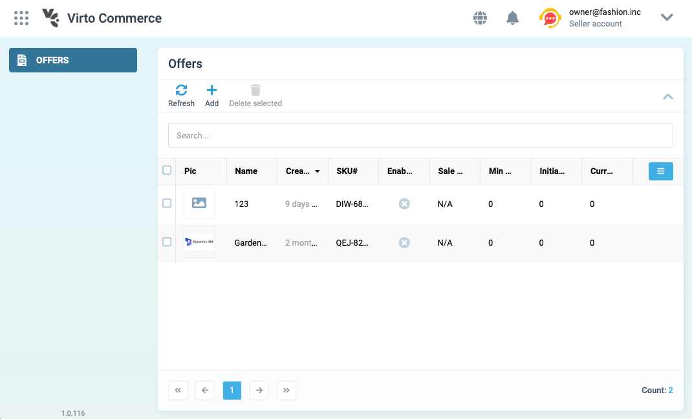

# Using Modules from Other Applications

This guide explains how to use modules from another custom application in your own project. It provides detailed instructions on initializing external modules, adding them to the navigation menu, and integrating them into your project.

In this guide, we'll use the example of the `vc-app-extend` project, which extends the functionality of the `vc-app` project located in the `sample` folder.

## Adding Custom Application

To incorporate another custom application into your project: 

1. [Install the dependencies.](Using-Modules-from-Other-Applications.md#installing-dependencies)
1. [Configure the external application as a plugin.](Using-Modules-from-Other-Applications.md#initializing-external-modules)
1. [Create a link in the navigation menu.](Using-Modules-from-Other-Applications.md#adding-a-module-to-the-navigation-menu)

### Installing Dependencies

Let's assume you want to include modules from the `vc-app` application into your custom application, `vc-app-extend`. The package that contains these modules from `vc-app` is named `@vc-app/modules`. To add this dependency to your project, use the following command:

```bash
yarn add @vc-app/modules
```

### Initializing External Modules

After installing the dependency, you must initialize the `Offers` module from the `@vc-app/modules` package. To do this, navigate to `vc-app-extend/src` and import the package in the `main.ts` file as follows:

```typescript
import modules from "@vc-app/modules";
```

Since these modules are essentially Vue plugins and have an internal installation method, use the standard `Vue` method `use` for installation. In our example, we install the `Offers` module:

```typescript
import modules from "@vc-app/modules";

async function startApp() {
        ...
        const app = createApp(RouterView);
        app.use(VirtoShellFramework);

        // Import and initialize the Offers module from the @vc-app application
        app.use(modules.Offers.default, { router });

        app.use(router);
        ...
    }

startApp()
```

!!! warning
    Ensure that all modules, including external ones, are installed after `VirtoShellFramework` and before `Vue router`. The installation order should be as follows:

    1. `VirtoShellFramework`
    2. `modules`
    3. `Vue router`

In our example, we installed only one module. If you need to install all modules from the package, you can do so as follows:

```typescript
import modules from "@vc-app/modules";

async function startApp() {
        ...
        const app = createApp(RouterView);
        app use(VirtoShellFramework);

        // Import and initialize all available modules from the @vc-app application
        Object.values(modules).forEach(module => {
            app.use(module, { router });
        })

        app.use(router);
        ...
    }

startApp()
```

!!! note
    Notice that when initializing modules, we always pass the `router` as the second argument to the `use` method. This is necessary for the automatic registration of modules in the Vue routing system.


### Adding a Module to the Navigation Menu

After installing your module, you can add a link to the navigation menu based on your project's requirements. To do this, navigate to `vc-app-extend/src/pages` and locate the `menuItems` variable in the `App.vue` file. This variable serves as a storage for all navigation menu items and has its method, `navigationMenuComposer`, which defines the properties of menu items.

#### Finding the Appropriate Blade for the Navigation Menu

To determine which blade to use for the navigation menu, we'll refer to the schema in the source code of the external application, `vc-app`. In this case, as we intend to add `Offers` to the menu, we'll locate the file containing the blade schema, `grid.ts`, within the `vc-app/src/modules/offers/pages` path. This particular file functions as the `workspace blade` for the module. Crucially, the `settings` object within this schema must have the value `isWorkspace: true`.

```typescript title="vc-app-extend/src/modules/offers/pages/grid.ts" linenums="1"
import { DynamicGridSchema } from "@vc-shell/framework";

export const grid: DynamicGridSchema = {
  settings: {
    url: "/offers",
    // A unique blade ID, which also serves as the blade name for the navigation system
    id: "Offers",
    titleTemplate: "Offers",
    localizationPrefix: "Offers",
    // An attribute indicating that the blade is the primary workspace for the Offers module
    isWorkspace: true,
    composable: "useOffersList",
    component: "DynamicBladeList",
    toolbar: [
      {
        id: "refresh",
        icon: "fas fa-sync-alt",
        title: "Refresh",
        method: "refresh",
      },
      {
        id: "add",
        icon: "fas fa-plus",
        title: "Add",
        method: "openAddBlade",
      },
      {
        id: "deleteSelected",
        icon: "fas fa-trash",
        title: "Delete selected",
        method: "removeItems",
      },
    ],
  },
  ...
```

!!! note
    `isWorkspace` is a special attribute that designates the primary blade of the module, from which all interactions with the module begin.

#### Expanding the Navigation Menu

Since dynamic blade components operate at runtime and lack an importable component for the `openBlade` method, you can utilize an additional composable method called `useBladeNavigation`. This method returns the component of the registered blade, `resolveBladeByName`. To obtain the desired blade using this method, you need to pass the unique blade ID obtained in the [Finding the Appropriate Blade for the Navigation Menu](./include-and-setup-other-custom-app.md#finding-the-appropriate-blade-for-the-navigation-menu) step.

```typescript title="vc-app-extend/src/pages/App.vue" linenums="1"
// Initialize the module in the navigation menu
const menuItems = reactive(
    navigationMenuComposer([
        ...
        {
            title: "Offers",
            icon: "fas fa-file-invoice",
            isVisible: true,
            component: resolveBladeByName("Offers"),
        },
        ...
    ])
);
```

{: width="25"} [Navigation](../navigation.md)

After completing all the steps to add the module to the navigation menu, you will have the following result:


Now, the `Offers` module is ready for use!