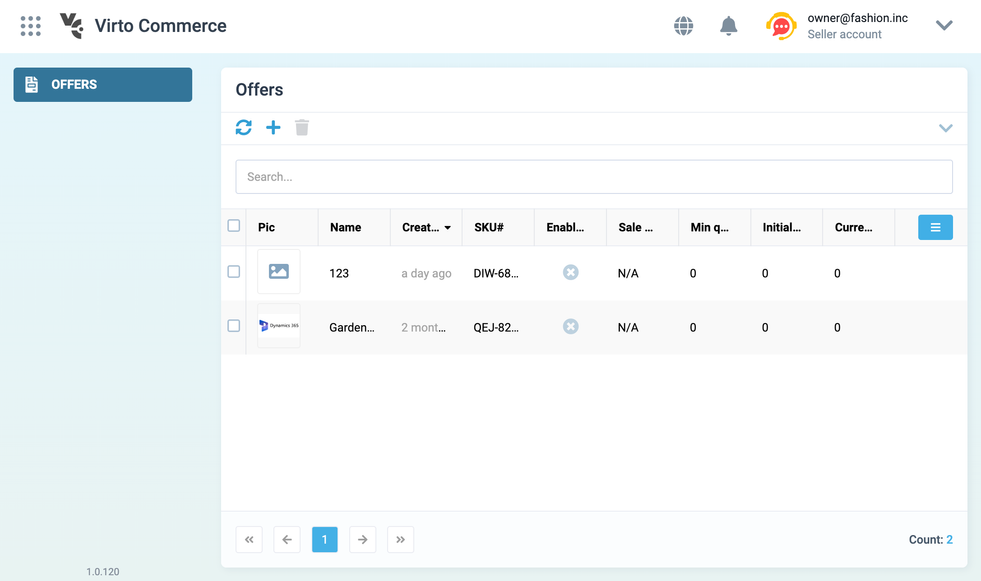
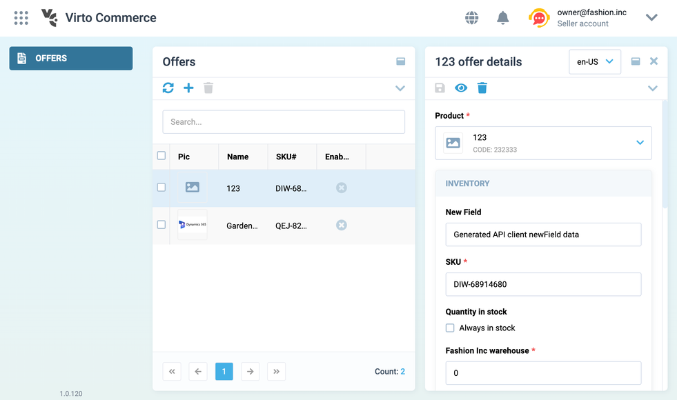

# Overview

This guide describes how to reference other custom VC-Shell applications to incorporate their logic into your custom app. It also explores various techniques for extending components, composables, and other essential logic.

This guide covers the following key steps:

1. [Incorporating and setting up custom application.](overview.md#incorporate-and-set-up-custom-applications)
1. [Replacing API clients used by other custom applications.](overview.md#replace-api-clients-used-by-other-custom-applications)
1. [Extending other apps views using dynamic views.](overview.md#extend-other-apps-views-using-dynamic-views)
1. [Extending composables.](overview.md#extend-composables)

In this guide, we'll use the example of the `vc-app-extend` project, which extends the functionality of the `vc-app` project from the `sample` folder.

[](https://github.com/VirtoCommerce/vc-shell/tree/main/sample/vc-app-extend)

## Incorporate and set up custom applications

All applications developed on the VC-Shell framework can seamlessly become part of other custom applications, allowing you to reuse or override key elements such as navigation menu items, API clients, blades, composables, UI components, and more.

To include and set up custom applications:

1. Reference custom application. In our example, we add:

    * Reference to the `vc-app`, representing the application to extend.
    * `Offers`, representing the module.

    ```typescript title="vc-app-extend/src/main.ts" linenums="1"
    import modules from "@vc-app/modules";

        async function startApp() {
          ...
          const app = createApp(RouterView);
          app.use(VirtoShellFramework);

          // Import and initialize Offers module from @vc-app applicaiton
          app.use(modules.Offers.default, { router })

          app.use(router);
          ...
        }

    startApp()
    ```

1. Verify the result:

    

Now you have successfully incorporated and set up the custom application. Your custom app can now leverage the modules and functionalities of the `vc-app`, providing you with the flexibility to extend and customize your application as needed.

{: width="25"} [Using modules from other applications](../Essentials/dynamic-views/Using-Modules-from-Other-Applications.md)

## Replace API Clients used by other custom applications

When referencing other applications, you might need to access new fields or functionalities in TypeScript strongly typed API clients. In some scenarios, when you are extending the Virtocommerce REST API used by a referenced application (as explained in our domain model extension article), you may need to access new fields or functionalities. If the same API type is used by the application you are referencing, you can regenerate the API client to include these changes.

!!! note
    Before replacing the original API types used by @vc-app with updated ones, it might be useful to understand how Vite aliases work. Vite aliases provide a mechanism to replace the original API types used by the `@vc-app` with updated ones. For more information about aliases in Vite, refer to the [Vite documentation](https://vitejs.dev/config/shared-options.html#resolve-alias).

To replace the original API types used by `@vc-app` with updated ones, generate the API client using the **vc-shell/api-client-generator** package:

1. Add the API generator as a development dependency using the following command:

    ```
    yarn add @vc-shell/api-client-generator cross-env
    ```

    !!! note
        Alternatively, you can manually add `"@vc-shell/api-client-generator"` and `"cross-env"` as development dependencies in your **package.json** file.


    [cross-env](https://github.com/kentcdodds/cross-env) is a tool that sets and uses environment variables across platforms.

1. Add a script to the `scripts` section of your application's **package.json** file:

    ```json title="vc-app-extend/package.json" linenums="1"
    {
        ...
        "scripts": {
            ...
            "generate-api-client": cross-env api-client-generator --APP_PLATFORM_MODULES='[MarketplaceVendor]' --APP_API_CLIENT_DIRECTORY=./src/api_client/
        }
    }
    ```

1. Set the `APP_PLATFORM_URL` in your project's **.env** file.

    ```yml title="vc-app-extend/.env" linenums="1"
    # Set your Platform URL here
    APP_PLATFORM_URL=https://vcmp-dev.paas.govirto.com/
    ```

1. Execute the command to generate the API client:

    ```
    yarn generate-api-client
    ```

You can now use the generated API client in your custom application.


### Example changes after API client generation

After generating the API client for your `@vc-app-extend` application, you can see the following changes in the `Offer` class:

* Original `@vc-app` application Offer class:

    ```typescript title="vc-app/src/api_client/marketplacevendor.ts" linenums="1"
    export class Offer implements IOffer {
        isSuspended?: boolean;
        isActive?: boolean;
        ...
        }
    ```

* Generated API client Offer class for `vc-app-extend` application:

    ```typescript title="vc-app-extend/src/api_client/marketplacevendor.ts" linenums="1"
    export class Offer implements IOffer {
        isSuspended?: boolean;
        isActive?: boolean;
        //New field
        newField?: string;
        ...
        }
    ```

This demonstrates that the Offer class in the `@vc-app-extend` application now includes an additional field `newField`, which was not present in the original `@vc-app application`'s Offer class.

{: width="25"} [Generate API Client](../How-tos/generate-api-client.md)

### Override command processing logic

To customize your applications to specific requirements, you can customize the command processing logic. This involves overriding default behaviors. The modules underlying your application rely on API client packages as peerDependencies. To replace the API they use, add an alias to your main application's Vite configuration file, `vite.config.ts`:

```typescript title="vc-app-extend/vite.config.ts" linenums="1"
export default getApplicationConfiguration({
  resolve: {
    alias: {
      "@vc-app/api": "@vc-app-extend/api"
    },
  },
  ...
});
```

Now other custom application modules use your generated API.

## Extend other apps views using dynamic views

You can enhance the interactivity and functionality of your applications by adding new buttons and controls to forms, extending the user interface.
If the referenced application uses blades built on dynamic views <!-- (refer to our [VC-Shell dynamic view guide](TODO: link to vc-shell dynamic view)) -->, you can extend these views with new UI elements, including fields, forms, lists, and more, without the need to directly modify the source code of the application you are extending.

In the example below, we focus on the `Offers` module, along with the `useOffersList` and `useOfferDetails` composables that we are extending. Let's add a control that will display data from a new field of the generated API client.

1. Define overrides:

    ```typescript title="vc-app-extend/src/modules/offers/schemaOverride/overrides.ts" linenums="1"
    import { OverridesSchema } from "@vc-shell/framework";

    export const overrides: OverridesSchema = {
    upsert: [
        // Adding a new input control that will display data from 'newField' property
        {
            name: "Offer",
            path: "content[0].children[1].fields",
            index: 0,
            value: {
                id: "exampleInput",
                component: "vc-input",
                label: "New Field",
                property: "newField",
            },
        },
    ]
    ```

1. Add overrides to `createDynamicAppModule`:

    ```typescript title="vc-app-extend/src/modules/offers/index.ts" linenums="1"
    import { createDynamicAppModule } from "@vc-shell/framework";
    import modules from "@vc-app/modules";
    // Import the previously defined overrides
    import overrides from "./schemaOverride";

    export default createDynamicAppModule({
        schema: modules.Offers.schema,
        composables: modules.Offers.composables,
        locales: modules.Offers.locales,
        moduleComponents: modules.Offers.components,
        overrides, // <- imported 'overrides'
    });
    ```

1. Initialize the extended module:

    ```typescript title="vc-app-extend/src/main.ts" linenums="1"
    import { Offers } from "./modules";

    async function startApp() {
      ...
      const app = createApp(RouterView);
      app.use(VirtoShellFramework);

      // Install the extended Offers module
      app.use(Offers, { router });
      app.use(router);
      ...
    }

    startApp();
    ```

1. Verify the result:

    

This process allows you to seamlessly extend views from the referenced application without the need to directly modify the source code, providing flexibility in customizing your application.


{: width="25"} [Using dynamic view for extending views from the other apps](../Essentials/dynamic-views/Extending-Views.md)


## Extend composables

Composables are functions with an internal state that changes over time and methods that modify this state. You cannot directly modify the state. The only way to change the state is by calling one of the composable's methods. However, because the state is reactive, thanks to Vue's Composition API, you can watch and react to these changes when necessary to update the UI or perform other operations.

This pattern encapsulates the state and business logic and exposes it through easy-to-use methods.

In most cases, the composables defined in the referenced app and bound to specific blades are reusable and shareable across various applications. For example, the `useOffer` composable defined in the Vendor Portal application can be extended with new methods or logic in another custom app.

### Example

To illustrate composable extension, let's add a button to the toolbar:

1. Define overrides:

    ```typescript title="vc-app-extend/src/modules/offers/schemaOverride/overrides.ts" linenums="1"
    import { OverridesSchema } from "@vc-shell/framework";

    export const overrides: OverridesSchema = {
      upsert: [
        // Adding a new input control that will display data from 'newField' property
        {
          id: "Offer",
          path: "content[0].children[1].fields",
          index: 0,
          value: {
            id: "exampleInput",
            component: "vc-input",
            label: "New Field",
            property: "newField",
          },
        },
        // Adding a new action button to blade toolbar
        {
          id: "Offer",
          path: "settings.toolbar",
          index: 1,
          value: {
            id: "newToolbarAction",
            title: "Click me!",
            icon: "fas fa-plus",
            method: "showAlert",
          },
        },
      ],
    };
    ```

1. Extend the composable:

    ```typescript title="vc-app-extend/src/modules/offers/composables/useOfferDetails/index.ts" linenums="1"
    import { IBladeToolbar } from "@vc-shell/framework";
    import modules from "@vc-app/modules";
    import { Ref, UnwrapRef, computed, ref } from "vue";
    import * as _ from "lodash-es";

    export type ExtendedOfferDetailsScope = UnwrapRef<
      ReturnType<typeof modules.Offers.composables.useOfferDetails>["scope"]
    > & {
      toolbarOverrides: {
        showAlert: IBladeToolbar;
      };
    };

    export const useOfferDetails = (args) => {
      const { load, saveChanges, remove, loading, item, validationState, scope, bladeTitle } =
        modules.Offers.composables.useOfferDetails(args);

      // Adding a new method that will be called by new toolbar button
      function clickMe() {
        alert("I'm alert!");
      }

    // Extending useOfferDetails 'scope' and adding a new 'showAlert' method representing 'method' key of new toolbar button:
    const extendedScope = _.merge(
        ref({}),
        ref(scope.value),
        ref({
          toolbarOverrides: {
            showAlert: {
              clickHandler() {
                clickMe();
            },
            isVisible: true,
            },
          },
        })
      ) as Ref<ExtendedOfferDetailsScope>;

      return {
        load,
        saveChanges,
        remove,
        loading,
        item,
        validationState,
        scope: computed(() => extendedScope.value),
        bladeTitle,
      };
    };
    ```

1. Integrate the extended composable:

    ```typescript title="vc-app-extend/src/modules/offers/index.ts" linenums="1"
    import { createDynamicAppModule } from "@vc-shell/framework";
    import modules from "@vc-app/modules";
    import overrides from "./schemaOverride";
    // Import the extended composable
    import { useOfferDetails } from "./composables";

    export default createDynamicAppModule({
        schema: modules.Offers.schema,
        composables: {
            useOffersList: modules.Offers.composables.useOffersList,
            useOfferDetails, <- Override @vc-app useOfferDetails composable with the imported one
    },
    locales: modules.Offers.locales,
    moduleComponents: modules.Offers.components,
    overrides, // <- Imported 'overrides'
    });
    ```

1. Verify the result:

    

<!-- Read more about [Extending composables](../)
TODO: Link to Custom App development/VC Shell/Extensibility/Extending composables -->