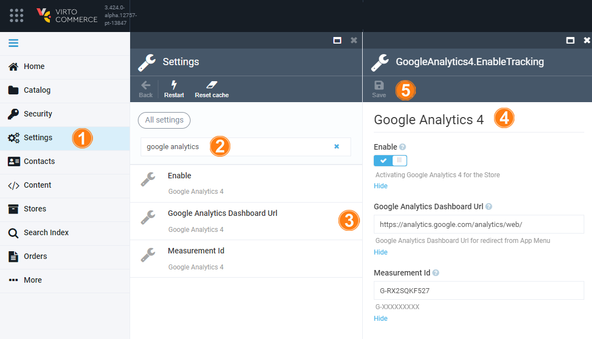

# Settings

To set Google Analytics 4 module:

1. Click **Settings** in the main menu.
1. Type **Google Analytics** to find the settings related to the module.
1. Click any item in the list to:
    * Activate Google Analytics 4 for the Store.
    * Add Google Analytics Dashboard Url for redirect from App Menu.
    * Enter measurement Id.
1. Configure your settings in the next blade.
1. Click **Save** in the toolbar to save the changes.

{: width="800"}
