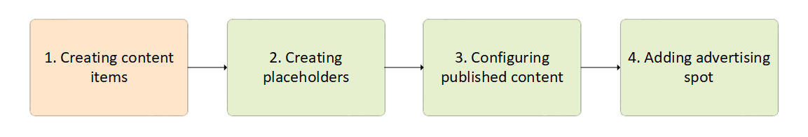
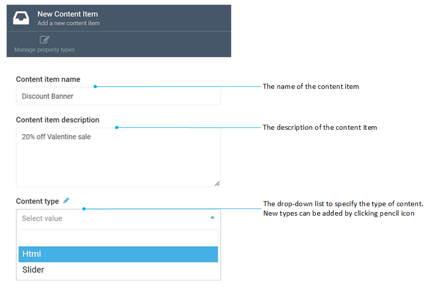

# Manage dynamic content items

Managing synamic content items includes:

* [Creating contact items.](managing-content-items.md#creating-content-items)
* [Editing contact items.](managing-content-items.md#editing-and-deleting-content-items)
* [Deleting contact items.](managing-content-items.md#delete-content-items)

## Create content items

The first step of bringing marketing content online is creating content items:

To create a dynamic content item:

1. Click **Marketing** in the main menu.
1. In the next blade, click **Dynamic content**.
1. In the next blade, click **Content items**.
1. In the next **Content items** blade, click **Add** in the toolbar.
1. In the next **New content item** blade, click **Content item**. 

	

1. Fill in the following fields:

	

1. Click **Create** to save the changes.

!!! note
	Content items can be grouped into folders by location (home page, checkout page, etc.), type (banners, sliders, etc.), or anything else you see fit.

Your new content item has been added to the list.

## Edit content items

To edit a content item:

1. Follow steps 1-3 from the instruction above.
1. Click the required item in the **Content item list**.
1. Modify the item in the next blade.
1. Click **Save** in the toolbar to save the changes.

!!! warning
	When you edit the type of a dynamic content item, the relevant properties of such an item are also changed.

The modifications have been saved.

## Delete content items

1. Follow steps 1-3 from the instruction above.
1. Check the required item(s) in the **Content item list**.
1. Click **Delete** in the toolbar.
1. Confirm the deletion.

!!! note
	You can delete only those dynamic content items that do not belong to published content; otherwise, the system displays a message that the associated published content should be deleted first.

The item has been deleted.