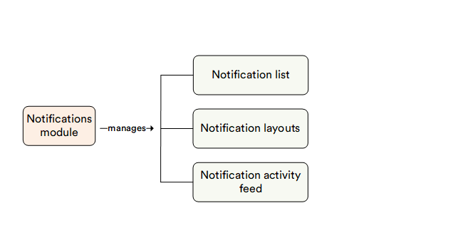

# Overview

The Virto Commerce Notifications module enables you to manage a variety of notification scenarios for your customers. You'll need to send notifications to your customers in various situations:

* When they successfully sign up.
* When they request a password reset.
* When their order is complete, and more.

For all these scenarios, the Notifications module facilitates sending emails or other messages to inform your customers about the next steps they should take or provide them with the necessary information.

Virto Commerce offers a range of pre-configured notifications right out of the box. Additionally, your development team can also [configure](../../../dev_docs/Fundamentals/Notifications/configuration.md) custom notifications as needed.

## Key features

The diagram below illustrates the interconnections among various key entities within the Notifications module:

With the Notifications module, you can:

1. [Manage email and text notifications.](notification-list.md)
2. [Create new notification layouts.](notification-layouts.md)
3. [View the notifications logs.](notification-log.md)
