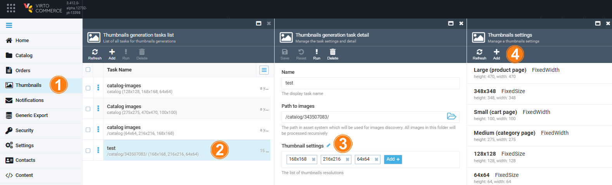
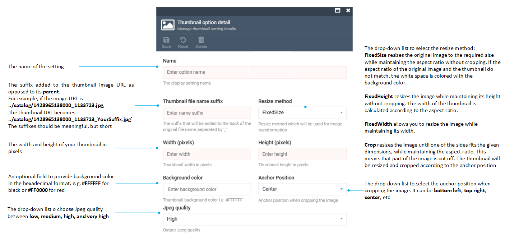

# Manage thumbnail settings
Before generating your thumbnails, you can edit various settings to adjust the images you get as a result:

1. Click **Thumbnails** in the main menu.
1. In the **Thumbnails generation tasks list** blade, click the required task.
1. In the **Thumbnails generation task detail** blade, click {: width="30" height="30"} next to the **Thumbnails settings** field.
1. In the **Thumbnails settings** blade, click **Add** in the toolbar to add a new setting or click the required setting from the list to edit it. 

	

1. Fill in or edit the following fields:

	

1. Click **Save** in the toolbar to save the changes.

Your new setting appears in the list.

[Define color code](https://htmlcolorcodes.com/){ .md-button }