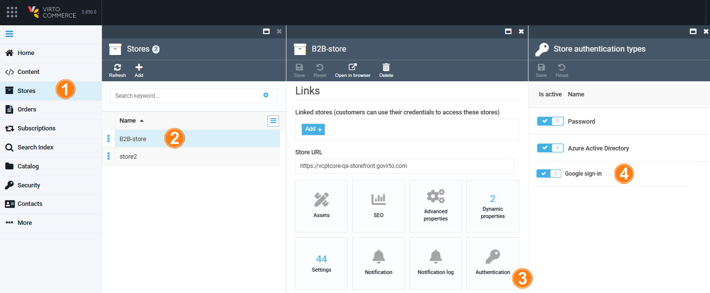
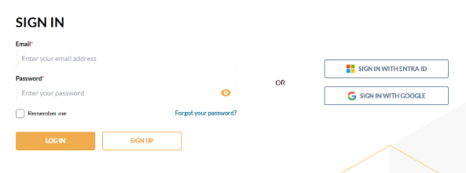

# Add Google as SSO Provider

To integrate Google as a new SSO provider, install the [Google SSO module](https://github.com/VirtoCommerce/vc-module-google-sso/releases). After that:

1. [Create Google OAuth 2.0 Client.](adding-google-as-sso-provider.md#google-oauth-20-client)
1. [Set the appsettings.json file.](adding-google-as-sso-provider.md#set-appsettingsjson-file)
1. [Manage Platform settings.](adding-google-as-sso-provider.md#manage-platform-settings)


## Create Google OAuth 2.0 Client


To integrate Google APIs with your application using OAuth 2.0, you need to create authorization credentials. These credentials will allow your app to access the enabled APIs for your project:

1. Go to the [Google API & Services Console](https://console.cloud.google.com/apis).
1. Create a new project if you don't have one, then open the project dashboard.
1. Configure OAuth consent screen. In the **OAuth consent screen** tab:
     1. Select **User Type** --> **External** and click **Create**.
     1. Fill in the **App Information** (name, user support email, and developer contact information).
     1. Skip the **Scopes** and **Test users** sections for now.
     1. Review your settings and return to the dashboard.
1. Navigate to the **Credentials** tab, select **Create credentials** --> **OAuth client ID**.
1. Choose **Web application** as the **Application type** and name your credentials.
1. In the **Authorized redirect URIs** section, click **ADD URI** to specify the redirect URI. Ensure your platform uses HTTPS; otherwise, SSO will not function correctly.

    !!! note
        If your platform runs on a local machine, put https://localhost:10645/signin-google.

1. Click **Create**.
1. Save **Client ID** and **Client Secret** to use them in the module.

## Set appsettings.json file

Store Google Client ID, secret values and other sensitive settings in KeyVault Storage. In our example, we use the **appsettings.json** configuration file. Add the following section to the configuration:

```json title="appsettings.json"

"Google": {
	"Enabled": true,
	"AuthenticationType": "Google",
	"AuthenticationCaption": "Google",
	"ClientId": "<your Client ID>",
	"ClientSecret": "<your Client Secret>",
	"DefaultUserType": "Manager"
},
```

## Manage Platform settings

Configure store settings:

1. Click **Stores** in the main menu.
1. In the next blade, select the desired store.
1. In the next blade, click on the **Authentication** widget.
1. In the next blade, enable/disable **Google sign-in** for the selected store.

    

    !!! note
        By default, all registered authentication types are enabled.

1. Click **Save** to save the changes.

The GraphQL query confirms that authentication via Google AD is enabled:

{: style="display: block; margin: 0 auto;" width="650"}

The Google authentication button appears on the login page of the Frontend Application:

{: style="display: block; margin: 0 auto;" width="700"}


<br>
<br>
********

<div style="display: flex; justify-content: space-between;">
    <a href="../adding-sso-provider">← Adding Azure AD (Entra ID) as SSO provider </a>
    <a href="../../integrations/google-analytics/ga-events">Google Analytics events  →</a>
</div>