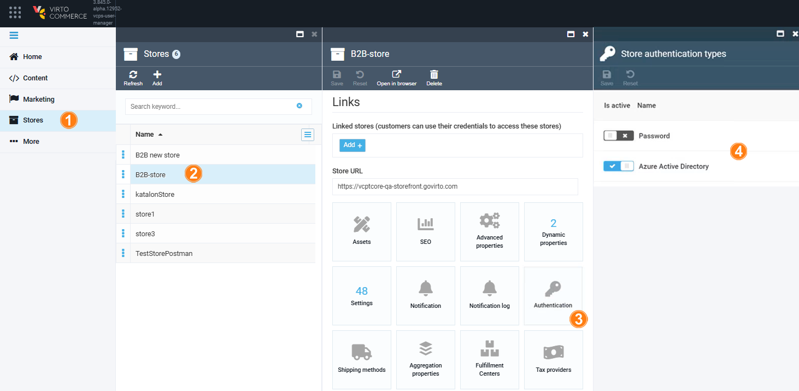
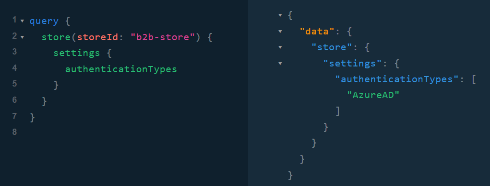
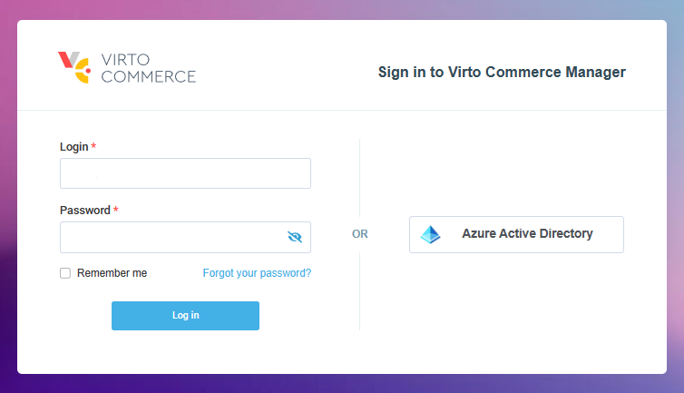

# Add Entra ID (Azure AD) as SSO Provider

!!! note
    Azure Active Directory (Azure AD) has been renamed to Microsoft Entra ID. For the remainder of this guide, these terms are considered synonymous.

To integrate Entra ID (Azure AD) as a new SSO provider, install the [Azure AD module](https://github.com/VirtoCommerce/vc-module-azure-ad/releases). After that:

1. [Manage backend settings.](#backend-settings)
1. [Manage Platform settings.](#platform-settings)


## Backend settings

Set up the necessary environment variables for the Frontend Application to authenticate users via Entra ID (Azure AD) authentication provider:

```json title="environment.yml"
set "Azuread…Enabled=true"
set "AzureAd_ApplicationId=86d04c35-143d-4d3c-aca2-8608e2186282"
set "Azurend…TenantId=bc03e660-5e3a-45c4-bf5c-b75489f78923"
set "AzureAd…ValidateIssuer=MultitenantAzureAD"
```

## Platform settings

Configure store settings:

1. Click **Stores** in the main menu.
1. In the next blade, select the desired store.
1. In the next blade, click on the **Authentication** widget.
1. In the next blade, enable/disable authentication types for the selected store.

    

    !!! note
        By default, all registered authentication types are enabled.

1. Click **Save** to save the changes.

The GraphQL query confirms that authentication via Entra ID (Azure AD) is enabled:

{: width="650"}

The Azure AD authentication button appears on the login page of the Frontend Application:

{: width="700"}

!!! note
    If an account does not exist, clicking on the Azure Active Directory button will automatically create a new account.


<br>
<br>
********

<div style="display: flex; justify-content: space-between;">
    <a href="../anonymous-authentication">← Anonymous authentication </a>
    <a href="../adding-google-as-sso-provider">Adding Google as SSO provider  →</a>
</div>