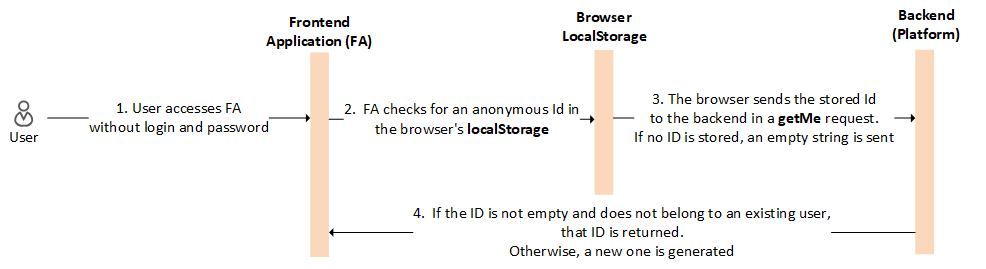

# Anonymous Authentication

Anonymous authentication allows an e-commerce system to track and manage interactions for users who haven't logged in. In the Virto Commerce Frontend Application, anonymous users are recognized using a unique identifier stored locally in their browser.

When a visitor accesses the website, Virto Commerce assigns an anonymous ID to that user if they don’t already have one. This ID is stored in the browser’s `localStorage`. This enables the system to recognize the user as long as they remain on the same device and browser. When the Frontend Application needs to fetch data about the user (for example, their shopping cart, browsing history, or preferences), it sends a `getMe` request to the backend. This request includes the anonymous user ID that was stored earlier in `localStorage`. Instead of creating a new anonymous user for every session, the backend now checks whether an ID was provided in the request. If the ID is not empty and does not belong to an existing user, that ID is returned. Otherwise, a new one is generated. In other words, no anonymous profiles are stored on the server, and the backend only checks whether an ID was provided in the request. 

{: style="display: block; margin: 0 auto;" }

Anonymous authentication provides the following benefits:

* Enhanced user experience.
* Faster performance.
* Simplicity for developers.

Anonymous authentication can be used for: 

* **Guest checkout**: Users can shop without logging in and still have their carts preserved across browsing sessions.
* **Abandoned cart recovery**: If a user adds items to their cart and leaves without logging in, their cart can be retained when they return, potentially leading to higher conversion rates.

 
 
********

    <a href="../authentication-types">← Token-based authentication</a>
    <a href="../adding-sso-provider">Adding Azure AD (Entra ID) as SSO provider  →</a>

