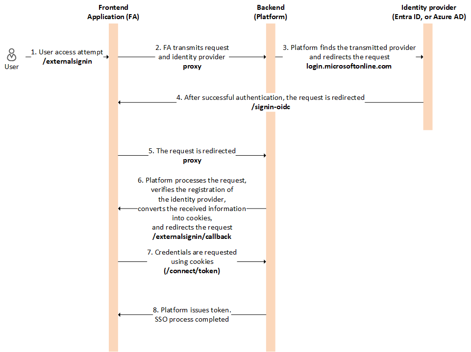

# Authentication Types

At the heart of Virto Commerce Frontend’s security is token-based authentication. This approach offers a streamlined way to verify users while maintaining a high level of security. There are two primary methods for obtaining these tokens in Virto Commerce Frontend:

* **Username and password authentication**: The most common form of authentication involves users logging in with their username and password. Upon successful authentication, a token is generated and sent to the user. This token is then used for subsequent requests, ensuring that the user remains authenticated without the need to re-enter their credentials.

    {: style="display: block; margin: 0 auto;" }

* **Single Sign-On (SSO) via Providers like Entra ID (Azure AD) or Google**: For businesses that use Single Sign-On (SSO), Virto Commerce Frontend supports integration with SSO providers such as Azure Active Directory (Azure AD or Entra ID) or Google. This method allows users to authenticate using their existing credentials from another trusted provider. Once authenticated through SSO provider, the platform issues a token that the user can use to access Virto Commerce’s features without needing to log in separately.

    {: style="display: block; margin: 0 auto;" }

{: width="25"} [Adding Entra ID [Azure AD] as SSO provider](adding-sso-provider.md)

{: width="25"} [Adding Google as SSO provider](adding-google-as-sso-provider.md)

 
 
********

    <a href="../../migration">← Migration to Storefrontless architecture</a>
    <a href="../anonymous-authentication">Anonymous authentication →</a>

