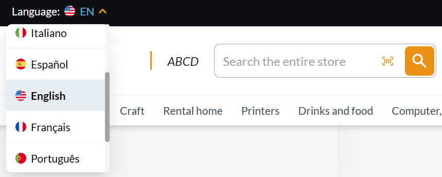
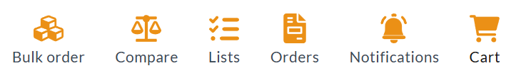
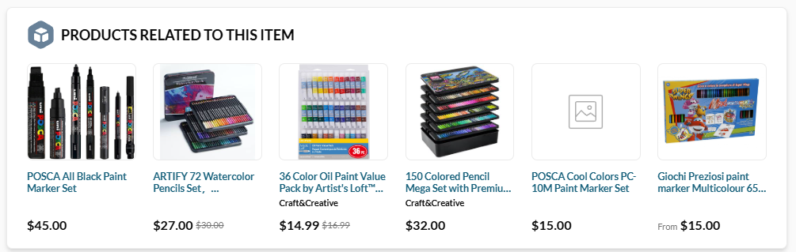
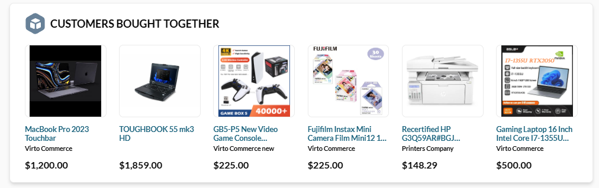
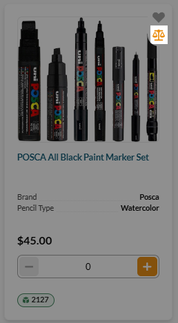

# Functionality Customization

This guide explains how to customize Virto Commerce Frontend functionality using configuration files. Each file controls a specific aspect of the Frontend:

* [manifest.webmanifest](#manifestwebmanifest) defines Progressive Web App (PWA) settings.
* [menu.json](#menujson) configures navigation menus for desktop and mobile.
* [product-default.json](#product-defaultjson) and [product_b2c.json](#product_b2cjson) manage product page layout and content blocks.
* [settings_data.json](#settings_datajson) provides global Frontend settings for browsing, checkout, search, vendors, branding, and more.

By adjusting these files, you can flexibly tailor the Frontend experience without modifying the core application code.

## manifest.webmanifest

The [manifest.webmanifest](https://github.com/VirtoCommerce/vc-frontend/blob/dev/client-app/config/manifest.webmanifest) file defines **Progressive Web App (PWA)** settings for the Virto Commerce Frontend. It allows you to configure how the Frontend behaves when installed on devices or added to the home screen, as well as control certain visual and functional aspects.

| Field              | Purpose                                                                                                         |
| ------------------ | --------------------------------------------------------------------------------------------------------------- |
| `name`             | Full name of the store. <br>Displayed when the app is installed on a device.                                        |
| `short_name`       | Shortened name for UI contexts where space is limited<br> (e.g., home screen icons).                                |
| `description`      | Provides a description of the store, <br>used by search engines or PWA installers.                                  |
| `lang`             | Default language of the application, <br>affecting accessibility and SEO.                                           |
| `display`          | Determines how the app appears when launched:<br> `standalone` hides the browser UI, giving an app-like experience. |
| `orientation`      | Controls device orientation.                                              |
| `start_url`        | The URL that opens when users launch the PWA<br> from a home screen shortcut.                                       |
| `background_color` | Sets the background color displayed during app loading.                                                         |
| `theme_color`      | Sets the color for the browser UI elements <br>(status bar, address bar) and splash screen.                         |
| `icons`            | Defines icons for the PWA on different devices and screen sizes.<br> SVG, PNG, or other formats can be used.        |

**Example. Setting default language**

<div class="grid" markdown>

```json hl_lines="5"
...
  "name": "Store",
  "short_name": "Store",
  "description": "Store description",
  "lang": "en-US",
  "display": "standalone",
  "orientation": "any",
...
```

{: style="display: block; margin: 0 auto;" }


</div>


## menu.json

The [menu.json](https://github.com/VirtoCommerce/vc-frontend/blob/dev/client-app/config/menu.json) file defines the structure and behavior of **header and footer menus** in the Virto Commerce Frontend. It allows you to configure which menu items appear, their order, associated icons, routes, and nested submenus, providing a flexible way to adapt navigation to your Frontend needs.

| Section                    | Purpose                                                                                                                        |
| -------------------------- | ------------------------------------------------------------------------------------------------------------------------------ |
| `header.desktop.main`      | Defines the main menu items for the desktop view. Each item can include an ID, route, title, icon, and priority for ordering.  |
| `header.desktop.account`   | Defines the **My Account** dropdown for desktop, including links like Dashboard, Profile, Orders, Lists, and Saved Credit Cards. |
| `header.desktop.corporate` | Defines the corporate menu for desktop users, such as Company Info and Company Members.                                        |
| `header.mobile.main`       | Defines the main menu items for mobile devices, including catalog, compare, bulk order, cart, and contact links.               |
| `header.mobile.account`    | Defines the mobile **My Account** menu with nested items similar to desktop.                                                     |
| `header.mobile.corporate`  | Defines the mobile corporate menu items.                                                                                       |
| `footer`                   | Defines footer navigation items (empty in this example, but can be populated similarly).                                       |

**Example. Setting menu items order**

<div class="grid" markdown>

```json
...
        {
          "id": "bulk-order",
          "route": {
            "name": "BulkOrder"
          },
          ...
        },
        {
          "id": "compare",
          "route": {
            "name": "CompareProducts"
          },
        },
        ...
        {
          "id": "lists",
          "route": {
            "name": "Lists"
          },
        },
        ...
        {
          "id": "orders",
          "route": {
            "name": "Orders"
          },
          ...
        },
        {
          "id": "cart",
          "route": {
            "name": "Cart"
          },
        },
...
```

{: style="display: block; margin: 0 auto;" }


</div>


## product-default.json

The [product-default.json](https://github.com/VirtoCommerce/vc-frontend/blob/dev/client-app/config/product-default.json) file defines the **layout and content structure of product pages** in the Virto Commerce Frontend. It allows you to configure which sections and blocks appear on a product page, their order, visibility, and specific types of content displayed. This provides a flexible way to control product presentation without modifying the core code.

| Section / Block               | Purpose                                                                                                                 |
| ----------------------------- | ----------------------------------------------------------------------------------------------------------------------- |
| `settings`                    | Contains metadata for the template, such as the template name (`name`).                                                 |
| `content`                     | Defines the sections that make up the product page.<br> Each section can have an `id`, `type`, `hidden` flag, and `blocks`. |
| `product-info`                | Displays main product details such as properties, description, assets, and variations.                                  |
| `product-properties` (block)  | Shows product attributes like SKU, color, size, etc.                                                                    |
| `product-description` (block) | Displays the full product description.                                                                                  |
| `product-assets` (block)      | Shows images, videos, or downloadable files.                                                                            |
| `product-variations` (block)  | Allows selection of different product variants.                                                                         |
| `related-products`            | Displays products related to the current one to encourage cross-selling.                                                |
| `recommended-products`        | Displays additional product suggestions based on models<br> such as `related-products` or `bought-together`.                |
| `product-reviews`             | Displays user reviews, ratings, and comments for the product.                                                           |


**Example. Displaying the related products section**

<div class="grid" markdown>

```json
...
    {
      "id": "section3",
      "type": "related-products",
      "hidden": false
    },
...
```

{: style="display: block; margin: 0 auto;" }


</div>


## product_b2c.json

The [product_b2c.json](https://github.com/VirtoCommerce/vc-frontend/blob/dev/client-app/config/product_b2c.json) file defines a **product page template optimized for B2C (Business-to-Consumer) scenarios** in Virto Commerce Frontend. It customizes functionality by specifying which sections and blocks appear on the product page, and how they are structured.

| Section / Block            | Purpose                                                                                                                                                               |
| -------------------------- | ----------------------------------------------------------------------------------------------------------------------------------------------------------------------|
| **`settings`**             | Contains metadata, here naming the template **"Product template B2C"**.                                                                                               |
| **`product-info`**         | Displays the main product details. Includes: <ul><li>`product-options`: Lets customers configure product options (e.g., size, color).</li><li>`product-properties`: Shows product attributes like SKU, materials, or specifications.</li><li>`product-description`: Displays the detailed product description.</li><li>`product-assets`: Provides product media, such as images, videos, or downloadable files.</li></ul> |
| **`related-products`**     | Encourages cross-selling by showing items related to the current product.                                                                                             |
| **`recommended-products`** | Suggests additional items based on models: <ul><li>`related-products`: Shows similar items.</li><li>`bought-together`: Displays products often purchased with the current one.</li></ul>  |
| **`product-reviews`**      | Displays user-generated reviews, comments, and ratings.                                           |


**Example. Displaying the recommended products section**

<div class="grid" markdown>

```json
...
      "id": "section4",
      "type": "recommended-products",
      "hidden": false,
...
```

{: style="display: block; margin: 0 auto;" }


</div>


## settings_data.json

The [settings_data.json](https://github.com/VirtoCommerce/vc-frontend/blob/dev/client-app/config/settings_data.json) file defines **global theme and Frontend behavior settings** for Virto Commerce Frontend. It provides toggles, limits, and configurations that control how the Frontend looks and functions for end users, including the following:


| Setting / Group                | Purpose                                                                                                        |
| ------------------------------ | -------------------------------------------------------------------------------------------------------------- |
| **`current`**                  | Specifies the currently active settings profile (e.g., `"default"`).                                           |
| **Product browsing and display** | <ul><li>`details_browser_target`: Defines how product detail links open (`_blank`, `_self`).</li><li>`product_compare_enabled` and `product_compare_limit`: Enables product comparison and sets the max number of items to compare.</li><li>`product_filters_sorting` and `product_filters_sorting_direction`: Controls if product filters can be sorted, and in which order.</li><li>`product_quantity_control`: Defines the UI for quantity selection (e.g., `"stepper"`).</li><li>`range_filter_type`: Configures filter type (e.g., `"slider"`).</li></ul> |
| **Vendors and categories**       | <ul><li>`vendor_enabled`: Enables vendor info display.</li><li>`vendor_rating_enabled`: Shows vendor ratings.</li><li>`categories_limit`: Restricts number of categories shown.</li><li>`wishlists_limit`: Sets max number of wishlists a user can create.</li></ul>                                                                 |
| **Search**                     | <ul><li>`search_max_chars`: Max characters allowed in search queries.</li><li>`search_static_content_suggestions_enabled`: Enables static content suggestions in search results.</li><li>`search_product_phrase_suggestions_enabled`: Toggles product phrase suggestions.</li></ul>                                                   |
| **Checkout**                   | <ul><li>`checkout_multistep_enabled`: Toggles multistep checkout flow.</li><li>`checkout_comment_enabled`: Allows buyers to leave comments during checkout.</li><li>`checkout_purchase_order_enabled`: Enables purchase order number field.</li><li>`checkout_coupon_enabled`: Allows coupon code usage.</li><li>`checkout_gifts_enabled`: Enables gift options.</li></ul> |
| **Payments and security**        | <ul><li>`isCVVinSkyflowRequired`: Defines whether CVV is mandatory when storing cards in Skyflow.</li></ul> |
| **Navigation and layout**        | <ul><li>`default_return_url`: Defines redirect URL after certain actions (e.g., login).</li><li>`catalog_pagination_mode`: Controls pagination style (`infinite_scroll`, etc.).</li><li>`desktop_menu_mode`: Defines menu layout (`horizontal`/`vertical`).</li></ul>|
| **Branding and media**           | <ul><li>`logo_image`, `logo_inverted_image`, `favicon_image`: Customize Frontend branding.</li><li>`homepage_background_image`: Sets the homepage banner image.</li></ul>   |
| **Images and media handling**    | <ul><li>`image_thumbnails_enabled`: Enables thumbnail generation.</li><li>`image_thumbnails_original_fallback_enabled`: Falls back to original if thumbnail missing.</li><li>`image_thumbnails_suffixes`: Defines suffixes for different image sizes (`sm`, `md`, `lg`).</li><li>`image_carousel_in_product_card_enabled`: Enables image carousel inside product cards.</li></ul> |
| **Messaging and files**          | <ul><li>`files_enabled`: Allows file uploads.</li><li>`push_messages_enabled`: Enables push notifications for Frontend.</li></ul> |
| **Pricing and availability**     | <ul><li>`zero_price_product_enabled`: Determines if products with price `0` can be displayed/purchased.</li></ul> |
| **Orders**                     | <ul><li>`orders_statuses`: Defines which order statuses are available for customers (continues in file).</li></ul>            |


**Example. Enabling products comparison**

<div class="grid" markdown>

```json
...
"settings": {
    "details_browser_target": "_blank",

    "files_enabled": true,

    "push_messages_enabled": true,

    "product_compare_enabled": true,
    "product_compare_limit": 5,
    "product_filters_sorting": false,
...
```

{: style="display: block; margin: 0 auto;" }


</div>


<br>
<br>
********

<div style="display: flex; justify-content: space-between;">
    <a href="../visual-theme-customization">← Visual theme customization</a>
    <a href="../texts-customization">Texts customization →</a>
</div>