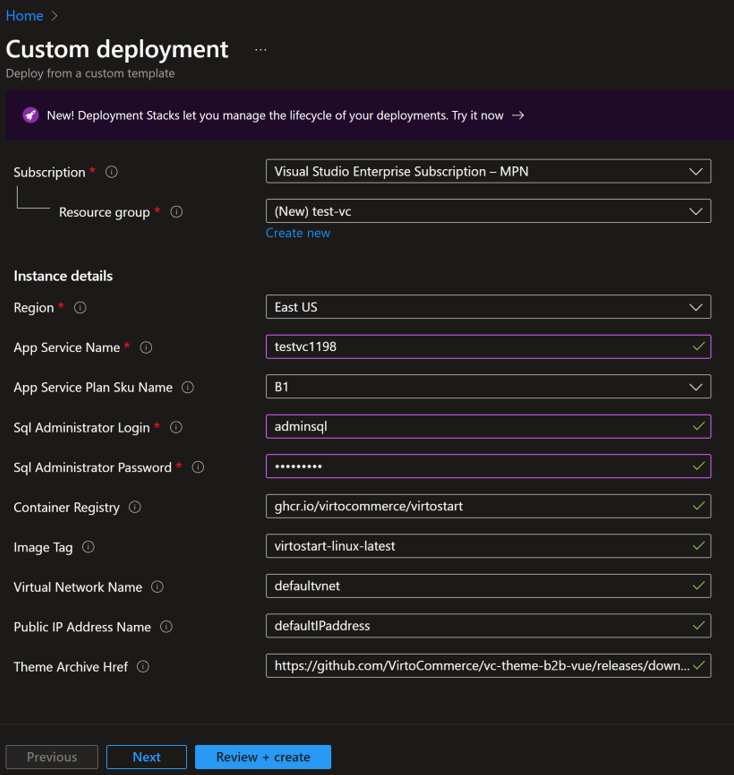
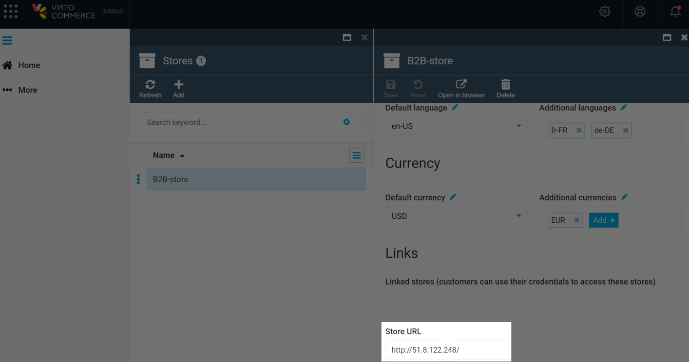
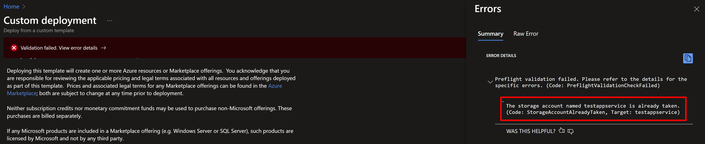
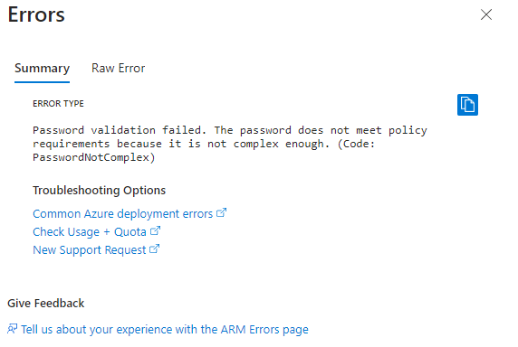
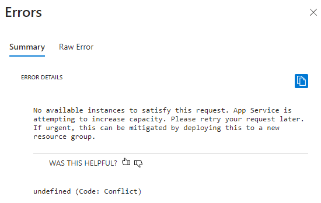
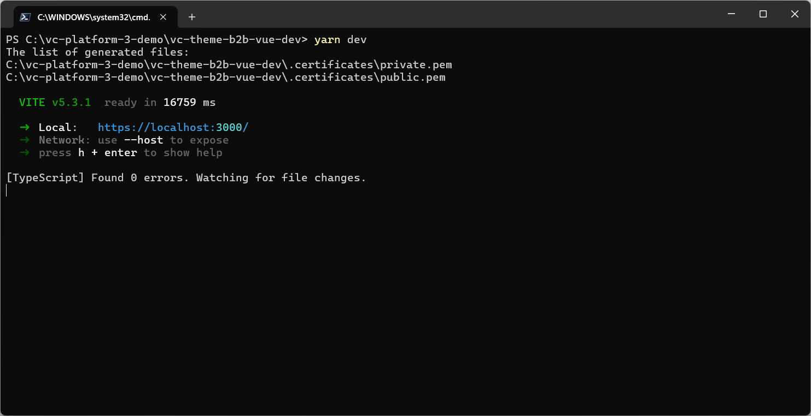
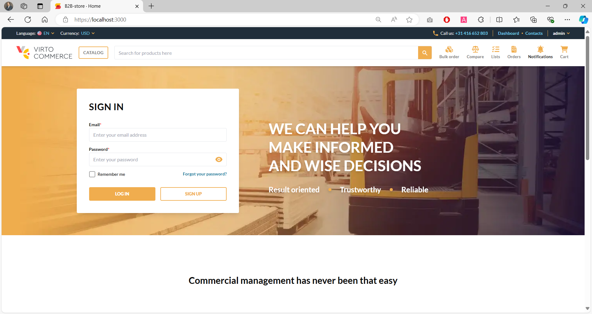

# Deployment

This section provides detailed instructions on how to deploy the new Virto Commerce Frontend Application across various environments. The deployment options available are:

* [Virto Cloud.](deployment.md#deployment-in-virto-cloud)
* [Azure.](deployment.md#deployment-in-azure-in-progress)
* [Local Machine.](deployment.md#deployment-on-local-machine)

## Deployment on Virto Cloud

Virto Cloud natively supports the new architecture. Use the following methods to deploy in Virto Cloud:

* [Through configuration files.](deployment.md#through-configuration-file)
* [Through Virto Cloud portal.](deployment.md#through-virto-cloud-portal)

### Through configuration file

To deploy through configuration files:

1. Disable the storefront application by removing it from the configuration.
1. Add a reference to the Virto Commerce Frontend Application 2.x.
1. Enable the routes section. The table below shows the mapping of paths to platform routes. The platform routes handle all requests related to the SPA's core functionality, such as authentication, authorization, file management, and data querying.

| Path              | Description                                                                                       |
|-------------------|---------------------------------------------------------------------------------------------------|
| **/xapi**         | A custom API endpoint for interacting with the SPA's backend services.                            |
| **/files**        | A path for uploading and downloading files from the SPA's storage.                                |
| **/connect/token**| A path for requesting and refreshing access tokens for the SPA's users.                           |
| **/graphql**      | A path for executing GraphQL queries and mutations on the SPA's data.                             |
| **/revoke/token** | A path for revoking access tokens for the SPA's users.                                            |
| **/api/files**    | An alternative path for accessing the SPA's file management service.                              |

These routes are integral to ensuring that the SPA operates smoothly and securely, handling everything from user authentication to complex data interactions.

The appropriate snippet of the **environments.yml** file is as follows:

```yaml title="environments.yml"
storefront:
    enabled: false
    imageRepository: virtopaasregistrymain.azurecr.io/vcptcore/storefront
    servicePlan: S1
    imageTag: 6.37.0-master-628b3528
    config:
      DOTNET_USE_POLLING_FILE_WATCHER: true
      ASPNETCORE_FORWARDEDHEADERS_ENABLED: true
      CookieAuthenticationOptions__ExpireTimeSpan: 12:00:00
      SnapshotCollectorConfiguration__IsEnabled: false
      Swagger__UI__Enable: true
      VirtoCommerce__DefaultStore: B2B-store
      VirtoCommerce__Endpoint__Password: store
    themes:
          B2B-store: https://vc3prerelease.blob.core.windows.net/packages/b2b-webservice.zip
ingress: {}
customApps:
    app1:
        enabled: false
    app2:
        enabled: false
routes:
- host: vcptcore-dev-storefront.govirto.com
    root: B2B-store
    paths:
    - path: /xapi
        route: platform
    - path: /files
        route: platform
    - path: /connect/token
        route: platform
    - path: /graphql
        route: platform
    - path: /revoke/token
        route: platform
    - path: /api/files
        route: platform
protectedParameters:
    - platform.image.tag
    - storefront.image.tag
    #- themes.B2B-store
    #- custom.app1.image.tag
```

### Through Virto Cloud portal [In Progress]

The detailed instructions will be provided soon.

## Deployment on Azure

To deploy the Frontend Application on Azure:

1. Create all Azure resources using the Azure button:

    [](https://portal.azure.com/#create/Microsoft.Template/uri/https%3A%2F%2Fraw.githubusercontent.com%2FVirtoCommerce%2Fvc-platform%2Fdev%2FazureDeployWebAppForContainer.json)

1. Fill in the required values on the **Custom deployment** page and create Azure resources:

    

1. After successful deployment, open the Platform and perform initial setup, installing sample data if necessary.
1. Change the default password for the **admin** user. 
1. Set the store URL (**Stores** --> **Your store** --> **Store URL**) in the Platform in the form of `http://x.x.x.x/`:

    

1. Use the Azure Application Gateway IP address to access the Frontend part of Virtocommerce solutions.

Your Frontend App has now been successfully deployed on Azure.

### Common deployment issues

During the deployment process, various issues can arise that require attention, including:

* [Azure template validation issue.](deployment.md#azure-template-validation-issue)
* [Password issue.](deployment.md#password-issue)
* [Azure infrastructure issue.](deployment.md#azure-infrastructure-issue)

#### Azure template validation issue 

An Azure template validation error may occur if a resource with the selected name already exists. The error message typically indicates that the name must be modified before proceeding. 



This issue can arise because the template uses the `App Service Name` parameter as a name for other Azure resources, potentially leading to conflicts.

#### Password issue

Errors may occur if the password entered in the `Sql Administrator Password` field does not meet complexity requirements. 



To resolve this, the template must be redeployed with a new, compliant password.

#### Azure infrastructure issue 

The error occurs during the deployment process and has a self-explanatory description. 



The problem is usually temporary and cannot be solved by the user. The workaround is to use a new resource group for the deployment.

## Deployment on local machine

Deploying on a local machine includes:

1. [Meeting the prerequisites.](deployment.md#prerequisites)
1. [Deploying the Frontend Application.](deployment.md#frontend-application-deployment)

### Prerequisites

Before installing the Frontend Application:

1. Install [Node.js v20 (20.11.0 or higher).](https://nodejs.org/en/download/)
1. [Install Platform latest version](../../../platform/developer-guide/Getting-Started/Installation-Guide/windows) or connect to an instance of the platform that is already set up and running on a cloud service.  
1. Enable [corepack](https://yarnpkg.com/corepack)  and run as administrator on Windows:

   ```bash
   corepack enable
   ```

If you have installed `yarn` globally, uninstall it:

* via `npm`:

    ```bash
    npm uninstall --global yarn
    ```
        
* or through your operation system installation tools:

    - **Control Panel**, **Chocolatey**, or **Scoop** on Windows.
    - **Launchpad**, **Finder**, **Homebrew**, or **MacPorts** on macOS.
    - Native package manager such as **apt** on Linux.

### Frontend Application deployment

To deploy the Frontend Application on a local machine:

1. Clone the repository:

    ```bash
    git clone https://github.com/VirtoCommerce/vc-theme-b2b-vue.git "C:\vc-theme-b2b-vue\"
    ```

1. Check `yarn` version. It should be **4.1.0** or higher (not 1.XX.):

    ```bash
    yarn -v
    ```

1. Install dependencies:

    ```bash
    yarn install
    ```

1. Build and run with hot reload for development:
      1. Add new **.env.local** file.
      1. Copy **APP_BACKEND_URL** from the **.env** file and set its value to the correct endpoint to **Virto Commerce Platform**:

         ```dotenv
         # .env.local file
         APP_BACKEND_URL=https://localhost:5001
         ```

      1. Run `yarn dev` or `yarn dev-expose`:

        

      1. Follow the link provided in the terminal.

Your Frontend Application is now running successfully.



## Build options

Choose the appropriate build command based on your needs:

* Build for production with validation and minification:

    ```bash
    yarn build
    ```

* Build in development mode:

    ```bash
    yarn build:dev
    ```

* Build in development mode with change tracking:

    ```bash
    yarn build:watch
    ```

* Create an artifact to install from the built code:

    ```bash
    yarn compress
    ```


## Types generation

To keep your project aligned with the GraphQL server, you need to generate the necessary types by running the following command:

```
yarn generate:graphql
```

This command performs two key steps:

1. It downloads the **schema.json** file from the GraphQL server located at the `APP_BACKEND_URL`.
1. It generates the **types.ts** file for both general and independent modules.

Even if independent modules are not installed on the platform, the types can still be generated safely.

## Dependency analysis

The following sections guide you through analyzing bundle sizes and visualizing the dependency graph.

### Bundle size analysis

To optimize your application, it’s important to understand the size of various JavaScript chunks like **vendor.js** and **index.js**. Run the following command to analyze bundle sizes:

```
yarn generate:bundle-map
```

The results will be saved in the **artifacts** folder, providing you with a clear overview of your bundle sizes.

### Visualize dependency graph

Use the command below to generate a dependency graph:

```
yarn generate:dependency-graph
```

!!! note
    This command requires specific parameters to run successfully. For example:

    ```
    yarn generate:dependency-graph client-app/main.ts client-app/shared/account/components/checkout-default-success-modal.vue
    ```

The generated graph will be saved in the **artifacts** folder for your review.

### Troubleshooting

If you encounter an error such as `dot command not found` on Windows, it's likely due to a missing Graphviz installation. Ensure that [Graphviz](https://graphviz.gitlab.io/download/) is installed on your system to resolve this issue.
