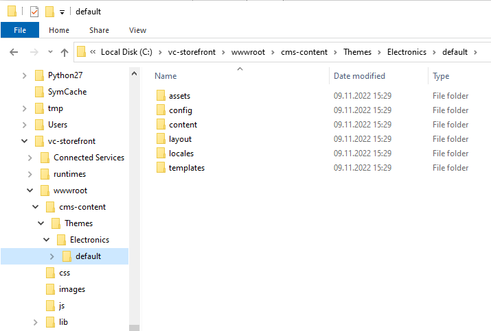

# Quick Start on Windows

This section will quickly guide you through simple Storefront setup based on Windows environment.

!!! note 
    If Platform and Storefront are deployed in the same on-premises environment, Storefront should be deployed on a different port from Platform.

## Prerequisites

Prior to installing Storefront, install:

- And launch [Platform latest version](https://github.com/VirtoCommerce/vc-platform/releases/latest). Deploy it:

    - [On Windows.](../../../../platform/developer-guide/Getting-Started/Installation-Guide/windows)
    - [On Linux.](../../../../platform/developer-guide/Getting-Started/Installation-Guide/linux)
    - [On macOS.](../../../../platform/developer-guide/Getting-Started/Installation-Guide/macOS)
    
- [Install the Experience API module.](../../../../platform/developer-guide/GraphQL-Storefront-API-Reference-xAPI/getting-started)
    
- Install the [Profile Experience API module.](https://github.com/VirtoCommerce/vc-module-profile-experience-api)

- Configure stores from scratch or Install sample data.

- Go to the Security section, create a new frontend user with the role of Administrator, and remember the login credentials.
 

## Install Storefront with Precompiled Version

To install Storefront:

1. Download [Storefront latest release](https://github.com/VirtoCommerce/vc-storefront/releases/latest).
1. Unpack it to a local folder, e.g., **c:\vc-storefront**. After thatm you will have the directory with Storefront precompiled files
1. Open the **appsettings.json** file in a text editor.    
1. In the `Endpoint` section, supply the correct path and credentials for the Virto Commerce Platform in the `Url`, `UserName`, and `Password` fields:
    
    ```json title="appsettings.json"
    ...
    "Endpoint": {
        "Url": "https://localhost:5001",
        "UserName": "admin",
        "Password": "store",
    ```

1. In the `VirtoCommerce` section, change `DefaultStore` to `B2B-Store`:

    ```json title="appsettings.json"
    ...
    "VirtoCommerce": {
        "DefaultStore": "B2B-Store",
    ```

## Install vc-theme-b2b-vue from Bundle

To install the B2B Vue theme:

1. Download [latest theme release](https://github.com/VirtoCommerce/vc-theme-b2b-vue/releases/latest).
1. Unpack the **vc-theme-b2b-vue-x.xx.x.zip** package containing the theme to **{storefront path}\wwwroot\cms-content\themes\{store-name}**, for example:

    

!!! note 
    Storefront seamlessly handles theme content resolution through paths in **CMS Content Themes{StoreCode}{ThemeName}**, offering robust support for multi-store and multi-theme functionality.

## Launch Storefront

To launch the Storefront app, run the following command:

```
dotnet VirtoCommerce.Storefront.dll 
```

**dotnet.exe** starts Virto Storefront, loads theme, and connects to Virto Commerce Platform via API. After that, Virto Storefront is ready to open in the browser.

## Troubleshooting and Technical Configurations

Below you will find common issues and the necessary adjustments to optimize the deployment and functionality of Virto Storefront.

### Configure Storefront CMS Content

Based on your deployment schema, you can configure content storage. Storefront  **appsettings.json** file contains **ContentConnectionString** setting with pointed to the folder with actual themes and pages content:

```json
...
"ConnectionStrings": {
	//For themes stored in local file system
	"ContentConnectionString": "provider=LocalStorage;rootPath=~/cms-content"
	//For themes stored in azure blob storage
	//"ContentConnectionString" connectionString="provider=AzureBlobStorage;rootPath=cms-content;DefaultEndpointsProtocol=https;AccountName=yourAccountName;AccountKey=yourAccountKey"
  },
...
```

### Run Storefront on HTTP Schema

To run the platform only at HTTP schema in production mode, it's enough to pass only HTTP URLs in `--urls` argument of the `dotnet` command.

```console
  dotnet VirtoCommerce.Storefront.dll --urls=http://localhost:5002
```

### Run Platform on HTTPS Schema

1. Install and trust HTTPS certificate:

    ```console
        dotnet dev-certs https --trust
    ```

    {: width="25"} [Enforcing HTTPS in ASP.NET Core](https://docs.microsoft.com/en-us/aspnet/core/security/enforcing-ssl?view=aspnetcore-3.0&tabs=visual-studio#trust)


1. Run the following command to start VirtoCommerce Storefront with HTTPS:

    ```console
        dotnet VirtoCommerce.Storefront.dll --urls=https://localhost:4302/
    ```

1. Trust the .Net Core Development Self-Signed Certificate. 

{: width="25"} [Trusting Self-Signed Certificate](https://blogs.msdn.microsoft.com/robert_mcmurray/2013/11/15/how-to-trust-the-iis-express-self-signed-certificate/)


### Failed to Bind to Address http://127.0.0.1:5000: Address Already in Use Exception

This occurs when no ports are specified, which makes Kestrel bind the connection to http://localhost:5000 and https://localhost:5001. These ports might be already used by the platform application. To resolve this, use different ports for the Storefront application: 

```
dotnet VirtoCommerce.Storefront.dll --urls https://localhost:5005
```

### Forward Scheme for Linux and Non-IIS Reverse Proxies

Apps that call `UseHttpsRedirection` and `UseHsts` put a site into an infinite loop if deployed to an Azure Linux App Service, Azure Linux virtual machine (VM), Linux container, or behind any other reverse proxy besides IIS. The TLS is terminated by the reverse proxy, without Kestrel being aware of the correct request scheme. OAuth and OIDC also fail in this configuration because they generate incorrect redirects.

`UseIISIntegration` adds and configures Forwarded Headers Middleware when running behind IIS; however, there is no matching automatic configuration for Linux (Apache or Nginx integration).

To forward the scheme from the proxy in non-IIS scenarios, set the `ASPNETCORE_FORWARDEDHEADERS_ENABLED` environment variable to true.

{: width="25"} [Configure ASP.NET Core to Work with Proxy Servers and Load Balancers](https://docs.microsoft.com/en-us/aspnet/core/host-and-deploy/proxy-load-balancer?view=aspnetcore-5.0#forward-the-scheme-for-linux-and-non-iis-reverse-proxies)