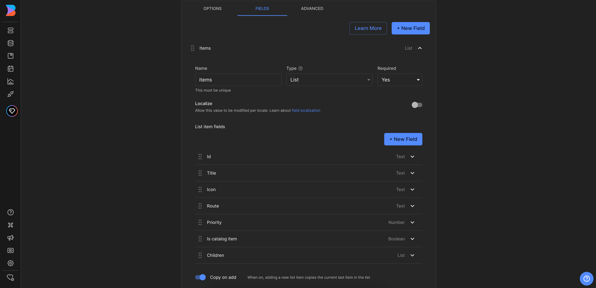
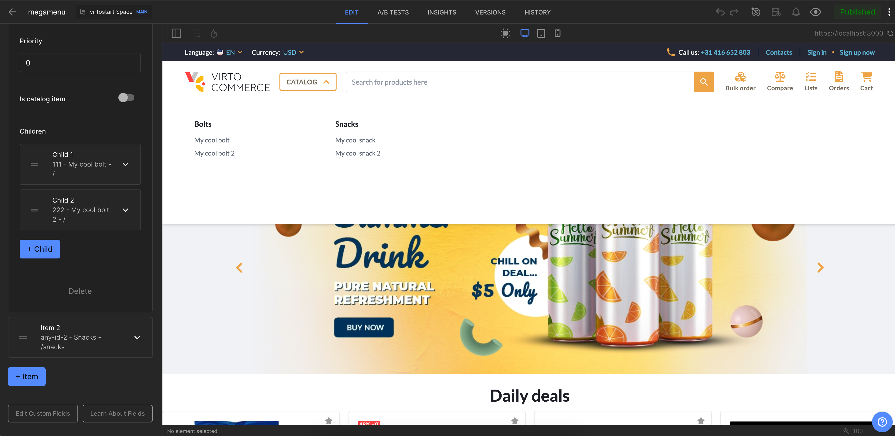

# Overview

In this article, we will integrate `Catalog Menu` with the `Builder.io CMS`. The integration will allow you to create and manage catalog navigation links in the `Builder.io CMS` and display them in the `Virto Commerce vue-b2b-theme`.

This guide will cover the following topics:

1. **Create of data model**: We will create a `Structured data model` for `Catalog Menu`.
2. **Fetch Content from Builder.io**: We will fetch catalog navigation links from `Builder.io` and display them in the `vue-b2b-theme`.

## Create Data Model in Builder.io

First we will navigate to the `Models` menu where we will hit `Create Model` on the top right corner. You will be prompted with an dropdown to select the model type, we will select `Data`. After selecting the model type, we will be prompted with an input field to name the component, we will use `Megamenu items`, and description. After confirming the name, we will be redirected to the model editor where we should change preview URL to `http://localhost:YOUR_PORT` where `YOUR_PORT` is the port of your `Virto Commerce vue-b2b-theme` application.


Next step will be to set-up the actual field in the entry that holds our component, for this we will click on `Fields` and adding a new field called `items` of the type `List`. This field will hold the items of the catalog menu. We will also add a new fields called `id`, `title`, `icon`, `route`, `priority`, `isCatalogItem`, `children`. The `children` field will be of the type `List` and will hold the same fields as it's parent.

In our example, the nesting could be presented as follows:

```text
items
    └── id
    └── title
    └── icon
    └── route
    └── priority
    └── isCatalogItem
    └── children
        └── id
        └── title
        └── icon
        └── route
        └── priority
        └── isCatalogItem
```



## Create Catalog Menu Content

First we will navigate to the `Content` menu and click on the `Megamenu items` in `Structured data models` section. Now click `New Entry` and select `Megamenu items` model from dropdown to create new catalog menu content. It will open a new page where we can add the content for our catalog menu.



Now you can click `+ Item` button to add items to the catalog menu. After adding items, you can click `+ Child` button to add children links  to the selected item.

## Fetch Content from Builder.io and Display in vue-b2b-theme

To fetch content from `Builder.io` and display it in the `vue-b2b-theme`, we will go to the `vue-b2b-theme` and edit the `useNavigations` composable. We will change the `fetchCatalogMenu` method to fetch the `Catalog Menu` from `Builder.io`. Specifically, we need to replace the `getMenu` method call with the `getContent` method call and pass the path to our menu.

```typescript title="client-app/core/composables/useNavigations.ts" linenums="1"
export function useNavigations() {
    // ...
      async function fetchCatalogMenu() {
    // ...

    try {
      if (catalog_menu_link_list_name) {

        // Commented out the old method of fetching the catalog menu
        // catalogMenuItems.value = (await getMenu(catalog_menu_link_list_name)).map((item) =>
        //   convertToExtendedMenuLink(item, true),
        // );

        // Get catalog menu from Builder.io
        catalogMenuItems.value = (
          await getContent({
            model: "megamenu-items",
            apiKey: themeContext.value.settings.builderIoKey,
          })
        )?.data?.items

      } else {
        // ...
      }
    }
    // ...
  }
  // ...
}
```

After making the changes, the `Catalog Menu` will now be fetched from `Builder.io` and displayed in the `vue-b2b-theme`!

Now you can publish the changes and see the `Catalog Menu` in the `vue-b2b-theme`.
