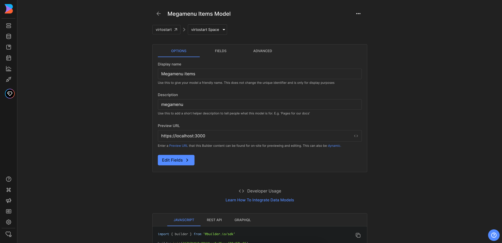

# Overview

In this article, we will integrate **Catalog Menu** with the Builder.io CMS. The integration will allow you to create and manage catalog navigation links in the Builder.io CMS and display them in the **Virto Commerce vue-b2b-theme**.

In this guide, we will:

1. [Create a structured data model for the Catalog menu.](catalog-menu-intergration.md#create-data-model-in-builderio)
1. [Create catalog menu content.](catalog-menu-intergration.md#create-catalog-menu-content)
1. [Fetch catalog navigation links from Builder.io and display them in the vue-b2b-theme.](catalog-menu-intergration.md#create-catalog-menu-content)

## Create Data Model in Builder.io

To create data model in Builder.io:

1. Go to the **Models** menu and click **Create Model** in the top right corner. 
1. Select the model type from the dropdown list. We will select **Data**. 
1. Enter the name of the component and its description. We will enter **Megamenu items**. 
1. Change preview URL to **http://localhost:YOUR_PORT** where **YOUR_PORT** is the port of your **Virto Commerce vue-b2b-theme** application.

    

1. Set up the actual field in the entry that holds our component. In our example, we click **Fields** and add a new field called **items** of the type **List**. This field will hold the items of the catalog menu. Similarly, we add new fields **id**, **title**, **icon**, **route**, **priority**, **isCatalogItem**, **children**. The **children** field will be of the type **List** and will hold the same fields as its parent. The nesting will be as follows:

    ```text
    items
        └── id
        └── title
        └── icon
        └── route
        └── priority
        └── isCatalogItem
        └── children
            └── id
            └── title
            └── icon
            └── route
            └── priority
            └── isCatalogItem
    ```

    

## Create Catalog Menu Content

To create catalog menu content:

1. Go to the **Content** menu and click **Megamenu items** in the **Structured data models** section. 
1. Click **New Entry** and select **Megamenu items model** from the dropdown list to create new catalog menu content. 
1. On the new page, add the content for the catalog menu.
1. Click **+ Item** to add items to the catalog menu. 
1. Click **+ Child** to add children links to the selected item.

    


## Fetch Content from Builder.io and Display in vue-b2b-theme

To fetch content from Builder.io and display it in the **vue-b2b-theme**, go to the **vue-b2b-theme** and edit the `useNavigations` composable: change the `fetchCatalogMenu` method to fetch the **Catalog Menu** from Builder.io. Specifically, replace the `getMenu` method call with the `getContent` method call and pass the path to our menu.

  ```typescript title="client-app/core/composables/useNavigations.ts" linenums="1"
  export function useNavigations() {
      // ...
        async function fetchCatalogMenu() {
      // ...

      try {
        if (catalog_menu_link_list_name) {

          // Commented out the old method of fetching the catalog menu
          // catalogMenuItems.value = (await getMenu(catalog_menu_link_list_name)).map((item) =>
          //   convertToExtendedMenuLink(item, true),
          // );

          // Get catalog menu from Builder.io
          catalogMenuItems.value = (
            await getContent({
              model: "megamenu-items",
              apiKey: themeContext.value.settings.builderIoKey,
            })
          )?.data.items

        } else {
          // ...
        }
      }
      // ...
    }
    // ...
  }
  ```

The **Catalog Menu** has been fetched from Builder.io and displayed in the **vue-b2b-theme**. Now you can publish the changes and see the **Catalog Menu** in the **vue-b2b-theme**.
