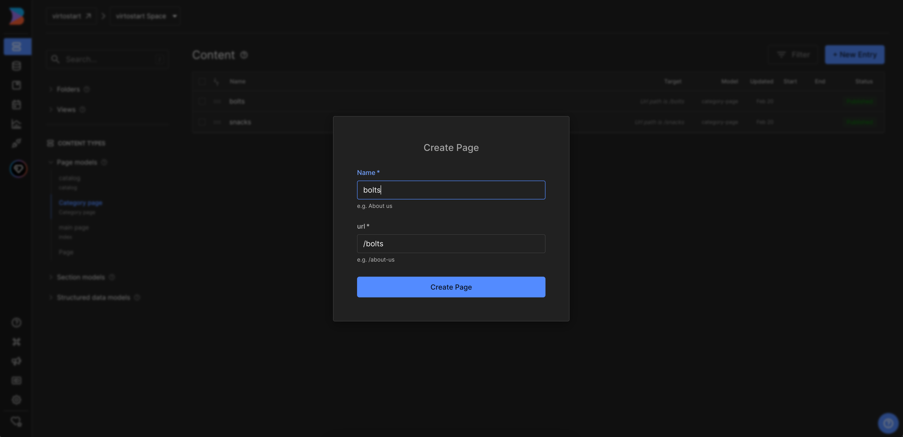
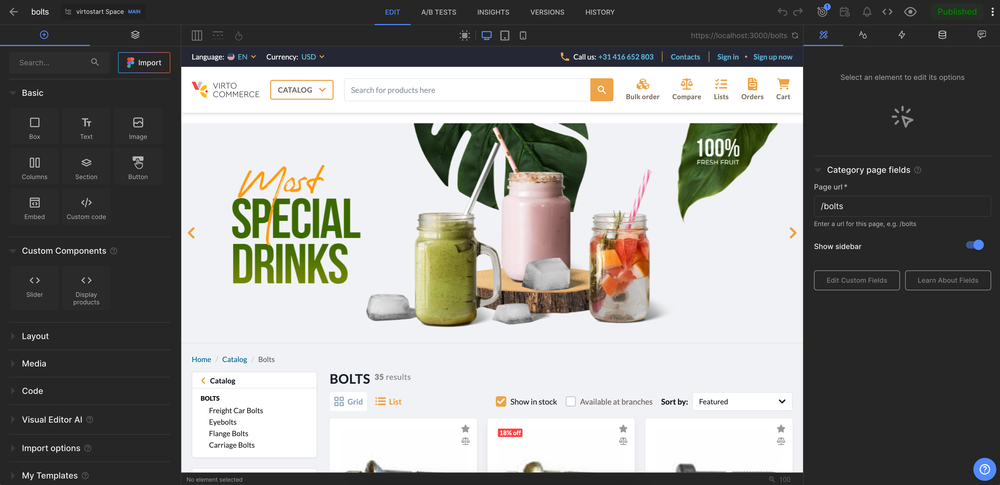

# Overview

In this article, we will integrate `Builder.io CMS` into the category page of the `Virto Commerce vue-b2b-theme`. The integration will allow you to create and manage content in `Builder.io CMS` and display it in the `Virto Commerce vue-b2b-theme`.

To use `Builder.io CMS` with the page you need to follow these steps:

1. **Create page model**: First, you need to create a page model in the `Builder.io CMS` for the category page. The page model should define the properties of the catalog page and how it should be rendered in the `Builder.io CMS`.
2. **Add Builder.io to the page component**: After creating a page model, you need to add `Builder.io` to the page component in the `Virto Commerce vue-b2b-theme`. This will allow you to fetch content from `Builder.io` and display it in the catalog page.
3. **Create content**: After creating a page model, you can start creating content in the `Builder.io CMS`. You can create content by adding components to your page model and filling them with content.

## Create Page Model in Builder.io

First we will navigate to the `Models` menu where we will hit `Create Model` on the top right corner. You will be prompted with an dropdown to select the model type, we will select `Page`. After selecting the model type, we will be prompted with an input field to name the component, we will use `Category page`, and description. After confirming the name, we will be redirected to the model editor where we should change preview URL to `http://localhost:YOUR_PORT` where `YOUR_PORT` is the port of your `Virto Commerce vue-b2b-theme` application.


Now we can use this model to create the content for our category page, so we can proceed to create the page content. We will navigate to the `Content` menu and click on the `Category page` in `Page models` section. Now click `New Entry` and select `Category page` model from dropdown to create new page:



## Add Builder.io to the Page Component

To integrate 'Builder.io' with the category page, you need to follow these steps:

1) Edit 'category.vue' page component in the 'client-app/pages' folder.

=== "Template"

    ```html title="client-app/shared/landing-page.vue"
    <template>
        <RenderContent
            v-if="canShowContent"
            model="category-page"
            :content="content"
            :api-key="apiKey"
            :custom-components="registeredComponents"
        />
        <Category
            :category-id="categoryId"
            :show-sidebar="content?.data?.showSidebar ?? true"
        />
    </template>
    ```

=== "Script"

    ```typescript title="client-app/shared/landing-page.vue"
    import { Category } from "@/shared/catalog";
    import { getContent, RenderContent, isPreviewing } from "@builder.io/sdk-vue/vue3";
    import { onMounted, shallowRef } from "vue";
    import { useRouter } from "vue-router";
    import { useBuilder } from "@/shared/builder-io/composables/useBuilder";

    interface IProps {
        categoryId: string;
    }

    defineProps<IProps>();
    const router = useRouter();
    const { registeredComponents } = useBuilder();

    const canShowContent = shallowRef(true);
    const content = shallowRef(null);
    const pageNotFound = shallowRef(false);

    onMounted(async () => {
        await tryLoadContent(window.location.pathname);
    });

    router.beforeEach(async (to) => {
        await tryLoadContent(to.fullPath);
    });

    async function tryLoadContent(url: string) {
        try {
            const result = await getContent({
            model: "category-page",
            apiKey: "121744b9a9944bae8c35aeef88a87ba0",
            userAttributes: {
                urlPath: url,
            },
            });

            content.value = result;
            canShowContent.value = !!content.value || isPreviewing();
        } catch (e) {
            pageNotFound.value = true;
        }
    }
    ```

2) As we want to use `showSidebar` property to control sidebar visibility - we should change the `category.vue` component to use props from `matcher.vue` and add `v-if` condition on `sidebar` section.

```html title="client-app/shared/catalog/components/category.vue" linenums="1"
<template>
     <!-- Sidebar -->
      <div class="flex items-stretch lg:gap-6">
        <template v-if="showSidebar">

          <!-- Sidebar template -->

        </template>
      </div>
</template>
```

```typescript title="client-app/shared/catalog/components/category.vue" linenums="1"
interface IProps {
  categoryId?: string;
  isSearchPage?: boolean;
  showSidebar?: boolean;
}

const props = withDefaults(defineProps<IProps>(), {
  showSidebar: true,
});
```

Now you can preview the category page in the `Builder.io` and start creating content for it.

## Create content

After adding `Builder.io` to the category page component, you can start creating content in the `Builder.io CMS`. You can create content by adding components to your page model and filling them with content.

If you have already added custom components to `Builder.io`, you can use them to create content for the page. For more details on how to add custom components to Builder.io, you can read the article [Registering Custom Components](./registering-custom-components.md).

As a result, you will get integration of `Builder.io CMS` with the category page of `Virto Commerce vue-b2b-theme`:


