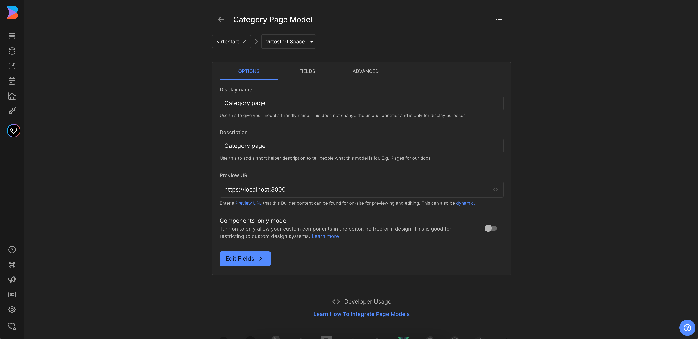
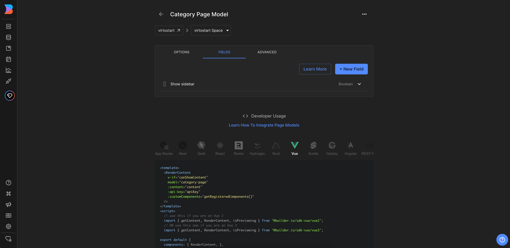

In this article, we will integrate Builder.io CMS into the category page of the **Virto Commerce vue-b2b-theme**. The integration allows you to create and manage content in Builder.io CMS and display it in the **Virto Commerce vue-b2b-theme**.

To use Builder.io CMS with the page:

1. [Create page model in Builder.io CMS for the category page](category-page-integration.md#create-page-model-in-builderio). The page model defines the properties of the category page and how it is rendered in the Builder.io CMS.
1. [Add Builder.io to the page component](category-page-integration.md#add-builderio-to-the-page-component). This allows you to fetch content from `Builder.io** and display it in the category page.
1. [Create content](category-page-integration.md#create-content). Add components to your page model and fill them with content.

## Create Page Model in Builder.io

To create page model:

1. Go to the **Models** menu and click **Create Model** in the top right corner. 
1. Select the model type from the dropdown list. We select **Page**. 
1. Enter the name of the component and its description. We enter **Category page**.
1. Change preview URL to **http://localhost:YOUR_PORT** where **YOUR_PORT** is the port of your **Virto Commerce vue-b2b-theme** application.

    

1. Add a new field called **showSidebar** of the type **Boolean**. This allows you to hide the sidebar if needed. 
1. Click **Save** to save the changes.

    

1. Use this model to create the content for our category page in the **Page content** section. Go to the **Content** menu and click **Category page** in the **Page models** section. 
1. Click **New Entry** and select **Category page** model from the dropdown list to create new page:

    

## Add Builder.io to the Page Component

To integrate Builder.io with the category page:

1. Edit **category.vue** page component in the **client-app/pages** folder.

    === "Template"

        ```html title="client-app/shared/landing-page.vue"
        <template>
            <RenderContent
                v-if="canShowContent"
                model="category-page"
                :content="content"
                :api-key="apiKey"
                :custom-components="registeredComponents"
            />
            <Category
                :category-id="categoryId"
                :show-sidebar="content?.data?.showSidebar ?? true"
            />
        </template>
        ```

    === "Script"

        ```typescript title="client-app/shared/landing-page.vue"
        import { Category } from "@/shared/catalog";
        import { getContent, RenderContent, isPreviewing } from "@builder.io/sdk-vue/vue3";
        import { onMounted, shallowRef } from "vue";
        import { useRouter } from "vue-router";
        import { useBuilder } from "@/shared/builder-io/composables/useBuilder";

        interface IProps {
            categoryId: string;
        }

        defineProps<IProps>();
        const router = useRouter();
        const { registeredComponents } = useBuilder();

        const canShowContent = shallowRef(true);
        const content = shallowRef(null);
        const pageNotFound = shallowRef(false);

        onMounted(async () => {
            await tryLoadContent(window.location.pathname);
        });

        router.beforeEach(async (to) => {
            await tryLoadContent(to.fullPath);
        });

        async function tryLoadContent(url: string) {
            try {
                const result = await getContent({
                model: "category-page",
                apiKey: "121744b9a9944bae8c35aeef88a87ba0",
                userAttributes: {
                    urlPath: url,
                },
                });

                content.value = result;
                canShowContent.value = !!content.value || isPreviewing();
            } catch (e) {
                pageNotFound.value = true;
            }
        }
        ```

1. As we want to use `showSidebar` property to control sidebar visibility, we change the **category.vue** component to use props from **matcher.vue** and add `v-if` condition in the `sidebar` section.

    ```html title="client-app/shared/catalog/components/category.vue" linenums="1"
    <template>
        <!-- Sidebar -->
        <div class="flex items-stretch lg:gap-6">
            <template v-if="showSidebar">

            <!-- Sidebar template -->

            </template>
        </div>
    </template>
    ```

    ```typescript title="client-app/shared/catalog/components/category.vue" linenums="1"
    interface IProps {
    categoryId?: string;
    isSearchPage?: boolean;
    showSidebar?: boolean;
    }

    const props = withDefaults(defineProps<IProps>(), {
    showSidebar: true,
    });
    ```

Now you can preview the category page in the Builder.io and start creating content for it.

## Create content

You can create content by adding components to your page model and filling them with content.

If you have already added custom components to Builder.io, you can use them to create content for the page. 

{: width="25"}  [Registering Custom Components](registering-custom-components.md)

As a result, you will get integration of Builder.io CMS with the category page of **Virto Commerce vue-b2b-theme**:


