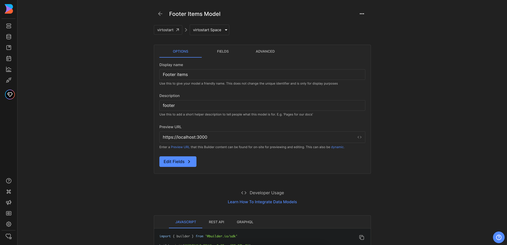

In this article, we will integrate **Footer** with the Builder.io CMS. The integration will allow you to create and manage footer sections and navigation links in the Builder.io CMS and display them in the **Virto Commerce vue-b2b-theme**.

In this guide, we will:

1. [Create a structured data model.](footer-integration.md#create-data-model-in-builderio)
1. [Fetch footer sections and navigation links from Builder.io and display them in the vue-b2b-theme.](footer-integration.md#fetch-content-from-builderio-and-display-in-vue-b2b-theme)

## Create Data Model in Builder.io

To create data model:

1. Go to the **Models** menu and click **Create Model** in the top right corner. 
1. Select the model type from the dropdown list. We select **Data**. 
1. Enter the name of the component and its description. We enter **Footer items**.
1. Change preview URL to **http://localhost:YOUR_PORT** where **YOUR_PORT** is the port of your **Virto Commerce vue-b2b-theme** application.

    

1. Set up the actual field in the entry that holds our component. In our example, we click **Fields** and add a new field called **columns** of the type **List**. This field will hold the columns of the footer. Similarly, we add new fields **title** (type **Text**), links (type **List**), which is an array. The **links** field holds the links of the footer. The nesting will be as follows:

    ```text
    columns
        └── title
        └── links
                └── title
                └── link
    ```

    

## Create Footer Content

To create footer content:

1. Go to the **Content** menu and click **Footer items** in the **Structured data models** section. 
1. Click **New Entry** and select **Footer items model** from the dropdown list to create new footer content. 
1. On the new page, add the content for the footer.
1. Click **+ Column** to add columns to the footer. 
1. Click **+ Link** to add links to the footer.

    

## Fetch Content from Builder.io and Display in vue-b2b-theme

To fetch content from Builder.io and display it in the **vue-b2b-theme**, go to the **vue-b2b-theme** and edit the **vc-footer** component. Remove hard-coded columns and change it to the fetched ones.

The final `vc-footer` component will look as follows:

=== "Template"

    ```html
    <template>
        <footer aria-label="Footer">
            <!-- Top footer -->
            <div
            v-if="!compact"
            class="hidden bg-[color:var(--color-footer-top-bg)] text-[color:var(--color-footer-top-text)] md:block print:!hidden"
            >
            <div class="container mx-auto grid grid-cols-2 gap-4 p-12 lg:grid-cols-4 xl:grid-cols-5">
                <!-- Logo column -->
                <div class="hidden xl:block">
                <VcImage :src="$cfg.logo_inverted_image" :alt="$context.storeName" class="h-9" lazy />
                </div>

                <div v-for="(col, index) in columns" :key="index">
                <div v-t="col.title" class="mb-3 text-base font-extrabold uppercase text-white"></div>
                <div class="flex flex-col space-y-1">
                    <FooterLink
                    v-for="(link, linkIndex) in col.links"
                    :key="`link_${linkIndex}`"
                    v-t="link.title"
                    :to="link.link"
                    ></FooterLink>
                </div>
                </div>
            </div>
            </div>

            <!-- Bottom footer -->
            <!-- ... -->
        </footer>
    </template>
    ```

=== "Script"

    ```typescript title="client-app/shared/layout/components/footer/vc-footer.vue" linenums="1"
    import { getContent } from "@builder.io/sdk-vue/vue3";
    import pkg from "../../../../../package.json";
    import FooterLink from "./_internal/footer-link.vue";
    import { onMounted, ref } from "vue";

    interface IProps {
        compact?: boolean;
    }

    defineProps<IProps>();

    const { version } = pkg;

    const columns = ref([]);

    onMounted(async () => {
        try {
            const result = await getContent({
                model: "footer-items",
                apiKey: "121744b9a9944bae8c35aeef88a87ba0",
            });

            columns.value = result.data.columns;
        } catch (e) {
            console.error(e);
        }
    });
    ```

After making the changes, the footer will now be fetched from Builder.io and displayed in the **vue-b2b-theme**.

Now you can publish the changes in Builder.io and see the updated footer in the **vue-b2b-theme**.
