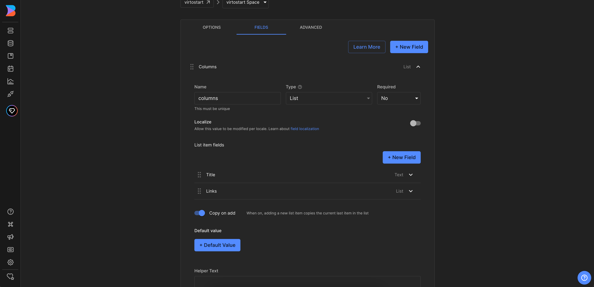
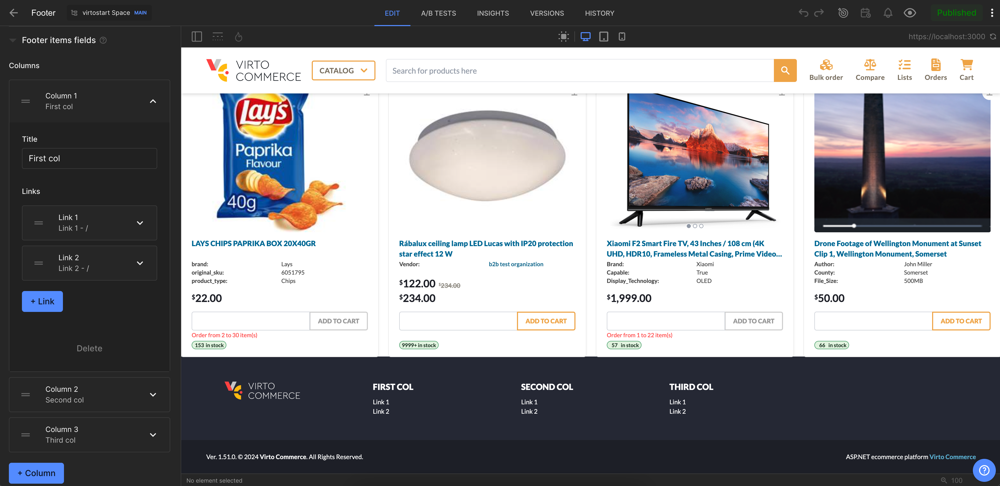

# Overview

In this article, we will integrate `Footer` with the `Builder.io CMS`. The integration will allow you to create and manage footer sections and navigation links in the `Builder.io CMS` and display them in the `Virto Commerce vue-b2b-theme`.

This guide will cover the following topics:

1. **Create of data model**: We will create a `Structured data model` for `Footer`.
2. **Fetch Content from Builder.io**: We will fetch footer sections and navigation links from `Builder.io` and display them in the `vue-b2b-theme`.

## Create Data Model in Builder.io

First we will navigate to the `Models` menu where we will hit `Create Model` on the top right corner. You will be prompted with an dropdown to select the model type, we will select `Data`. After selecting the model type, we will be prompted with an input field to name the component, we will use `Footer items`, and description. After confirming the name, we will be redirected to the model editor where we should change preview URL to `http://localhost:YOUR_PORT` where `YOUR_PORT` is the port of your `Virto Commerce vue-b2b-theme` application.


Next step will be to set-up the actual field in the entry that holds our component, for this we will click on `Fields` and adding a new field called `columns` of the type `List`. This field will hold the columns of the footer. We will also add a new field called `title` of the type `Text` and a new field called `links` of the type `List`, which is array. The `links` field will hold the links of the footer.

In our example, the nesting could be presented as follows:

```text
columns
    └── title
    └── links
            └── title
            └── link
```



## Create Footer Content

First we will navigate to the `Content` menu and click on the `Footer items` in `Structured data models` section. Now click `New Entry` and select `Footer items` model from dropdown to create new footer content. It will open a new page where we can add the content for our footer.



Now you can click `+ Column` button to add  columns to the footer. After adding columns, you can click `+ Link` button to add links to the footer.

## Fetch Content from Builder.io and Display in vue-b2b-theme

To fetch content from `Builder.io' and display it in the `vue-b2b-theme`, we will go to the `vue-b2b-theme` and edit the `vc-footer` component. We will remove hard-coded columns and change it to the fetched ones.

The final `vc-footer` component will look like this:

=== "Template"

    ```html
    <template>
        <footer aria-label="Footer">
            <!-- Top footer -->
            <div
            v-if="!compact"
            class="hidden bg-[color:var(--color-footer-top-bg)] text-[color:var(--color-footer-top-text)] md:block print:!hidden"
            >
            <div class="container mx-auto grid grid-cols-2 gap-4 p-12 lg:grid-cols-4 xl:grid-cols-5">
                <!-- Logo column -->
                <div class="hidden xl:block">
                <VcImage :src="$cfg.logo_inverted_image" :alt="$context.storeName" class="h-9" lazy />
                </div>

                <div v-for="(col, index) in columns" :key="index">
                <div v-t="col.title" class="mb-3 text-base font-extrabold uppercase text-white"></div>
                <div class="flex flex-col space-y-1">
                    <FooterLink
                    v-for="(link, linkIndex) in col.links"
                    :key="`link_${linkIndex}`"
                    v-t="link.title"
                    :to="link.link"
                    ></FooterLink>
                </div>
                </div>
            </div>
            </div>

            <!-- Bottom footer -->
            <!-- ... -->
        </footer>
    </template>
    ```

=== "Script Section"

    ```typescript title="client-app/shared/layout/components/footer/vc-footer.vue" linenums="1"
    import { getContent } from "@builder.io/sdk-vue/vue3";
    import pkg from "../../../../../package.json";
    import FooterLink from "./_internal/footer-link.vue";
    import { onMounted, ref } from "vue";

    interface IProps {
        compact?: boolean;
    }

    defineProps<IProps>();

    const { version } = pkg;

    const columns = ref([]);

    onMounted(async () => {
        try {
            const result = await getContent({
                model: "footer-items",
                apiKey: "121744b9a9944bae8c35aeef88a87ba0",
            });

            columns.value = result.data.columns;
        } catch (e) {
            console.error(e);
        }
    });
    ```

After making the changes, the `Footer` will now be fetched from `Builder.io` and displayed in the `vue-b2b-theme`!

Now you can publish the changes in `Builder.io` and see the updated `Footer` in the `vue-b2b-theme`.
