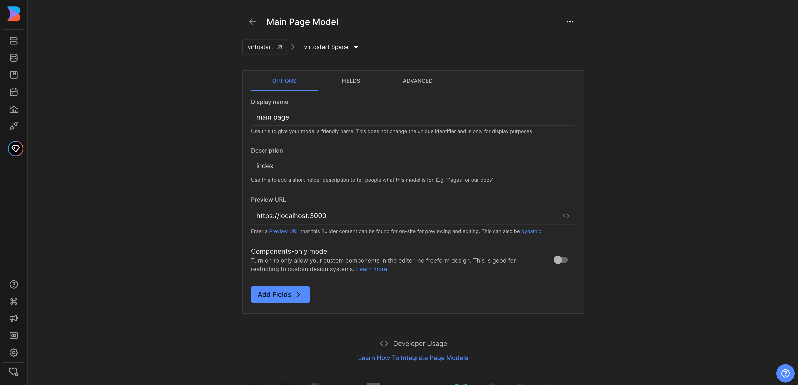
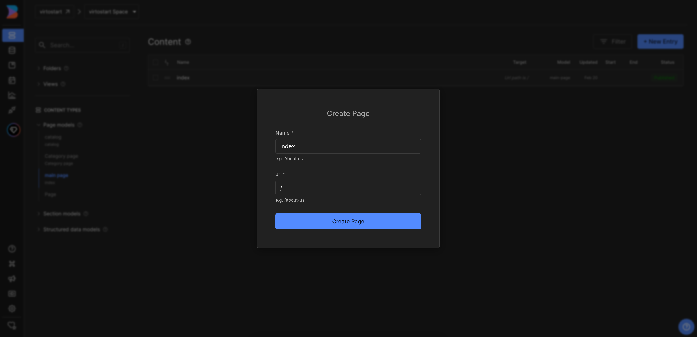
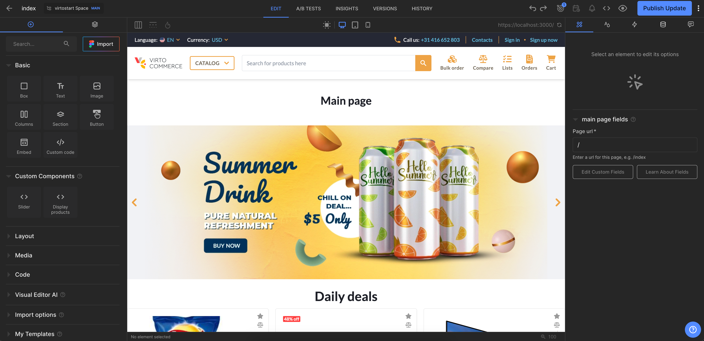

# Overview

In this article, we will integrate Builder.io CMS into the index page of the **Virto Commerce vue-b2b-theme**. The integration will allow you to create and manage content in Builder.io CMS and display it in the **Virto Commerce vue-b2b-theme**.

To use Builder.io CMS with the page:

1. [Create page model for the index page](index-page-integration.md#create-page-model-in-builderio). The page model defines the properties of the index page and how it is rendered in the Builder.io CMS.
1. [Add Builder.io to the page component in the **Virto Commerce vue-b2b-theme**](index-page-integration.md#add-builderio-to-the-page-component). This allows you to fetch content from Builder.io and display it in the index page.
1. [Create content](index-page-integration.md#create-content). Add components to your page model and fill them with content.

## Create Page Model in Builder.io

1. Go to the **Models** menu and click **Create Model** in the top right corner. 
1. Select the model type from the dropdown list. We select **Page**. 
1. Enter the name of the component and its description. We enter **main page**.
1. Change preview URL to **http://localhost:YOUR_PORT** where **YOUR_PORT** is the port of your **Virto Commerce vue-b2b-theme** application.

    

1. Use this model to create the content for our index page. Go to **Content** menu and click on the **main page** in **Page models** section. 
1. Click **New Entry** and select **main page** model from the dropdown list to create a new page:

    

## Add Builder.io to the Page Component

To add Builder.io to the page component you need to add `RenderContent` into your template. As we want totally replace the content of the page with the content from Builder.io, we will use `v-if` directive to show `RenderContent` only when content is loaded.

=== "Template"

    ```html title="client-app/pages/index.vue"
    <template>
         <div v-if="canShowContent">
            <RenderContent model="main-page" :content="content" :api-key="apiKey" :custom-components="registeredComponents" />
        </div>
    </template>
    ```

=== "Script"

    As you can see we are using `main-page` as a content ID to fetch the content from Builder.io.

    ```typescript title="client-app/pages/index.vue"
    import { ref, shallowRef } from "vue";
    import { useI18n } from "vue-i18n";
    import { usePageHead } from "@/core/composables";
    import { getContent, RenderContent, isPreviewing } from "@builder.io/sdk-vue/vue3";
    import { useBuilder } from "@/shared/builder-io/composables/useBuilder";

    const { t } = useI18n();
    const { registeredComponents } = useBuilder();

    const canShowContent = shallowRef(true);

    const content = shallowRef(null);
    const pageNotFound = shallowRef(false);

    usePageHead({
        title: t("pages.home.meta.title"),
        meta: {
            keywords: t("pages.home.meta.keywords"),
            description: t("pages.home.meta.description"),
        },
    });

    onMounted(async () => {
        try {
            const result = await getContent({
                model: "main-page",
                apiKey: "121744b9a9944bae8c35aeef88a87ba0",
                userAttributes: {
                    urlPath: url,
                },
            });

            content.value = result;
            canShowContent.value = !!content.value || isPreviewing();
        } catch (e) {
            pageNotFound.value = true;
        }
    });
    ```

Now you can preview the index page in the Builder.io and start creating content for it.

## Create content

After adding Builder.io to the page component, you can start creating content in the Builder.io CMS. You can create content by adding components to your page model and filling them with content.

If you have already added custom components to Builder.io, you can use them to create content for the page. 

{: width="25"} [Registering Custom Components](registering-custom-components.md)

As a result, you will get integration of Builder.io CMS with the index page of **Virto Commerce vue-b2b-theme**:


