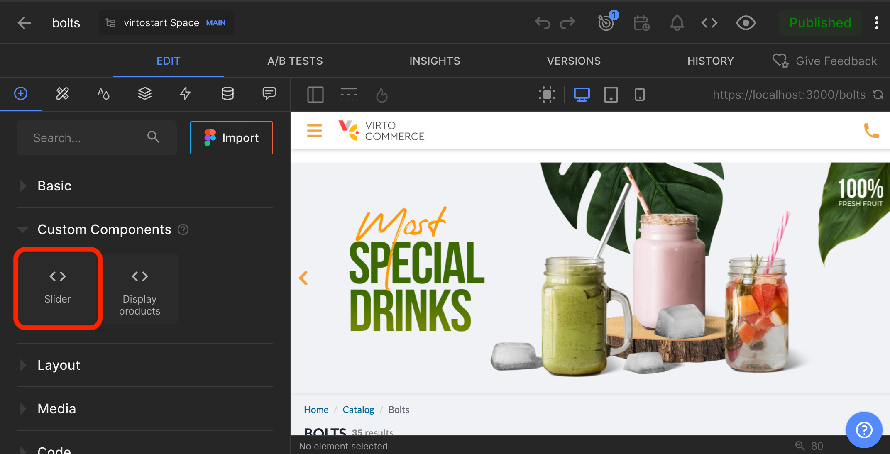

# Overview

In this article, we will explore how to register any custom component in the Builder.io CMS. The registration of custom components allows you to use any UI components like `Slider` in the Builder.io CMS when creating content.

## Register Custom Components

To register a custom component in the Builder.io CMS:

1. Create a reference for the custom component you want to register. The wrapper component should be a **.ts** file. It describes the inputs—or the props—that should be editable in the **Visual Editor**.
1. Register the reference using the `useBuilder` composable which we created [here](overview.md#connect-builderio-with-virto-commerce-vue-b2b-theme). This will make the custom component available for use in the Builder.io CMS.
1. Provide a list of components to the `RenderContent` component. This allows you to use the custom components in the Builder.io CMS.

## Example. Slider Component Registration

In this example, we will show how to register a `Slider` component in the Builder.io CMS:

1. Create a reference for the `Slider` component:

    ```typescript title="@/shared/builder-io/components/custom/slider.ts" linenums="1"
    import Slider from "../../../static-content/components/slider.vue";

    export const slider = {
      component: Slider,
      name: "Slider",
      inputs: [
        {
          name: "slides",
          type: "list",
          defaultValue: [],
          subFields: [
            {
              name: "image",
              type: "string",
            },
          ],
        },
      ],
    };
    ```

2. Register the `slider` component with the `useBuilder` composable:

    ```typescript title="client-app/app-runner.ts" linenums="1"
    import { createApp } from "vue";
    import App from "./App.vue";
    import * as builderSharedComponents from "@/shared/builder-io/components/custom";

    export default async () => {
        // ...
        const app = createApp(App);

        const { registerCustomComponents } = useBuilder();

        registerCustomComponents(builderSharedComponents);

        app.mount('#app');
    }
    ```

3. Provide this list of components to the `RenderContent` component:

    ```typescript linenums="1"
    <template>
        <RenderContent :custom-components="registeredComponents" />
    </template>

    <script setup>
    import { RenderContent } from "@builder.io/sdk-vue/vue3";
    import { useBuilder } from "@/shared/builder-io/composables/useBuilder";

    const { registeredComponents } = useBuilder();
    ```

The **Slider** component is now registered and available for use in the Builder.io CMS. You can now use the **Slider** component when creating content in the Builder.io CMS:


