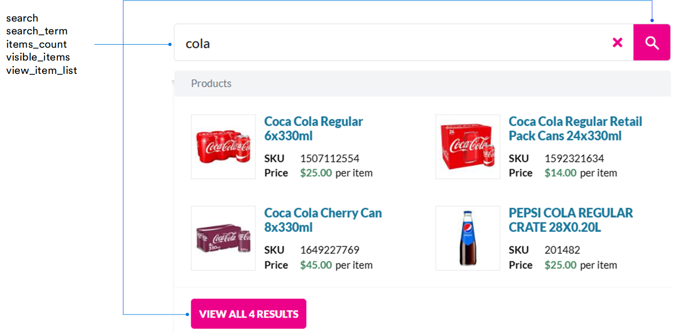

# Google Analytics Events

Google Analytics is used in the Virto Commerce Frontend Application to track user interactions and provide insights into user behavior. To make these insights more accessible for marketers, several preconfigured events are automatically sent to Google Analytics. You can view and analyze these events through Google Tag Manager (GTM).

{: width="25"} [GA integration](../../../../../platform/user-guide/integrations/google-analytics/integration#direct-ga4-integration)

{: width="25"} [Google Tag Manager setup for GA4](../../../../../platform/user-guide/integrations/google-analytics/integration#google-tag-manager-setup-for-ga4)

## Tracked sales funnel events

Sales funnel (checkout) events represent sequential steps that guide the customer from the shopping cart to completing the payment. These events help you understand where customers drop off and how efficiently your checkout flow works.

After the customer proceeds to checkout, the following events are tracked in the specified order:

| GA event         	    | Action (trigger)                                                                          | Checkout step                                                          	|
|-------------------	|-------------------------------------------------------------------------------------------|-----------------------------------------------------------------------	|
| begin_checkout    	| Click **Proceed to checkout**.                                                           	|                                                                         	|
| add_shipping_info 	| Click **Proceed to billing** after specifying the shipping address and delivery method. 	| Shipping.                                                             	|
| add_payment_info  	| Click **Review order** after specifying the billing address and the payment method.       | Billing.                                                              	|
| place_order       	| Click **Place order** after reviewing the order.                                       	| Order review.                                                         	|
| purchase          	| Click **Pay now** after selecting the payment method.                                 	| Payment (unless manual payment was select at the previous step). 	        |

!!! note
    For a single-step checkout, only `begin_checkout` and `place_order` are tracked. Other events can be added at the client's request.

## Events beyond the checkout funnel

Outside the checkout flow, Virto Commerce tracks various interaction events that describe how users search, browse, and interact with products. Unlike sales funnel events, these do not follow a specific order. Instead, they capture actions wherever the user is on the Frontend.

### Search events

When a user types a query into the search bar and submits it (presses **Enter**, clicks the magnifying glass icon, or selects **View all results**), several search-related events are triggered automatically.
These events help you analyze:

* What users search for.
* How many results they see.
* How many items are visible in the suggestions dropdown.
* Which product lists users view immediately after searching.

### Other Frontend interactions

The table below shows additional events that track user actions across the Frontend:

<table border="1" cellpadding="8" cellspacing="0">
  <thead>
    <tr>
      <th>GA event</th>
      <th>Action (trigger)</th>
      <th>Result</th>
      <th>Location</th>
    </tr>
  </thead>
  <tbody>
    <tr>
      <td>login</td>
      <td>Submit login form with valid credentials.</td>
      <td>User is logged into the storefront.</td>
      <td>Login page. Popup login form.</td>
    </tr>
    <tr>
      <td>sign_up</td>
      <td>Submit registration form.</td>
      <td>User account is created.</td>
      <td>Registration page. Registration popup.</td>
    </tr>
    <tr>
      <td rowspan="7">view_item_list</td>
      <td>Type query into the search bar.</td>
      <td>Dropdown list appears.</td>
      <td>Wherever search bar is present.</td>
    </tr>
    <tr>
      <td>Open product page → View related products (e.g. <b>Products related to this item</b>, <b>Customers bought together</b>).</td>
      <td>Related products widgets appear on product page.</td>
      <td>Related products widget on product page.</td>
    </tr>
    <tr>
      <td>Open product page → View variations.</td>
      <td>Product variations appear on product page.</td>
      <td>Product variations widget on product page.</td>
    </tr>
    <tr>
      <td>Open cart → View recently browsed products.</td>
      <td>Recently browsed products widget appears on cart page.</td>
      <td>Recently browsed products widget on cart page.</td>
    </tr>
    <tr>
      <td>Open product comparison page → View compared products.</td>
      <td>The list of products added for comparison appears on product comparison page.</td>
      <td>Product comparison page.</td>
    </tr>
    <tr>
      <td>Open catalog → View products in the catalog.</td>
      <td>The products from the catalog appear.</td>
      <td>Catalog.</td>
    </tr>
    <tr>
      <td>Open lists.</td>
      <td>The products lists appear.</td>
      <td>Lists.</td>
    </tr>
    <tr>
      <td>view_item</td>
      <td>Open product page.</td>
      <td>Product page opens.</td>
      <td>Product page.</td>
    </tr>
    <tr>
      <td rowspan="8">select_item</td>
      <td>Go to Catalog → Select any item from it</td>
      <td>Product page opens.</td>
      <td>Catalog</td>
    </tr>
    <tr>
      <td>Type query into the search bar → Select product from the dropdown</td>
      <td>Product page opens.</td>
      <td>Product page.</td>
    </tr>
    <tr>
      <td>Go to product page → Select item from the recommended products</td>
      <td>Product page opens.</td>
      <td>Recommended products widgets on product page.</td>
    </tr>
    <tr>
      <td>Go to product page → Select item from the related products.</td>
      <td>Product page opens.</td>
      <td>Related products widget on product page.</td>
    </tr>
    <tr>
      <td>Go to cart → Select item from the recently browsed products.</td>
      <td>Product page opens.</td>
      <td>Recently browsed products on cart page.</td>
    </tr>
    <tr>
      <td>Go to cart page → Select item from the products list.</td>
      <td>Product page opens.</td>
      <td>Product list on cart page.</td>
    </tr>
    <tr>
      <td>Go to lists → Select item from the list.</td>
      <td>Product page opens.</td>
      <td>Lists.</td>
    </tr>
    <tr>
      <td>Go to compare page → Select item from the compared products list.</td>
      <td>Product page opens.</td>
      <td>Product comparison page.</td>
    </tr>
    <tr>
      <td>view_cart</td>
      <td>Go to Catalog → Add products to cart → Open cart.</td>
      <td>Cart with product opens.</td>
      <td>Cart.</td>
    </tr>
    <tr>
      <td>add_to_cart</td>
      <td>Add products to cart.</td>
      <td>Products are added to the cart.</td>
      <td>Cart.</td>
    </tr>
    <tr>
      <td>remove_from_cart</td>
      <td>Remove item from cart.</td>
      <td>Products are removed from cart.</td>
      <td>Cart</td>
    </tr>
    <tr>
      <td>clear_cart</td>
      <td>Click <strong>Clear cart</strong>.</td>
      <td>The cart is empty.</td>
      <td>Cart</td>
    </tr>
    <tr>
      <td>update_cart_item</td>
      <td>Change product quantity or options in the cart.</td>
      <td>Updated item quantity or configuration.</td>
      <td>Cart.</td>
    </tr>
    <tr>
      <td>add_to_wishlist</td>
      <td>Add product to wishlist.</td>
      <td>The product is added to list.</td>
      <td>Category page. Product page.</td>
    </tr>
    <tr>
      <td>view_search_results</td>
      <td>Submit a search query and open the full search results page.</td>
      <td>Search results page with matching products appears.</td>
      <td>Search results page.</td>
    </tr>
  </tbody>
</table>

 
 
********

    <a href="../../../authentication/authentication-types">← Authentication types </a>
    <a href="../../prerender_io/">Enhancing SEO with Prerender.io  →</a>

