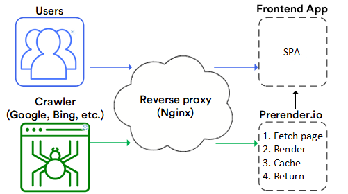
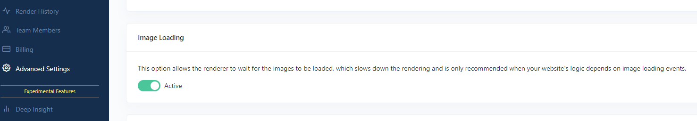
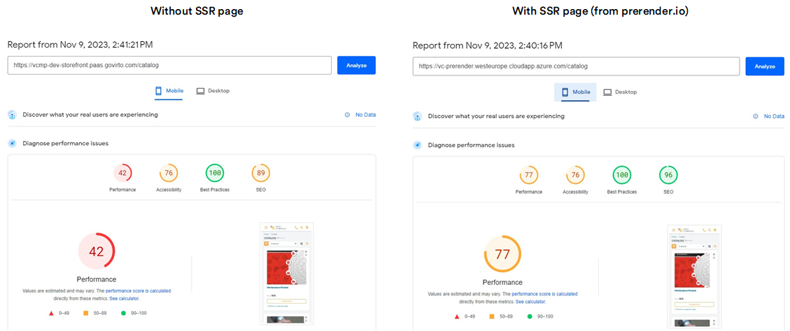

# Enhancing SEO with Prerender.io

The current Virto Commerce Frontend Application uses the power of Single Page Applications (SPAs) to provide a unique, interactive, and fast user experience. However, while SPAs excel in user experience, they often pose challenges for search engines due to their dynamic nature. This dynamic behavior, which is a strength for user engagement, can become a hurdle in attracting organic traffic.

To overcome these challenges and strike a balance between an engaging user experience and search engine optimization (SEO), [Prerender.io](http://prerender.io/) represents as a valuable solution. Prerender.io generates pre-rendered HTML snapshots for SPAs, significantly improving SEO-friendliness and Web Vitals metrics. This integration doesn't require the adoption of complex Server-Side Rendering (SSR) frameworks like Next or Nuxt, preserving the simplicity of the presentation application. This guide explores how Prerender.io provides a straightforward yet highly effective solution to boost the visibility, performance, and overall experience of Vue.js SPAs.

!!! note "Preview feature"
    Virto Cloud can run a self-hosted prerender service as a preview, instead of the Prerender.io cloud SaaS. The headers and behavior mirror the cloud service, but the authentication token and the recache API endpoint differ. On-demand recaching also requires a paid Prerender.io plan, such as Advanced or Enterprise.

## Integration with Virto Commerce Frontend Application

In this guide, we describe the results of Prerender.io  integration with the vc-theme-b2b-vue. A practical example is our [site](https://virtostart-demo-store.govirto.com/), which is built on vc-theme-b2b-vue and uses the Prerender.io service.

### Configuration details

The integration involved setting up a reverse proxy using Nginx in front of the VC Frontend Application. Additionally, the vc-theme-b2b-vue and Prerender's cloud service were installed. The Nginx reverse proxy was configured based on the [example](https://docs.prerender.io/docs/nginx-1).

{: style="display: block; margin: 0 auto;" }

A notable configuration adjustment was made to ensure proper image loading on Server-Side Rendering (SSR) pages, requiring the activation of the image loading option in the [Prerender.io dashboard](http://Prerender.io).

{: style="display: block; margin: 0 auto;" }

## Performance evaluation

To measure the impact of Prerender.io on performance, a PageSpeed analysis was conducted for a category listing page. The comparison involved assessing the performance with and without SSR page rendering through Prerender.io.

{: style="display: block; margin: 0 auto;" }

## Operating Prerender

Once Prerender serves cached snapshots to crawlers, a few operational areas come up regularly: how crawlers are detected, the headers exchanged, refreshing snapshots after a deploy, keeping private routes out of the cache, and verifying that bots and humans are routed correctly.

### Crawler detection

The reverse proxy identifies bots by matching the `User-Agent` header against a regex. Only matching agents are forwarded to Prerender. Everything else receives the SPA shell.

The baseline is the `prerender-node` crawler list, which most Prerender proxies start from. Confirm the exact pattern in your deployment's rewrite rule, since it may differ:

```
(googlebot|bingbot|yandex|baiduspider|facebookexternalhit|twitterbot|rogerbot|linkedinbot|
embedly|quora\ link\ preview|showyoubot|outbrain|pinterest\/0\.|pinterestbot|slackbot|vkShare|
W3C_Validator|whatsapp|redditbot|applebot|flipboard|tumblr|bitlybot|skypeuripreview|nuzzel|
discordbot|google\ page\ speed|qwantify|bitrix\ link\ preview|xing-contenttabreceiver|
chrome-lighthouse|telegrambot|google-inspectiontool)
```

This baseline predates AI crawlers, so it does not include agents such as GPTBot or ClaudeBot. Add them if AI-crawler indexing matters. To add a bot, append `|<new-user-agent-fragment>` before the closing parenthesis, then redeploy the proxy configuration and verify with the recipes under [Verify routing](#verify-routing).

For Azure Application Gateway, the rewrite rule inspects the `User-Agent` and routes matches to the Prerender backend pool.

<br>
{: width="25"} [Setting up Prerender.io with Azure Application Gateway](/platform/developer-guide/latest/Tutorials-and-How-tos/How-tos/setting-up-prerender-io-with-azure-app-gateway)

### HTTP headers

The proxy authenticates to Prerender with a request header, and Prerender returns diagnostic headers on the response.

The request header from the proxy to Prerender:

| Header | Value | Purpose |
| --- | --- | --- |
| `X-Prerender-Token` | The token from your Prerender.io account | Authenticates the proxy to Prerender. Set it through the AGW rewrite set or the nginx `proxy_set_header`. Never expose it client-side. |

The response headers from Prerender to the bot or proxy:

| Header | Example | Meaning |
| --- | --- | --- |
| `x-prerender-cache` | `HIT` or `MISS` | The snapshot was served from cache (`HIT`) or freshly rendered (`MISS`). It is absent on human responses, which is the primary signal that a request took the SPA path. |
| `x-prerender-cache-level` | `L2` | The cache tier. `L1` is in-memory, `L2` is the persistent snapshot store. |
| `Cache-Control` | `private, max-age=600, must-revalidate` | The downstream cache directive on prerendered responses. It governs CDN and browser reuse, separate from Prerender's internal snapshot TTL. |
| `x-response-time` | `13.901` on a MISS, near `0` on a HIT | The server-side render time in milliseconds. |

The rendered HTML also carries a snapshot timestamp. Inspect it to tell whether a snapshot is stale relative to a recent deploy:

```html
<meta rel="x-prerender-render-at" content="2026-06-05T10:22:47.000Z">
```

### Refresh snapshots after deploy

Prerender caches each rendered page and does not automatically invalidate snapshots when you deploy a new frontend version. Until a snapshot expires or is recached, crawlers keep receiving the old HTML.

The snapshot lifecycle:

```
First bot hit   -> MISS -> Prerender renders (3-14 s) -> snapshot stored -> HTML returned
Subsequent hit  -> HIT  -> snapshot served immediately (near-instant)
Frontend deploy -> cache does NOT auto-invalidate -> bots see the old snapshot until recache or expiry
```

Snapshots are stored in two tiers, both returning `x-prerender-cache: HIT`. The `x-prerender-cache-level` header shows which tier served the response: `L1` in-memory or `L2` persistent. The `Cache-Control` directive on prerendered responses governs downstream CDN and browser reuse, not Prerender's internal snapshot TTL.

To refresh a page immediately, call the Prerender [Recache API](https://docs.prerender.io/docs/6-api) from your CI/CD pipeline after each deploy:

```bash
curl -H "Content-Type: application/json" \
  -d '{"prerenderToken": "<your-token>", "url": "https://<storefront>/catalog/laptops"}' \
  https://api.prerender.io/recache
```

To refresh many pages at once, replace `url` with a `urls` array (up to 1000 per request). Recaching only the pages that changed lets you keep a long cache expiration and still serve fresh content.

!!! note
    The Recache API is available on Prerender.io Advanced and Enterprise plans.

### Exclude private routes

Account and checkout pages contain session-specific content and have no SEO value. Add a path exclusion in your reverse proxy so prefixes such as `/account`, `/checkout`, `/cart`, and `/sign-in` bypass Prerender even when the User-Agent matches the crawler regex. This avoids wasting render capacity and prevents caching transient, user-specific responses.

Block the same routes from crawling in **robots.txt**, which is managed from the Platform Admin and served by the storefront. 

<br>
{: width="25"} [Custom robots.txt file](/platform/user-guide/latest/store/custom-robot-txt)

### Verify routing

Use the `x-prerender-cache` response header to confirm which path a request took:

```bash
# Bot path: should return x-prerender-cache: HIT (or MISS on the first hit)
curl -sI -A "googlebot" https://<storefront>/catalog | grep -i x-prerender-cache

# Human path: the header is absent, confirming the request was served the SPA shell
curl -sI https://<storefront>/catalog | grep -i x-prerender-cache
```

A `MISS` triggers a fresh render that takes a few seconds; a `HIT` is served from cache near-instantly. To force a fresh render during testing without clearing the cache, append a throwaway query parameter, for example `?cachebust=1`. Each unique URL is a separate cache entry, so remove the parameter when testing real cached behavior. When you contact Prerender support about a request, include the `x-prerender-request-id` value from the response.

To check when a snapshot was captured, read the timestamp meta tag from the rendered HTML:

```bash
curl -s -A "googlebot" https://<storefront>/catalog/laptops | grep x-prerender-render-at
# Expected: <meta rel="x-prerender-render-at" content="2026-06-05T...">
```

To force a fresh render and measure MISS latency:

```bash
time curl -s -A "googlebot" "https://<storefront>/catalog/laptops?cachebust=$(date +%s)" \
  -o /dev/null -w "HTTP %{http_code} | Time: %{time_total}s\n"
# Expected: HTTP 200 in 3-14 s on a MISS. Rerun without ?cachebust to confirm a near-instant HIT.
```

Crawlers should also receive correct HTTP status codes, for example 404 for a removed product. 

<br>
{: width="25"} [SPA architecture for SEO and 404 handling](../spa-architecture-for-seo-and-404-handling.md)

## Conclusion

The primary advantage of utilizing Prerender.io for custom Virto Commerce frontend solutions, especially those with stringent SEO requirements, lies in its ability to enhance SEO without compromising the purity of the SPA architecture. This eliminates the need for substantial changes or investments in complex SSR frameworks like Nuxt.js.

By avoiding server-side logic, Prerender.io enables a streamlined frontend solution, eliminating concerns related to caching, scaling, server error handling, and logging – elements typically unnecessary for pure SPA applications. Prerender.io offers a simplified and effective solution to enhance search engine visibility and performance without requiring extensive modifications to existing code.

<br>
{: width="25"} [SPA JavaScript SEO Challenges and Solutions - Prerender.io](https://prerender.io/blog/spa-javascript-seo-challenges-and-solutions/)

{: width="25"} [Setting Up Prerender.io with Azure Application Gateway](/platform/developer-guide/latest/Tutorials-and-How-tos/How-tos/setting-up-prerender-io-with-azure-app-gateway)


<br>
<br>
********

<div style="display: flex; justify-content: space-between;">
    <a href="../google-analytics/ga-events">← Google Analytics events </a>
    <a href="../builder-io/overview">Builder.io  →</a>
</div>